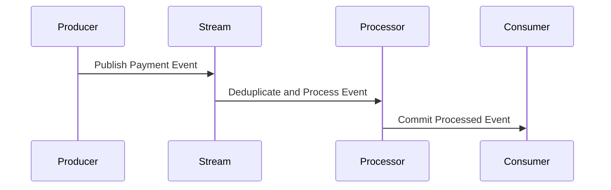

## Introduction

In distributed systems, especially within stream processing applications, one of the critical challenges is guaranteeing that each message or event is processed exactly once across multiple nodes and stages in the system. The End-to-End Exactly-Once delivery pattern is pivotal in scenarios where data consistency and accuracy are paramount, such as financial transaction systems, inventory management, or whenever data duplication leads to severe implications.

## Key Concepts

- **Producer**: The source or originator of data that needs to be processed.
- **Consumer**: The final system or application that acts upon the processed data.
- **Processing Pipeline**: Intermediate stages that process the data, which may include transformations, aggregations, or service calls.
- **State Management**: Mechanism for maintaining process state across restarts or failures.
- **Idempotency**: Ensuring that reprocessing a message or event more than once does not introduce errors or duplications.

## Architectural Approaches

1. **Idempotent Producers and Consumers**: Guarantee that repeated requests do not alter the final outcome, ensuring SAFE (Stateless, Atomic, Fast, and Efficacious) operations.

2. **Transaction Support**: Incorporating transactional systems or databases that support atomic commit/rollback procedures across the pipeline.

3. **Checkpointing and State Management**: Regularly saving the progress state so that recovery follows exactly-once semantics. Systems like Apache Flink and Kafka Streams use this approach effectively.

4. **Deduplication Strategy**: Utilize unique identifiers for events, ensuring that duplicate processing can be detected and avoided at different stages.

## Example Code

Let's illustrate with a simple Kafka Streams example in Java for a payment processing pipeline that ensures exactly-once semantics.

```java
Properties properties = new Properties();
properties.put(StreamsConfig.APPLICATION_ID_CONFIG, "payment-processing-app");
properties.put(StreamsConfig.BOOTSTRAP_SERVERS_CONFIG, "localhost:9092");
properties.put(StreamsConfig.PROCESSING_GUARANTEE_CONFIG, StreamsConfig.EXACTLY_ONCE_V2);

KafkaStreams streams = new KafkaStreams(topology, properties);
streams.start();
```

Here, the `EXACTLY_ONCE_V2` setting ensures that the Kafka Streams application will handle messages precisely once in its processing pipeline.

## Diagrams



This sequence diagram shows a simplified flow where the Producer publishes an event, the Stream ensures deduplication, and the Processor handles the event before committing the final result to the Consumer.

## Related Patterns

- **Idempotent Receiver Pattern**: Ensures that processing is insensitive to duplicates.
- **At-Least-Once Delivery**: Guarantees delivery but can result in duplicate processing.
- **Event Sourcing**: Maintains a log of immutable events to manage state changes.

## Additional Resources

- **Apache Kafka Documentation**: Provides insights and configurations for exactly-once semantics in distributed environments.
- **Apache Flink State Management**: Offers detailed guidance on consistent state handling for exactly-once processing.
- **Google Cloud Dataflow**: Demonstrates options for exactly-once processing within its pipeline architect.

## Summary

End-to-End Exactly-Once delivery is an essential pattern for systems where precision and accuracy are required. By ensuring that each piece of data is processed once—and only once—these systems can achieve higher reliability, satisfy strict business requirements, and maintain integrity across distributed environments. While achieving this can be complex due to distributed state management and failover recovery, employing a combination of robust tools and architectural strategies can help manage these challenges effectively.
