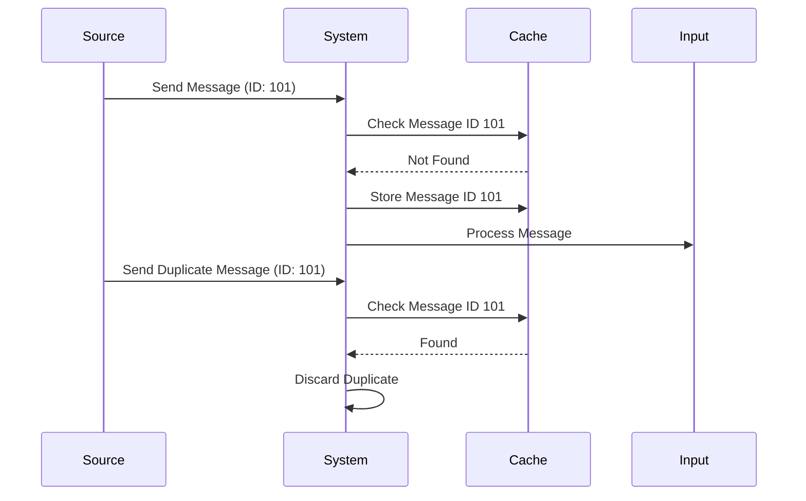

## Duplicate Detection and Elimination: Introduction

In modern distributed systems and stream processing environments, data redundancy due to duplicate messages can lead to inefficient processing and inaccurate results. The Duplicate Detection and Elimination pattern addresses this issue by identifying repeat messages and discarding them before they reach the processing logic, ensuring that each piece of data is processed exactly once or as intended.

## Description

Duplicate Detection and Elimination is a crucial design pattern employed in systems where messages or data events are prone to duplication. This duplication can result from network retransmissions, message broker redelivery, or inherent in the data source configuration. Redundant data can cause increased load on processing units and lead to duplicate triggers in downstream systems, often leading to corruption of the derived state or analytic results.

### Key Components

- **Unique Message Identifiers**: Each message is assigned a unique identifier (e.g., UUID, hash), enabling the system to track messages it has already processed.
- **Idempotent Processing**: Ensures that even if a duplicate message passes through, it does not alter the final outcome.
- **Storage Mechanism**: Utilizes a cache or database to store identifiers of processed messages to quickly determine if an incoming message is duplicate.

## Architectural Approaches

- **Message Brokers with Deduplication**: Utilize features provided by message brokers like Kafka or RabbitMQ to detect and prevent duplicate message delivery.
- **Custom Middleware**: Implement middleware layers in the application that track message IDs in memory or persistent stores (e.g., Redis, Cassandra) for duplicate detection.
- **Stream Processing Frameworks**: Leverage functionality of platforms like Apache Flink or Apache Beam that offer built-in mechanisms to handle exactly-once processing semantics.

## Best Practices

1. **Use Idempotent Operations**: Ensure all operations are idempotent, so repeated invocations with the same input do not alter the system state beyond the initial application.
   
2. **Optimize Identifier Storage**: Use efficient data structures such as Bloom Filters to store identifiers if space is a concern.
   
3. **Transactional Storage**: When using storage-based deduplication, use transactional semantics to ensure the atomicity of storing message IDs and processing logic.

4. **Regular Cleanup**: Periodically purge old identifiers from storage to reclaim space and maintain performance without impacting the operation integrity.

## Example Code

Here is a simplified example using Apache Kafka for duplicate detection in a Java application:

```java
import org.apache.kafka.clients.consumer.KafkaConsumer;
import java.util.Properties;
import java.util.HashSet;

public class DuplicateDetector {
    private HashSet<String> processedMessages = new HashSet<>();

    public boolean isDuplicate(String messageId) {
        return !processedMessages.add(messageId);
    }

    public void processMessages() {
        Properties properties = new Properties();
        // Set Kafka consumer properties

        KafkaConsumer<String, String> consumer = new KafkaConsumer<>(properties);
        // Subscribe to the topic

        while (true) {
            // Poll messages from Kafka
            consumer.poll(Duration.ofMillis(100)).forEach(record -> {
                String messageId = record.key(); // Assuming key is the unique identifier
                if (!isDuplicate(messageId)) {
                    // Process the message
                    System.out.println("Processed message: " + record.value());
                } else {
                    System.out.println("Duplicate message detected: " + messageId);
                }
            });
        }
    }
}
```

## Diagrams

### Duplicate Detection Flow



## Related Patterns

- **Idempotent Receiver**: Ensures operations can be repeated without additional effects.
- **Exactly Once Delivery**: Guarantees messages are delivered exactly once to the consumer.

## Additional Resources

- [Apache Kafka Idempotent Consumers](https://kafka.apache.org/documentation/idempotent)
- [Scaling at Duplication: Data Redundancy in Distributed Systems](https://www.thoughtworks.com/insights/duplication-distributed-systems)

## Summary

Duplicate Detection and Elimination is vital for maintaining data integrity and operational efficiency in stream processing systems. By leveraging unique identifiers and efficient storage mechanisms, systems can process large volumes of data without the redundancy and overhead of duplicate messages. As systems scale, adopting this pattern ensures robust and accurate data processing capabilities, meeting the demands of modern distributed architectures.
