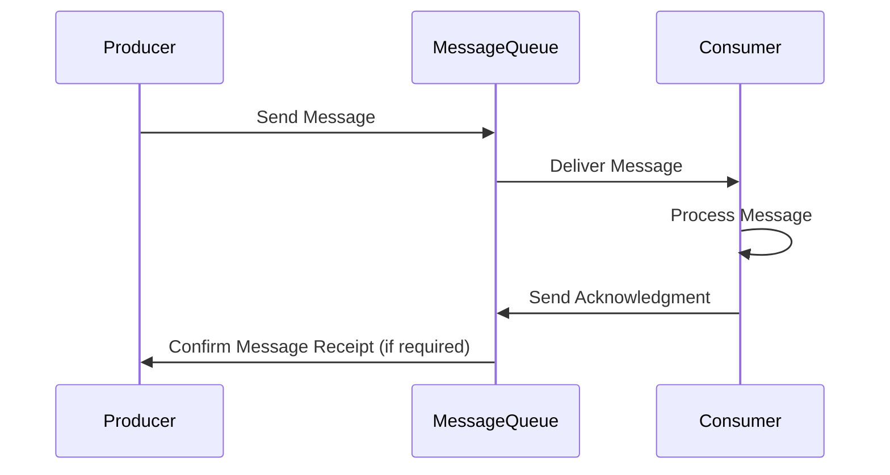

### Introduction

In distributed systems and cloud computing environments, processing streams of data reliably is a significant challenge, especially in scenarios involving large-scale message queues and stream processing systems. Achieving data consistency and reliable message processing necessitates the implementation of **Acknowledgment Protocols**. These protocols ensure that messages are not lost and are processed exactly once. This article explores the concept, importance, and implementation of acknowledgment protocols in stream processing architectures.

### What are Acknowledgment Protocols?

Acknowledgment protocols refer to the mechanisms that require consumers of messages to explicitly confirm the receipt and successful processing of those messages. Involvement includes:

- **Guaranteeing message delivery**: Messages are not discarded from the queue until an acknowledgment is received from the consumer.
- **Error handling**: If messages fail to be processed, they can be re-queued.
- **Ensuring data integrity**: By requiring acknowledgments, systems can achieve "exactly-once" or "at-least-once" processing semantics, minimizing data loss or duplication.

### Importance in Stream Processing

- **Reliability**: Ensures that all messages are delivered and processed even in the case of consumer failures.
- **Fault Recovery**: Supports automatic retries of message processing if the acknowledgment is not received within a certain period.
- **Consistency**: Helps in maintaining the state consistency of processing applications by guaranteeing the acknowledgment for each processed message.

### Implementation Approaches

1. **Automatic Acknowledgments**: Once a consumer successfully processes a message, the broker automatically registers an acknowledgment. This is efficient but may lead to message loss in the event of consumer crashes before processing.
  
2. **Manual Acknowledgments**: Consumers explicitly send acknowledgments after verifying that messages have been successfully processed. This method provides greater control and reliability.

#### Example Code Snippet

Below is an example implementation using a message queue with a manual acknowledgment feature in Java:

```java
import com.rabbitmq.client.*;

public class ManualAckConsumer {
    private final static String QUEUE_NAME = "example_queue";

    public static void main(String[] argv) throws Exception {
        ConnectionFactory factory = new ConnectionFactory();
        factory.setHost("localhost");
        Connection connection = factory.newConnection();
        Channel channel = connection.createChannel();

        channel.queueDeclare(QUEUE_NAME, false, false, false, null);
        System.out.println(" [*] Waiting for messages. To exit press CTRL+C");

        DeliverCallback deliverCallback = (consumerTag, delivery) -> {
            String message = new String(delivery.getBody(), "UTF-8");
            System.out.println(" [x] Received '" + message + "'");
            try {
                doWork(message);
                channel.basicAck(delivery.getEnvelope().getDeliveryTag(), false);
            } catch (Exception e) {
                channel.basicNack(delivery.getEnvelope().getDeliveryTag(), false, true);
            }
        };

        channel.basicConsume(QUEUE_NAME, false, deliverCallback, consumerTag -> {});
    }

    private static void doWork(String task) {
        // Simulates processing time
        try {
            Thread.sleep(1000);
        } catch (InterruptedException e) {
            Thread.currentThread().interrupt();
        }
    }
}
```

### Diagram Representation



### Related Patterns

- **Retry Pattern**: Works alongside acknowledgment protocols to handle transient failures by retrying message processing.
- **Event Sourcing**: Maintains a log of changes that can serve as an audit trail combined with acknowledgment protocols.
- **Idempotent Consumer**: Ensures that processing the same message more than once does not result in inconsistency.

### Additional Resources

- [RabbitMQ Acknowledgments and Publisher Confirms](https://www.rabbitmq.com/confirms.html)
- [Apache Kafka Documentation: Delivery Guarantees](https://kafka.apache.org/documentation/#semantics)
- [AWS SQS: Managing Visibility Timeout](https://docs.aws.amazon.com/AWSSimpleQueueService/latest/SQSDeveloperGuide/sqs-visibility-timeout.html)

### Summary

Acknowledgment protocols are critical components of reliable stream processing systems. By implementing these protocols, systems ensure data consistency, fault tolerance, and ultimately a more robust message processing environment. Deciding between automatic and manual acknowledgment and understanding the trade-offs of each approach provides flexibility based on specific use case requirements. Through these mechanisms, enterprises can scale their distributed systems while maintaining data integrity and reliability.
