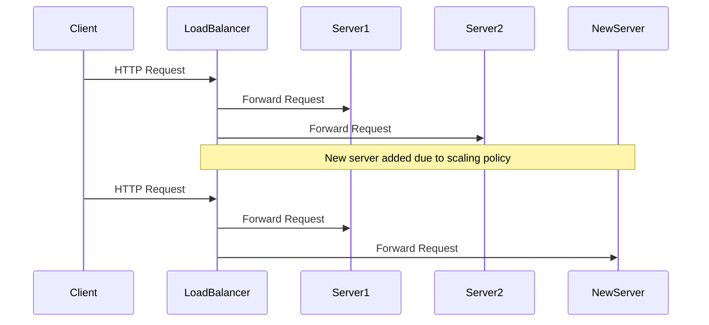

## Horizontal Scaling

**Horizontal Scaling** is a design pattern used in cloud computing and distributed systems to increase system capacity, improve performance, and ensure high availability by adding more nodes or machines. This approach effectively distributes the workload across multiple servers and is essential for systems that require to process large volumes of data or handle high concurrency levels efficiently.

### Architectural Approach

In horizontal scaling, additional servers are added to a cluster to manage the increased workload. Each server operates independently, ensuring that failure of one node does not significantly impact the system's overall performance. Load balancers are typically used to distribute requests evenly across available servers, ensuring efficient resource utilization and minimizing bottlenecks.

#### Key Components:

- **Load Balancer**: Directs traffic across multiple servers, ensuring even distribution of workloads.
- **Cluster Manager**: Manages the addition and removal of nodes, coordinating between load balancers and existing nodes.
- **Stateless Nodes**: Servers are often stateless to allow for easy addition or removal and facilitated fault tolerance.

### Best Practices

- **Use Stateless Services**: Design services to be stateless wherever possible to simplify scaling and recovery.
- **Implement Robust Load Balancing**: Utilize dynamic load balancing techniques to optimize performance and reduce latency.
- **Monitor System Health**: Implement comprehensive monitoring and alerting to ensure the health of the cluster and quickly address performance issues.
- **Automate Scaling Operations**: Use cloud platforms' auto-scaling features to automatically adjust the number of nodes based on load and capacity requirements.

### Example Code

Below is an example of how you might configure a cloud computing service to dynamically scale out by adding more instances using an AWS-like SDK:

```typescript
const autoScaling = new AutoScalingClient({ region: "us-west-2" });

const params = {
  AutoScalingGroupName: "my-app-asg",
  PolicyName: "my-scale-out-policy",
  AdjustmentType: "ChangeInCapacity",
  ScalingAdjustment: 1
};

autoScaling.putScalingPolicy(params, (err, data) => {
  if (err) {
    console.error("Error creating scaling policy", err);
  } else {
    console.log("Scaling policy created successfully", data);
  }
});
```

### Diagram



### Related Patterns

1. **Vertical Scaling**: Unlike horizontal scaling, vertical scaling involves adding more resources (CPU, memory) to a single server.
2. **Partitioning**: Dividing a database into smaller, more manageable pieces without horizontally scaling.
3. **Load Balancing**: Critical for ensuring effective horizontal scaling as it distributes the workload.

### Additional Resources

- *Designing Data-Intensive Applications* by Martin Kleppmann
- AWS Auto Scaling Documentation
- Fundamentals of Load Balancing on Google Cloud

### Final Summary

Horizontal Scaling is a foundational design pattern integral to managing modern cloud applications requiring high availability and scalability. By distributing the workload across multiple machines, systems can handle more traffic and data, offering robust fault tolerance and performance optimization. This design pattern, employed in conjunction with stateless design and dynamic load balancing, enables responsive and efficient scaling solutions that readily adapt to the varying demands of real-world applications.
