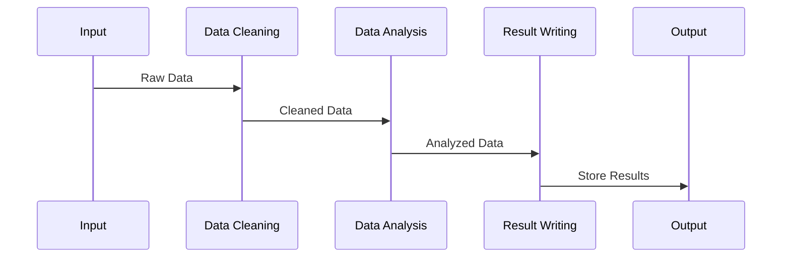

## Pipelining Design Pattern: Organizing Processing Tasks into Stages

### Detailed Explanation

The Pipelining pattern is a design concept derived from the world of assembly lines and enhances the parallel processing capabilities in distributed and parallel computing. By decomposing complex processing tasks into a series of distinct stages, it allows these stages to execute concurrently and continuously process different chunks of data sequentially. This means that subsequent stages can start processing even before the previous stage has finished completely, thus optimizing resource utilization and reducing time-to-completion for tasks.

#### Key Concepts:

- **Sequential Stages**: Tasks are broken down into independent processing units.
- **Concurrent Execution**: Each stage processes data simultaneously as soon as it receives input, allowing various stages to run in parallel.
- **Buffering**: Data is buffered between stages to ensure smooth data flow and manage variances in processing speed across different stages.

### Architectural Approach

The architectural foundation of the Pipelining pattern rests on a few critical components:

1. **Design Task Stages**: Identify and define the stages necessary to transform raw input data to the desired output.
2. **Parallelism Management**: Use thread pools, asynchronous methods, or external systems to allow stages to run concurrently.
3. **Data Flow Handling**: Implement buffers or messaging systems like Kafka or RabbitMQ to handle data transfer between stages.
4. **Error Handling and Compensation**: Ensure that error detection and compensation mechanisms are integrated to handle faults and retries without disrupting the pipeline flow.

### Example Code

Here’s a simplified example of how a pipeline might be constructed in Java using an ExecutorService for concurrent stage execution:

```java
import java.util.concurrent.Executors;
import java.util.concurrent.ExecutorService;
import java.util.List;
import java.util.stream.Collectors;
import java.util.stream.IntStream;

public class PipelineExample {

    public static void main(String[] args) {
        ExecutorService executor = Executors.newFixedThreadPool(3);

        List<Integer> data = IntStream.range(0, 100).boxed().collect(Collectors.toList());

        data.stream().map(PipelineExample::dataCleaningStage)
            .map(PipelineExample::dataAnalysisStage)
            .forEach(d -> executor.submit(() -> resultWritingStage(d)));

        executor.shutdown();
    }

    public static Integer dataCleaningStage(Integer input) {
        // Cleaning logic here
        return input * 2; // Dummy transformation
    }

    public static Integer dataAnalysisStage(Integer input) {
        // Analysis logic here
        return input / 2; // Dummy analysis
    }

    public static void resultWritingStage(Integer input) {
        // Writing logic here
        System.out.println("Data: " + input);
    }
}
```

### Diagrams

Here’s a Mermaid sequence diagram representing the flow between stages:



### Related Patterns

- **Batch Processing**: Processes tasks in batches; more static compared to pipelining.
- **Stream Processing**: Operates on continuous flows of data; pipelining can be used within stream processing systems.
- **Event-Driven Architecture**: Utilizes events to trigger processing, which can be integrated into pipeline models.

### Additional Resources

- Martin Fowler's blog has excellent articles on [Pipelines and Microservices](https://martinfowler.com/articles/pipelines.html).
- [The Reactive Manifesto](https://www.reactivemanifesto.org/) explores paradigms that support patterns like pipelining in distributed systems.

### Summary

The Pipelining design pattern is a powerful architectural structure that enhances data throughput and processing efficiency by simultaneously using discrete stages of processing. It is particularly well-suited for systems requiring rapid processing of large datasets, such as in big data and real-time analytics scenarios. By decoupling process stages and allowing concurrent execution, a well-designed pipeline can significantly leverage available computing resources and accelerate the end-to-end processing pipeline.
