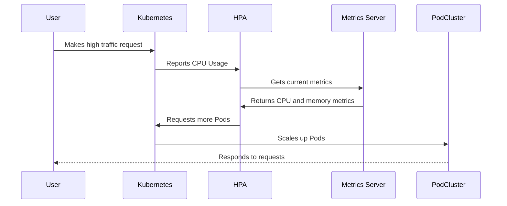

## Autoscaling

**Description**: Autoscaling is a design pattern that involves the automatic adjustment of computational resources, such as nodes or instances, based on the current load and performance metrics. This pattern is essential for maintaining optimal system performance and cost-efficiency, especially in cloud environments where demand can fluctuate significantly.

### Detailed Explanation

Autoscaling leverages performance metrics, such as CPU usage, memory usage, and request rates, to dynamically increase or decrease the number of running instances in a computing environment. This pattern helps maintain application stability during traffic spikes and ensures resource efficiency during low demand periods.

#### Key Components

1. **Metrics Collection**: Gathering data on system performance, usually involving CPU loads, memory usage, request/response times, and other relevant parameters.
2. **Decision Engine**: Analyzing the collected metrics to decide when scaling up (adding resources) or scaling down (removing resources) is necessary. This can be configured to use thresholds, predictive models, or machine learning algorithms.
3. **Activation Mechanism**: Initiating the scaling actions determined by the decision engine. This typically involves APIs or cloud service management tools.
4. **Load Balancers**: Distributing network or application traffic across multiple servers to ensure consistent application performance and availability.

### Architectural Approaches

- **Reactive Autoscaling**: Adjusts resources in response to real-time metrics, with a focus on quickly responding to demand changes.
- **Proactive Autoscaling**: Uses predictive models to forecast future demand, thus preemptively adjusting resources ahead of demand changes.
- **Scheduled Autoscaling**: Involves pre-defined schedules based on known patterns in demand, such as peak business hours or seasonal shifts.

### Best Practices

- Monitor and review resource usage patterns regularly to adjust scaling policies.
- Set appropriate scaling thresholds to balance between performance and cost.
- Integrate autoscaling with robust logging and monitoring solutions to troubleshoot and optimize performance.
- Use gradual auto-scaling strategies to prevent system instability due to rapid scaling actions.

### Example Code

Here’s a simple example using Kubernetes' Horizontal Pod Autoscaler (HPA):

```yaml
apiVersion: autoscaling/v2beta2
kind: HorizontalPodAutoscaler
metadata:
  name: example-hpa
spec:
  scaleTargetRef:
    apiVersion: apps/v1
    kind: Deployment
    name: example-deployment
  minReplicas: 1
  maxReplicas: 10
  metrics:
  - type: Resource
    resource:
      name: cpu
      target:
        type: Utilization
        averageUtilization: 50
```

### Diagrams



### Related Patterns

- **Load Balancing**: Distributing network requests across multiple resources to optimize response time and resource utilization.
- **Throttling**: Controlling the amount of load sent to an application to protect against overloading resources.
- **Circuit Breaker**: Fails fast and prevents system overloads by temporarily cutting off problematic services or resources.

### Additional Resources

- [Kubernetes Documentation: Horizontal Pod Autoscaler](https://kubernetes.io/docs/tasks/run-application/horizontal-pod-autoscale/)
- [AWS Auto Scaling](https://aws.amazon.com/autoscaling/)
- [Google Cloud Autoscaler](https://cloud.google.com/compute/docs/autoscaler)

### Summary

The Autoscaling design pattern plays a vital role in ensuring applications remain performant and cost-efficient in dynamic and potentially high-demand environments, such as cloud-based infrastructure. By leveraging real-time and predictive data, autoscaling ensures that resources are effectively aligned with current demands, thereby optimizing both utilization and application responsiveness.
