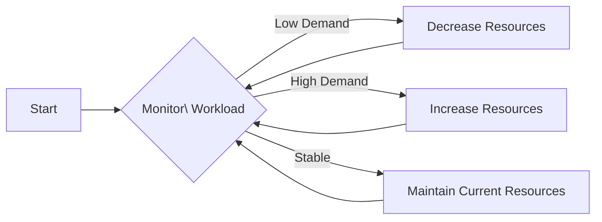

## Introduction

Dynamic Resource Allocation is a design pattern commonly used in cloud computing environments, especially in contexts like stream processing, where workloads can fluctuate rapidly. This pattern entails dynamically adjusting the allocation of resources such as CPU and memory to meet the current processing demands efficiently.

## Problem

In environments with variable workloads, static resource allocation can lead to underused resources during low demand and resource exhaustion during high demand, leading to inefficient costs and potential processing delays or failures.

## Solution

Dynamic Resource Allocation provides a mechanism to monitor workloads and adjust resource allocation on-the-fly. This solution involves:

- Monitoring system performance and current workload.
- Adjusting resources such as CPU and memory to ensure efficient processing.
- Utilizing cloud provider APIs to automate scaling of resources up or down as needed.

## Architectural Approach

1. **Monitoring**: Continuous performance monitoring to detect workload changes.
2. **Scaling Decisions**: Algorithms to decide whether to scale resources up or down based on preset thresholds.
3. **Implementation Tools**: Utilization of cloud platform auto-scaling tools, container orchestration systems like Kubernetes, or stream processing frameworks with built-in dynamic allocation features.

## Example Code

Here's an example of how dynamic resource allocation can be implemented using Apache Spark:

```scala
import org.apache.spark.streaming.{Seconds, StreamingContext}
import org.apache.spark.SparkConf

object DynamicResourceAllocationExample {

  def main(args: Array[String]): Unit = {
    val conf = new SparkConf().setAppName("DynamicResourceAllocationExample")
    conf.set("spark.dynamicAllocation.enabled", "true")
    conf.set("spark.dynamicAllocation.minExecutors", "1")
    conf.set("spark.dynamicAllocation.maxExecutors", "10")
    
    val ssc = new StreamingContext(conf, Seconds(10))

    // Define processing logic here

    ssc.start()
    ssc.awaitTermination()
  }
}
```

This Spark application leverages Spark's dynamic allocation feature to automatically adjust the number of executors.

## Diagrams

Below is a simplified diagram of Resource Allocation adjustment over time.



## Related Patterns

- **Auto-Scaling**: Automatically adjusts the number of computing instances in cloud-based architectures.
- **Load Balancing**: Distributes incoming requests evenly among available resources to avoid overload and optimize performance.
- **Circuit Breaker**: Temporarily halts service calls to a failing service to give it a chance to recover.

## Best Practices

- Always monitor the effectiveness of dynamic allocation by reviewing performance metrics and adjusting scaling policies based on historical data.
- Establish minimum and maximum resource limits to prevent excessive scaling, which could either lead to unnecessary costs or insufficient capacity.
- Integrate with a robust monitoring tool to capture detailed metrics for analysis and fine-tuning of resource allocation strategies.

## Additional Resources

- [Apache Spark Dynamic Resource Allocation](https://spark.apache.org/docs/latest/job-scheduling.html#dynamic-resource-allocation)
- [Kubernetes Horizontal Pod Autoscaler](https://kubernetes.io/docs/tasks/run-application/horizontal-pod-autoscale/)
- [AWS Auto Scaling](https://aws.amazon.com/autoscaling/)

## Summary

Dynamic Resource Allocation is a crucial pattern for efficiently managing resources in environments with fluctuating demands, such as stream processing. By dynamically adjusting resources, organizations can optimize performance, reduce costs, and maintain a smooth, uninterrupted service experience. Integrating this pattern with robust monitoring and control algorithms ensures scalable and cost-effective operations.
