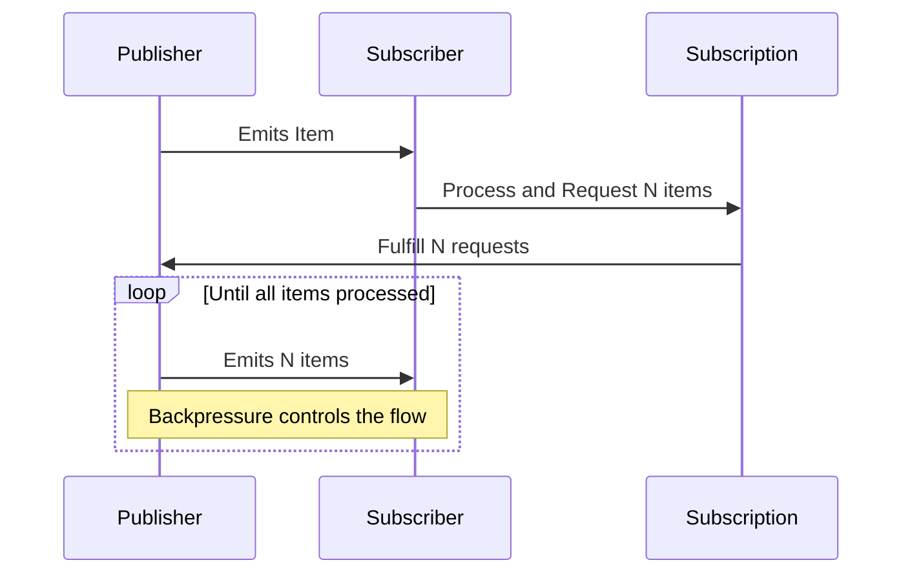

## Introduction

In distributed systems, especially those dealing with real-time streaming data, maintaining an optimal flow of data across various components is crucial. Backpressure handling is an essential design pattern used to manage data flow, prevent saturation and overloading of system components, and ensure the system remains stable, responsive, and efficient.

## What is Backpressure?

Backpressure refers to the mechanisms and strategies used in stream processing to control the data flow rate. It signals upstream components to adjust their output when downstream consumers can't process data quickly enough, thus preventing data bottlenecks and resource exhaustion.

## Architectural Approach

### Reactive Streams

A common approach to implementing backpressure is through the use of Reactive Streams, a specification that defines a standard for asynchronous streams of data with non-blocking backpressure. Reactive Streams libraries, such as Project Reactor, Akka Streams, and RxJava, enable seamless backpressure handling:

- **Publisher**: The source of data that emits items to one or more Subscribers based on request demand.
- **Subscriber**: The entity that processes the data items, requesting and consuming them at its own pace.
- **Subscription**: Represents the connection between the Publisher and Subscriber, allowing the Subscriber to request a specific number of data items.

### Design Considerations

1. **Adaptive Data Flow**: Implement flow control to dynamically adjust the data production rate based on consumer processing capacity.
2. **Resource Management**: Optimize memory and CPU utilization by preventing data queues from growing indefinitely.
3. **Resilience and Fault Tolerance**: Ensure the system can gracefully handle sudden spikes in data without crashing or losing data.

## Example Code

Here is a basic example implementing backpressure using the Project Reactor library in Java:

```java
import reactor.core.publisher.Flux;
import reactor.util.concurrent.Queues;

public class BackpressureExample {

    public static void main(String[] args) {
        Flux.range(1, 100)
            .onBackpressureBuffer(Queues.SMALL_BUFFER_SIZE())
            .subscribe(new BaseSubscriber<>() {
                @Override
                protected void hookOnSubscribe(Subscription subscription) {
                    request(10); // Initial request
                }

                @Override
                protected void hookOnNext(Integer value) {
                    processItem(value);
                    request(10); // Request more after processing
                }
            });
    }

    private static void processItem(Integer item) {
        System.out.println("Processed item: " + item);
        try {
            Thread.sleep(100); // Simulate processing time
        } catch (InterruptedException e) {
            Thread.currentThread().interrupt();
        }
    }
}
```

## Diagrams

### Mermaid UML Sequence Diagram



## Related Patterns

- **Circuit Breaker**: Allows upstream components to fail fast and protect the system from being overwhelmed by excessive load.
- **Throttling**: Limits the rate at which a certain action can be performed to prevent overwhelming downstream systems.
- **Load Shedding**: Drops less critical data during periods of high demand to ensure critical processing is not impacted.

## Additional Resources

- ["Reactive Streams Specification"](https://www.reactive-streams.org/)
- ["Project Reactor Documentation"](https://projectreactor.io/docs/core/release/reference/)
- ["Understanding Backpressure in Reactive Systems"](https://medium.com/reactive-streams/reactive-streams-specification-features-interoperability-e53f3235df95)

## Summary

Backpressure handling is a vital concept in streaming and reactive systems that enables adaptive data flow management by signaling upstream components to tailor data output to match the processing capabilities of downstream components. By incorporating backpressure mechanisms, systems can enhance resource utilization, maintain stability under varying loads, and improve overall application performance and reliability.
