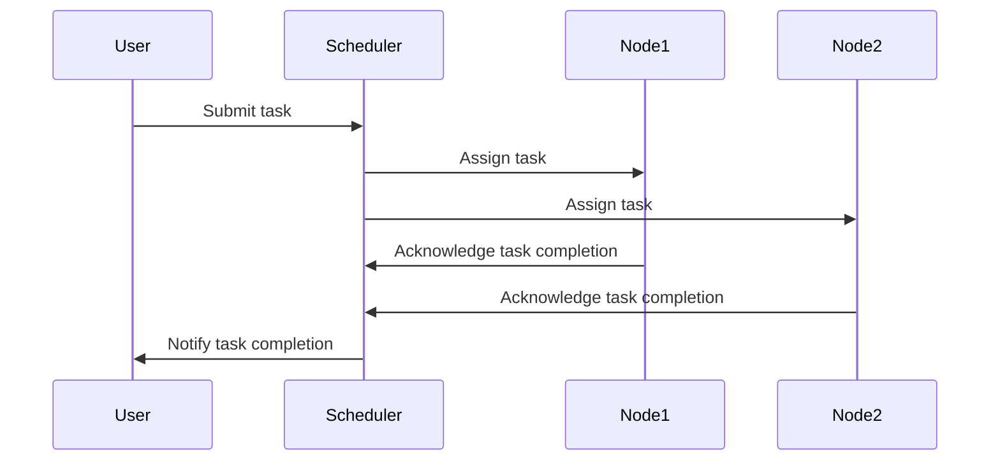

## Introduction

Distributed scheduling is a design pattern that coordinates task execution across multiple nodes to optimize resource utilization and performance. This pattern is essential for achieving scalability and fault tolerance in distributed systems. It often involves frameworks or services that distribute tasks dynamically based on resource availability and task requirements.

## Key Concepts

- **Task Coordination**: Efficiently managing the distribution and execution of tasks across a cluster of nodes. This involves determining where tasks should execute based on resource availability and policy constraints.
- **Resource Optimization**: Ensuring that tasks are executed in a manner that makes the best use of available resources, such as CPU, memory, and network bandwidth.
- **Scalability**: Automatically adjusting the number of tasks and their distribution in response to changes in workload.
- **Fault Tolerance**: Ensuring that the failure of a node does not result in the loss of tasks or impact the system's ability to process workload. Tasks can be rescheduled on other nodes.

## Architectural Approaches

1. **Centralized Scheduling**: A single-point scheduler that manages all task distributions within the system. Examples include Apache Mesos and Hadoop YARN. This approach can become a bottleneck as scale increases.
   
2. **Decentralized Scheduling**: Tasks are scheduled locally by each node based on available resources. This approach improves scalability but may lead to suboptimal resource utilization if not properly managed.

3. **Hierarchical Scheduling**: Combines centralized and decentralized scheduling by using multiple levels of scheduling entities. An example is Kubernetes, where a central API server schedules tasks across nodes, but individual nodes execute tasks.

4. **Reactive Scheduling**: Adapts the allocation of tasks based on real-time performance and resource usage metrics. This approach ensures resource-efficient scheduling and better response to changing demands.

## Best Practices

- **Use of Observability Tools**: Implement monitoring and logging to gain insights into resource utilization and task performance.
- **Dynamic Resource Allocation**: Utilize autoscaling features provided by many scheduling frameworks to adjust resource allocation dynamically based on demand.
- **Task Prioritization and Queuing**: Implement priority queues to ensure critical tasks are scheduled first, and strategies for handling task starvation.

## Example Code

```json
{
  "type": "job",
  "name": "stream-processing-task",
  "scheduling": {
    "strategy": "round-robin",
    "priority": "high"
  },
  "resources": {
    "cpu": "2",
    "memory": "4G"
  }
}
```

## Mermaid Diagram



## Related Patterns

- **Load Balancing**: Distributes incoming network traffic across multiple servers to ensure no single server becomes overwhelmed.
- **Job Queue**: Manages a list of tasks to be processed by workers, handling task prioritization and reruns.

## Additional Resources

- [Apache Mesos Documentation](http://mesos.apache.org/documentation/latest/)
- [Hadoop YARN Architecture](https://hadoop.apache.org/docs/r3.3.3/hadoop-yarn/hadoop-yarn-site/YARN.html)
- [Kubernetes Scheduling](https://kubernetes.io/docs/concepts/scheduling/kube-scheduler/)

## Summary

Distributed scheduling is crucial for optimizing resource usage and ensuring the efficient execution of tasks in a distributed system. By coordinating task execution across multiple nodes, systems can achieve higher performance, scalability, and fault tolerance. Implementing distributed scheduling involves carefully considering the architectural approach, accommodating changing workloads, and effectively prioritizing tasks to maximize system capabilities.
