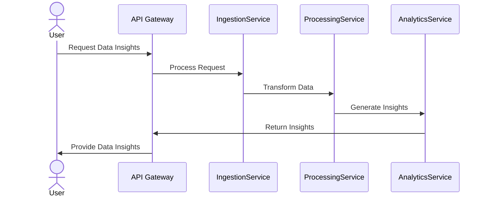

## Description

Microservices Architecture is an architectural style that structures an application as a collection of small autonomous services, each running in its own process and communicating with lightweight mechanisms, often HTTP resource APIs. These services are built around business capabilities and can be deployed independently. This pattern enables scalable, flexible, and resilience-focused systems by allowing individual services to be developed, tested, deployed, and scaled separately.

Key characteristics of microservices include:

1. **Independence**: Services operate independently and are developed autonomously by different teams.
2. **Resilience**: Failures in one service do not affect the others, facilitating greater reliability.
3. **Scalability**: Each service can be scaled independently, which allows for efficient resource utilization.
4. **Technology Diversity**: Different services can use different technology stacks, allowing teams to pick what's best for their context.

## Example

Consider a data pipeline application where distinct services handle data ingestion, processing, and analytics separately. Each service can be scaled or updated without affecting the others:

- **Data Ingestion Service**: Handles incoming data streams and may need to be scaled based on the volume of incoming data.
- **Processing Service**: Executes complex data transformations and may require scaling based on CPU or memory needs.
- **Analytics Service**: Provides data insights and reporting, potentially with API access, and can be scaled to cope with demand from user queries.

This separation allows each team to optimize their part of the system based on its specific requirements.

## Best Practices

- **API Gateway**: Use an API gateway to aggregate service calls and present them as a cohesive API to consumers.
- **Service Registry**: Employ service discovery mechanisms for automatic service registration and consumption.
- **Decentralized Data Management**: Services typically manage their databases independently, enhancing loose coupling.
- **Log Aggregation and Monitoring**: Implement centralized logging and monitoring to handle the complexity of distributed systems.

## Example Code

Here's a conceptual snippet of services in a microservices architecture using Kotlin and Spring Boot:

```kotlin
@SpringBootApplication
class IngestionServiceApplication

fun main(args: Array<String>) {
    runApplication<IngestionServiceApplication>(*args)
}

@RestController
@RequestMapping("/ingest")
class IngestionController {

    @PostMapping
    fun ingestData(@RequestBody data: DataPayload): ResponseEntity<*> {
        // Logic to process incoming data and forward to processing service
        return ResponseEntity.ok().build()
    }
}
```

Each service would have its own codebase, configuration, and deployment pipeline.

## Diagrams

Below is a simple Mermaid diagram illustrating interactions in a microservices architecture:



## Related Patterns

1. **Event-Driven Architecture Pattern**: Often used with microservices to decouple service interactions further.
2. **Service Mesh**: Provides service-to-service communication within microservices architectures.
3. **BFF (Backend for Frontend)**: Each frontend application has its own backend that communicates with micrоservices.

## Additional Resources

- [Martin Fowler on Microservices](https://martinfowler.com/articles/microservices.html)
- [Spring Cloud Documentation](https://spring.io/projects/spring-cloud)
- [Microservices Patterns by Chris Richardson](https://microservices.io/patterns/index.html)

## Summary

Microservices Architecture has revolutionized how software applications are designed to be more fault-tolerant, flexible, and scalable by encapsulating functionality in independently deployable services. By aligning closely with business capabilities and enabling continuous deployment, this paradigm facilitates rapid innovation and efficient resource use in cloud-native environments.
