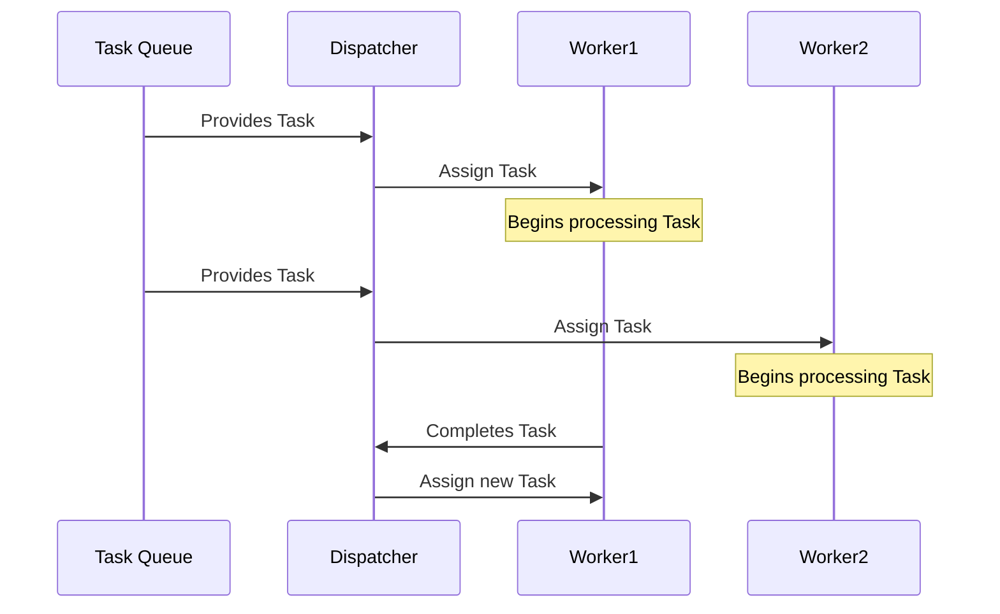

## Introduction

Worker Pools is a commonly used design pattern in cloud computing to efficiently manage task processing in a concurrent, scalable manner. By utilizing a pool of worker threads or processes, systems can handle multiple tasks in parallel while managing system resource usage effectively. This approach is particularly useful in applications that require high throughput and reduced latency, such as stream processing tasks.

## Design Pattern Explained

### Key Components

1. **Task Queue**: Consists of tasks that need to be processed. These tasks are often generated by various application components or APIs.

2. **Workers**: A set of threads or processes that repeatedly obtain tasks from the task queue and execute them independently. These workers are reusable, and upon completing a task, they return to fetch another one from the queue.

3. **Task Dispatcher**: An orchestrator responsible for assigning tasks from the task queue to different workers. It ensures load balancing and optimizes resource usage to avoid bottlenecks.

### Architectural Approach

When a new task arrives, the task is enqueued in the Task Queue. The Task Dispatcher then assigns it to one of the idle workers while considering load balancing strategies. Once a worker picks up the task, it processes it independently and returns to fetch the next task in the queue. This cycle continues, allowing for scalable and efficient task processing.

### Example Code

```java
import java.util.concurrent.Executors;
import java.util.concurrent.ExecutorService;
import java.util.concurrent.BlockingQueue;
import java.util.concurrent.LinkedBlockingQueue;

// Example of Worker Pool pattern in Java
class WorkerPoolExample {
    private final ExecutorService executor;
    private final BlockingQueue<Runnable> taskQueue;

    public WorkerPoolExample(int numOfWorkers) {
        taskQueue = new LinkedBlockingQueue<>();
        executor = Executors.newFixedThreadPool(numOfWorkers);
    }

    public void submitTask(Runnable task) {
        taskQueue.offer(task);
    }

    public void startProcessing() {
        while (!taskQueue.isEmpty()) {
            try {
                executor.execute(taskQueue.poll());
            } catch (Exception e) {
                System.err.println("Failed to process task: " + e.getMessage());
            }
        }
    }

    public void shutdown() {
        executor.shutdown();
    }
}

// Usage
public class App {
    public static void main(String[] args) {
        WorkerPoolExample pool = new WorkerPoolExample(5); // Initializes a pool with 5 workers.

        // Submitting tasks
        for (int i = 0; i < 10; i++) {
            final int index = i;
            pool.submitTask(() -> System.out.println("Processing Task " + index));
        }

        // Start processing tasks
        pool.startProcessing();
        pool.shutdown();
    }
}
```

### Diagram



## Related Patterns

- **Event-Driven Architecture**: Similar in handling tasks but focuses on event messaging systems rather than task queues.
- **Batch Processing**: A delayed processing approach that collects tasks and processes them in bulk, less interactive than Worker Pools.
- **Circuit Breaker**: Helps manage task failures in networked applications, potentially freezing the Worker Pool at failures.

## Best Practices

- **Optimal Worker Count**: Tune the number of workers based on the system's hardware capabilities and the complexity of tasks.
- **Error Handling**: Implement robust error handling to gracefully manage task failures without crashing the system.
- **Task Prioritization**: Add priority levels for tasks in the queue to ensure the most critical tasks are processed first.

## Additional Resources

- [ExecutorService Documentation](https://docs.oracle.com/javase/8/docs/api/java/util/concurrent/ExecutorService.html)
- [Java Concurrency in Practice by Brian Goetz](https://www.amazon.com/Java-Concurrency-Practice-Brian-Goetz/dp/0321349601)

## Summary

The Worker Pools pattern optimizes task processing by creating worker threads or processes that efficiently handle a concurrent workload. It is crucial in applications demanding high throughput and reduced latency. By following best practices such as optimal worker count adjustment, robust error handling, and task prioritization, you can leverage the full potential of Worker Pools for your cloud computing solutions.
