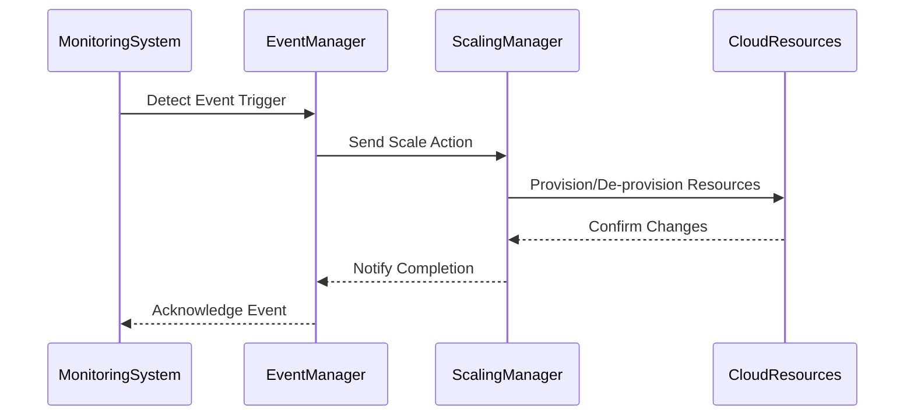

## Event-Driven Scaling Design Pattern

Event-Driven Scaling is a cloud computing design pattern that allows systems to automatically adjust their resources in response to varying loads and real-time events. By implementing this pattern, cloud applications can maintain optimal performance and cost-efficiency by scaling up to handle spikes in demand and scaling down when demand decreases.

### Detailed Explanation

The core idea behind Event-Driven Scaling is to utilize system-generated events to trigger actions that adjust computing resources. This is particularly useful in scenarios with highly variable workloads, ensuring applications remain responsive and efficient.

#### Key Components:
- **Event Triggers**: Specific conditions that, when met, initiate a scaling action. Common triggers include queue lengths, CPU and memory utilization, or custom metrics setup in monitoring tools.
- **Scaling Policies**: Rules that define how the system should scale, including the minimum and maximum number of instances, and the step size of scaling actions.
- **Resource Provisioning**: The mechanism that allocates or deallocates resources such as virtual machines, containers, or serverless functions in response to scaling actions.

### Architectural Approach

1. **Monitoring System**: Continuously evaluates the metrics and queues associated with your application.
2. **Event Generation**: When the monitored parameters cross predefined thresholds, events are generated.
3. **Action Handler**: Responds to the events by executing scaling actions, which may involve triggering cloud provider auto-scaling groups or custom orchestration scripts.
4. **Feedback Loop**: Continuously adjusts scaling parameters based on current performance and system state.



### Example Code: AWS Lambda Scaling

```javascript
// Node.js script to manage AWS Lambda function scaling
const AWS = require('aws-sdk');
const lambda = new AWS.Lambda();

exports.handler = async (event) => {
    const params = {
        FunctionName: 'MyFunction',
        // Adjust these settings as per your scaling policy and event triggers
        ReservedConcurrency: event.desiredConcurrency
    };

    try {
        const data = await lambda.putFunctionConcurrency(params).promise();
        console.log(`Concurrency successfully set: ${data}`);
    } catch (error) {
        console.error(`Error setting concurrency: ${error}`);
    }
};
```

### Best Practices

- **Leverage Cloud Provider Tools**: Use built-in auto-scaling features from cloud providers like AWS Auto Scaling, Azure's Virtual Machine Scale Sets, or Google Cloud's Autoscaler.
- **Granular Monitoring**: Implement detailed monitoring to catch subtle changes in workload patterns early, reducing reaction time for scaling actions.
- **Test Scaling Policies**: Regularly test scaling policies to ensure they perform correctly under various scenarios.

### Related Patterns

- **Reactive Streams**: Utilizes backpressure and flow control to manage the rate of data flow in complex stream processing systems.
- **Circuit Breaker**: Prevents a system from trying to execute a function that's likely to fail, designed to act during peak loads or unexpected failures.

### Additional Resources

- [AWS Auto Scaling Documentation](https://docs.aws.amazon.com/autoscaling/)
- [Azure Virtual Machine Scale Sets](https://learn.microsoft.com/en-us/azure/azure-monitor/vm-scale-set-monitoring)
- [Google Cloud Autoscaler](https://cloud.google.com/compute/docs/autoscaler)

### Summary

Event-Driven Scaling is a powerful design pattern that ensures cloud applications remain responsive and efficient by dynamically adjusting resources based on real-time events. By strategically implementing this pattern, businesses can optimize performance while controlling operational costs. Integrating robust monitoring and well-defined scaling policies is essential for successful deployment.
