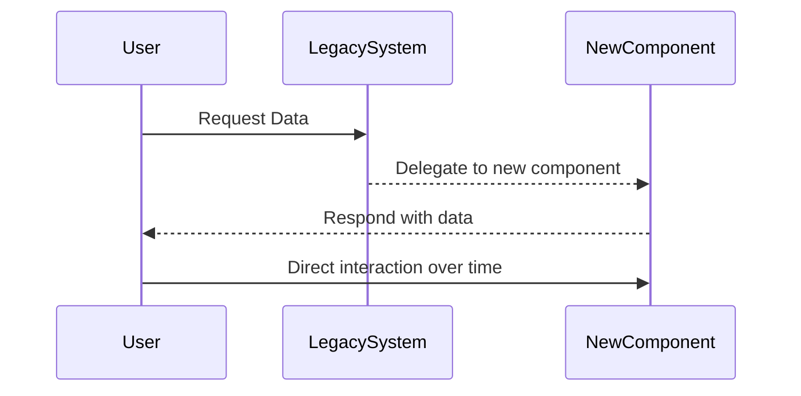

## Strangler Pattern

The Strangler Pattern is a design approach where new system components are developed alongside existing (often legacy) systems. Over time, the new system "strangles" or replaces parts of the old system until the legacy application can be fully decommissioned. This pattern facilitates gradual system modernization, reducing risks and costs typically associated with big-bang migrations.

### Architectural Approach

1. **Analyze Existing System**: Identify which parts of the legacy system should be targeted for replacement or scaling. Prioritize components based on business needs and technical debt.

2. **Design New Components**: Develop new services or modules that encapsulate the functionality of the old components. Preferably, each new component should be implemented using modern technologies and practices.

3. **Integrate with Existing System**: Seamlessly integrate the new components with the existing system to ensure compatibility and continuity of services.

4. **Migrate Services**: Gradually redirect users or processes from the old system to the new components. This redirection can occur at different levels: UI, API gateway, or database triggers.

5. **Monitor and Optimize**: Continuously monitor system performance and user feedback. Optimize new components for scalability and maintainability.

6. **Decommission Legacy Components**: Once new components are fully operational and tested, retire associated legacy components.

### Example Code

Suppose you're transitioning a payment processing component from a monolithic application to a microservice architecture using Java and Spring Boot.

#### Old System Service Code

```java
public class LegacyPaymentService {
    public void processPayment(Transaction transaction) {
        // legacy business logic
    }
}
```

#### New Microservice

```java
@RestController
@RequestMapping("/api/v1/payments")
public class PaymentService {
    
    @PostMapping("/process")
    public ResponseEntity<String> processPayment(@RequestBody Transaction transaction) {
        // modern processing logic
        return ResponseEntity.ok("Payment processed");
    }
}
```

### Related Patterns

- **Facade Pattern**: Provides a simple interface to complex subsystems, often coinciding with Strangler Pattern to abstract legacy systems.
- **Anti-Corruption Layer**: Prevents a new system from being polluted by the old system's peculiarities.
- **Adapter Pattern**: Allows new code to interact with legacy components.

### Diagrams

Here’s a simple Mermaid diagram demonstrating the Strangler Pattern application flow:



### Best Practices

- **Incremental Approach**: Transition functionalities in increments rather than all at once.
- **Feedback Loops**: Implement feedback mechanisms to detect issues early.
- **Version Management**: Keep track of versions between old and new components for rollback if needed.
- **Thorough Testing**: Implement robust testing strategies to ensure new components work seamlessly before complete migration.

### Additional Resources

- [Patterns of Enterprise Application Architecture](https://www.martinfowler.com/books/eaa.html) by Martin Fowler
- [Refactoring Techniques](https://refactoring.guru/)
- [Microservices Patterns](https://microservices.io/patterns/index.html) by Chris Richardson

### Summary

The Strangler Pattern is an effective way to transition from legacy systems to modern architectures, offering a structured approach that minimizes business disruption. By incrementally replacing system parts, this pattern helps mitigate risks and allows for a phased roll-out that is often more palatable to businesses and end-users alike. As with any modernization strategy, maintaining clear communication, thorough testing, and monitoring are crucial to success.
