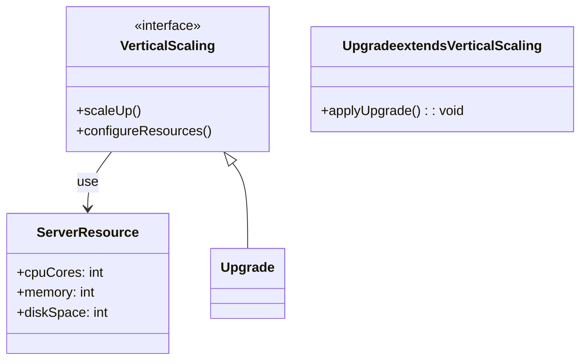

## Introduction to Vertical Scaling

Vertical scaling, also known as scaling up, is a strategy where existing computing resources of a server are upgraded to increase its capacity. This involves adding more CPU, memory, or storage to a machine rather than adding more machines (servers) to handle increased load. Vertical scaling contrasts with horizontal scaling, which focuses on adding more nodes to a system.

## Architectural Approaches

Vertical scaling typically involves the following approaches:

1. **Upgrading Physical Hardware**: Enhancement of the server components, such as RAM, CPU, or disk storage, is performed to amplify performance.

2. **Resource Optimization**: Utilizing cloud service providers to provision and adjust resources dynamically to scale up or down based on usage needs—examples include AWS EC2 instance types, Azure VM scale sets, or Google Cloud Compute Engine custom machine types.

3. **Containerized Applications**: Utilizing container orchestration tools (e.g., Kubernetes) to vertically scale instances offers flexibility and reduces downtime.

## Best Practices

- **Capacity Planning**: Regularly review application performance to assess when scaling is necessary. Use monitoring tools for real-time insights.
  
- **Load Balancing**: Even with vertical scaling, implementing efficient load balancers is crucial to distribute traffic effectively among upgraded resources.

- **Automated Scaling Policies**: For cloud environments, configuring autoscaling policies helps automate resource adjustments to meet changing demands.

- **Redundancy and Reliability**: Use redundant power supplies and storage, and ensure high-availability configurations to maintain uptime during scaling activities.

- **Cost Management**: Implementing careful cost management policies is important as vertical scaling can lead to increased expenses if resources remain underutilized.

## Example Code

```java
// Example simulation of vertical scaling using Apache Flink.

import org.apache.flink.api.common.functions.FlatMapFunction;
import org.apache.flink.streaming.api.datastream.DataStream;
import org.apache.flink.streaming.api.environment.StreamExecutionEnvironment;
import org.apache.flink.util.Collector;

public class FlinkVerticalScalingExample {

    public static void main(String[] args) throws Exception {
        // Set up the execution environment with enhanced parallelism capability.
        StreamExecutionEnvironment env = StreamExecutionEnvironment.getExecutionEnvironment();
        
        // Configure a higher parallelism degree as part of vertical scaling.
        env.setParallelism(8);

        // Example stream processing task
        DataStream<String> textStream = env.readTextFile("input.txt");

        DataStream<String> wordStream = textStream.flatMap(new Tokenizer());
        wordStream.print();

        env.execute("Flink Vertical Scaling Example");
    }

    public static final class Tokenizer implements FlatMapFunction<String, String> {
        @Override
        public void flatMap(String value, Collector<String> out) {
            // Tokenize the input text
            for (String word : value.toLowerCase().split("\\s")) {
                out.collect(word);
            }
        }
    }
}
```

## Diagrams



## Related Patterns

- **Horizontal Scaling**: Unlike vertical scaling, horizontal scaling involves adding more nodes to a system. It balances load distribution across multiple servers.
  
- **Auto-Scaling**: In cloud environments, auto-scaling refers to automatic adjustments in the number of computing resources based on pre-configured conditions.

## Additional Resources

- [Amazon Web Services EC2 Instances](https://aws.amazon.com/ec2/instance-types/)
- [Azure Virtual Machine Scale Sets](https://docs.microsoft.com/en-us/azure/virtual-machine-scale-sets/overview)
- [Google Cloud Custom VM Configurations](https://cloud.google.com/compute/docs/instances/custom-machine-types)

## Summary

Vertical scaling is an effective pattern for enhancing the computational capabilities of single nodes by upgrading their existing resources, facilitating better performance, and meeting higher demand requirements. It is critical in scenarios requiring high CPU or memory throughput and is widely employed in cloud environments, where resources can be dynamically managed and optimized. However, it is crucial to consider the potential limitations and overhead costs associated with vertical scaling.
