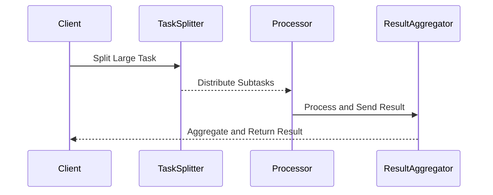
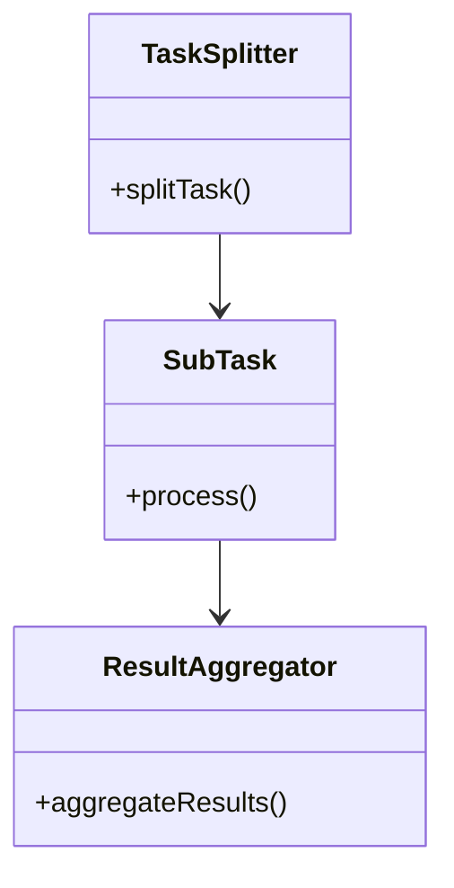

## Introduction

In complex data processing and stream handling scenarios, achieving scalability and high performance is crucial. The Split/Merge Pattern is an established architectural approach to address these requirements by decomposing tasks into smaller, autonomous units that can execute in parallel, followed by the integration of their outcomes.

## Detailed Explanation

### Core Concept

The Split/Merge Pattern is essentially about breaking down a large, monolithic task into discrete, parallel-executable chunks (Splitting) and then reconstituting these independently processed chunks into a final coherent result (Merging). This pattern is especially useful in scenarios involving large-scale data processing, such as batch processing, real-time analytics, and distributed computation frameworks.

### Architectural Approaches

1. **Parallel Processing**:
   - Split a task into multiple smaller tasks that can be processed in parallel across different computing nodes or threads.
   
2. **Message Passing**:
   - Use a messaging system or event-driven architecture to convey tasks to worker components, ensuring decoupled and asynchronous processing.
   
3. **Aggregation**:
   - Once tasks have been completed, aggregate the results, often requiring synchronization mechanisms to ensure accuracy and consistency.

### Best Practices

- **Task Granularity**: Determine an optimal granularity for splitting tasks to balance the overhead of managing multiple tasks with the gain in performance from parallelism.
- **Fault Tolerance**: Implement robust error handling and retries to manage failures in individual task executions.
- **Load Balancing**: Distribute tasks evenly across nodes using dynamic or static allocation strategies to prevent bottlenecks.

## Example Code

Consider splitting a computationally intensive list processing task using Java's Fork/Join framework:

```java
import java.util.concurrent.RecursiveTask;
import java.util.concurrent.ForkJoinPool;

// Task to compute sum of array elements
class SumTask extends RecursiveTask<Long> {
    private static final int THRESHOLD = 10;
    private int[] array;
    private int start, end;

    public SumTask(int[] array, int start, int end) {
        this.array = array;
        this.start = start;
        this.end = end;
    }

    @Override
    protected Long compute() {
        if (end - start <= THRESHOLD) {
            long sum = 0;
            for (int i = start; i < end; i++) {
                sum += array[i];
            }
            return sum;
        } else {
            int mid = (start + end) / 2;
            SumTask leftTask = new SumTask(array, start, mid);
            SumTask rightTask = new SumTask(array, mid, end);
            leftTask.fork();
            long rightResult = rightTask.compute();
            long leftResult = leftTask.join();
            return leftResult + rightResult;
        }
    }
}

// Main class to execute the sum task
public class SplitMergeExample {
    public static void main(String[] args) {
        int[] array = new int[100];
        for (int i = 0; i < array.length; i++) {
            array[i] = i + 1;
        }
        
        ForkJoinPool pool = new ForkJoinPool();
        SumTask task = new SumTask(array, 0, array.length);
        long sum = pool.invoke(task);
        
        System.out.println("Sum: " + sum);
    }
}
```

## Diagrams

### Sequence Diagram



### Class Diagram



## Related Patterns

- **MapReduce**: Similar pattern primarily used in batch processing environments for handling large datasets by mapping tasks to nodes and reducing the results.
- **Scatter-Gather**: A pattern where messages are scattered across multiple nodes and results are gathered back for aggregation.
- **Fan-Out Fan-In**: Used in messaging systems to distribute a message to multiple consumers (fan-out) and gather responses (fan-in).

## Additional Resources

- [Java Fork/Join Framework](https://docs.oracle.com/javase/tutorial/essential/concurrency/forkjoin.html)
- [Parallel Programming with Scala](https://docs.scala-lang.org/overviews/parallel-collections/overview.html)
- [Concurrency in Go](https://golang.org/doc/effective_go.html#concurrency)

## Summary

The Split/Merge Pattern provides a robust strategy for enhancing the performance and scalability of data processing tasks. By leveraging the pattern's principles, systems can efficiently utilize available resources, ensuring efficient task execution and timely data handling through parallelism. Proper implementation of this pattern can lead to significant improvements in applications requiring high-throughput and low-latency data processing.
