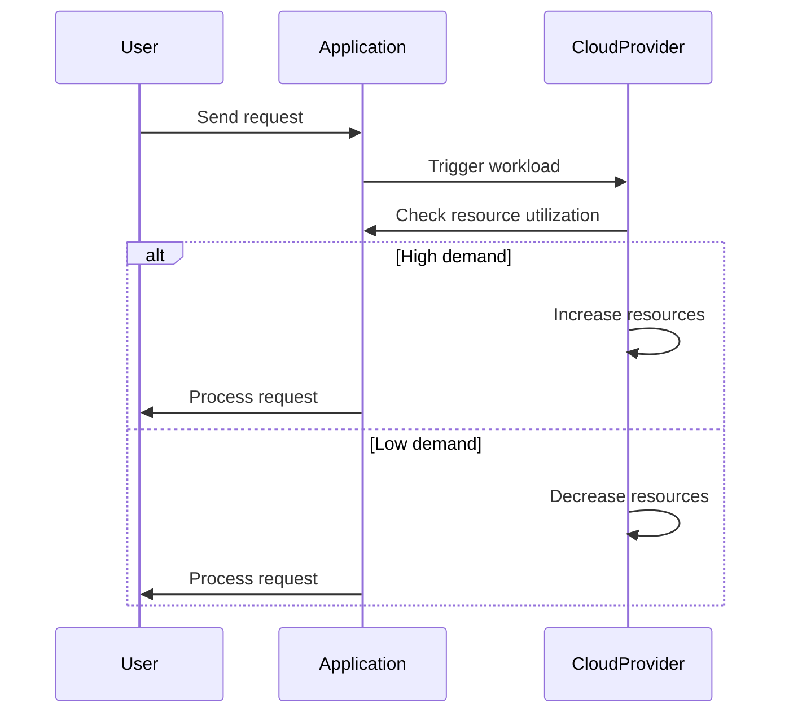

## Overview

Elastic Scaling is a crucial design pattern in modern cloud-based systems. It involves dynamically adjusting computing resources based on the current demand, allowing applications to maintain optimal performance while minimizing costs. This pattern is typically used in systems with varying workloads, such as stream processing, where the volume of data can fluctuate significantly over time.

## Architectural Approach

Elastic Scaling can be implemented using a combination of service orchestration, continuous monitoring, and resource allocation frameworks:

1. **Service Orchestration**: Systems like Kubernetes manage containerized applications, scaling the number of replicas in response to CPU or memory usage thresholds.

2. **Monitoring Tools**: Metrics collection tools like Prometheus continuously track performance indicators and trigger scaling actions as needed.

3. **Resource Allocation Frameworks**: Platforms like AWS Lambda, Azure Functions, and Google Cloud Functions enable serverless computing, where the infrastructure automatically expands or contracts based on function invocation frequency.

### Example Code

Here is an example of setting up AWS Lambda for automatic scaling based on incoming event volume:

```typescript
import * as cdk from '@aws-cdk/core';
import * as lambda from '@aws-cdk/aws-lambda';
import * as events from '@aws-cdk/aws-events';
import * as targets from '@aws-cdk/aws-events-targets';

class ElasticScalingStack extends cdk.Stack {
  constructor(scope: cdk.Construct, id: string, props?: cdk.StackProps) {
    super(scope, id, props);

    const function = new lambda.Function(this, 'ElasticFunction', {
      runtime: lambda.Runtime.NODEJS_14_X,
      handler: 'index.handler',
      code: lambda.Code.fromAsset('lambda'),
    });

    const eventRule = new events.Rule(this, 'Rule', {
      schedule: events.Schedule.rate(cdk.Duration.minutes(5)),
    });

    eventRule.addTarget(new targets.LambdaFunction(function));
  }
}

const app = new cdk.App();
new ElasticScalingStack(app, 'ElasticScalingStack');
```

### Diagram

Below is a Mermaid sequence diagram illustrating an elastic scaling workflow:



## Related Patterns

- **Load Balancing**: Distributes incoming network traffic across multiple servers to ensure no single server is overwhelmed.
- **Circuit Breaker**: Stops the flow of requests to a failing service to give it time to recover.
- **Auto-scaling**: Automatically adjusts the number of running instances based on demand.

## Additional Resources

- AWS Elastic Load Balancing: [AWS Documentation](https://aws.amazon.com/elasticloadbalancing/)
- Google Cloud Autoscaler: [Google Cloud Documentation](https://cloud.google.com/compute/docs/autoscaler)
- Microsoft Azure Autoscale: [Azure Documentation](https://docs.microsoft.com/en-us/azure/autoscale/)

## Summary

Elastic Scaling provides a robust framework for managing resources in a cloud environment. By dynamically adjusting resource allocation according to demand, organizations can maintain application performance and cost efficiency. This pattern is particularly advantageous in environments with variable and unpredictable workloads, such as those encountered in stream processing systems. Implementing Elastic Scaling ensures applications remain responsive and available, adapting seamlessly to changing conditions.
