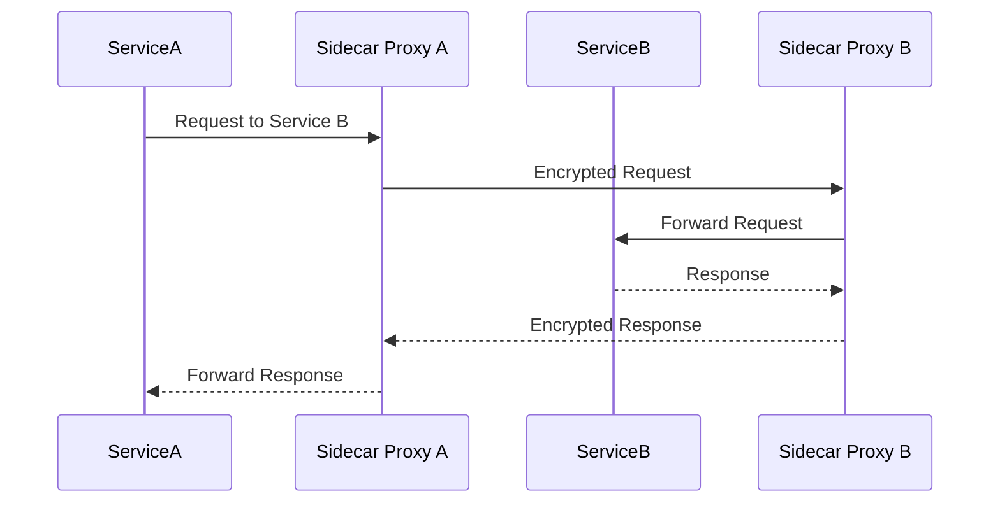

## Introduction

Service meshes are an integral part of modern cloud-native architectures where microservices are predominant. They provide an abstraction that aids in managing the communication between different service instances, allowing for easier control over network functionalities like load balancing, service discovery, failure recovery, metrics, and monitoring.

## Detailed Explanation

### Key Components of a Service Mesh

1. **Data Plane**: Handles the network traffic between microservice instances. It comprises lightweight network proxies that are deployed alongside application code.
   
2. **Control Plane**: Manages and configures the proxies to route traffic, collect metrics, and enforce policies. Provides administrative capabilities to control traffic and secure communication.

### Architectural Approaches

- **Sidecar Proxy Pattern**: Each service instance is paired with a sidecar proxy that intercepts all network traffic. This proxy can be configured dynamically by the control plane.

- **Observability and Resilience**: Service meshes enable deep observability of microservice communication and provide mechanisms to enforce resilience through retries, circuit breaking, and fault injection.

- **Service Identity and Security**: By centralizing certificate management and implementing mutual TLS, service meshes enhance the security posture by encrypting service-to-service communication.

### Example Code: Implementing a Basic Mesh with Istio

```yaml
apiVersion: "authentication.istio.io/v1alpha1"
kind: "Policy"
metadata:
  name: "test-service"
spec:
  targets:
  - name: myservice
  peers:
  - mtls: {}
```

Deploying Istio involves configuring the Kubernetes cluster, enabling automatic injection of sidecar proxies, and managing policies through CRDs (Custom Resource Definitions) in Kubernetes.

### Diagrams



### Related Patterns and Best Practices

- **Circuit Breaker Pattern**: Works well with service meshes by preventing network calls to services deemed unhealthy.
  
- **Bulkhead Pattern**: Service meshes naturally partition service calls into isolated groups to prevent cascading failures.

### Additional Resources

- [Istio Documentation](https://istio.io/docs/)
- [Linkerd: Lightweight Kubernetes Service Mesh](https://linkerd.io/)
- [Envoy Proxy](https://www.envoyproxy.io/)
- [Kubernetes Official Documentation](https://kubernetes.io/docs/)

## Summary

Service meshes represent a pivotal shift in cloud-native approaches to managing and scaling microservices. By abstracting underlying network details, they foster faster development cycles, enhance observability, and improve security. Implementations like Istio empower teams to handle complex microservice architectures with confidence, ensuring scalable and resilient service ecosystems.
