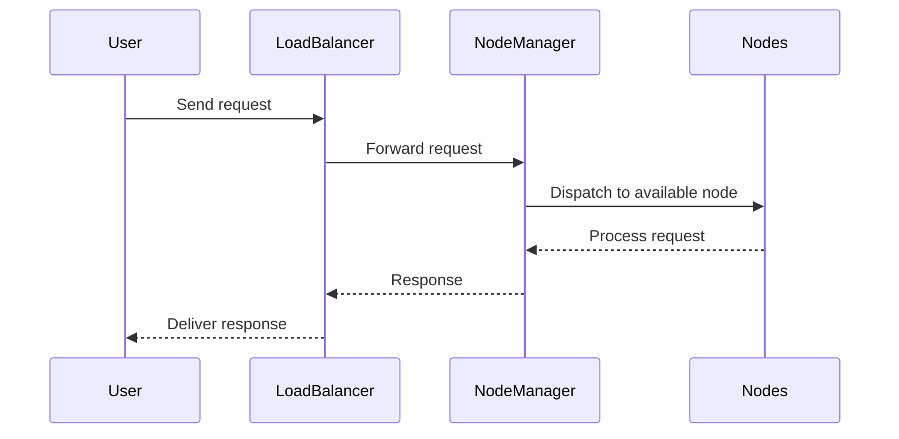

## Cluster Management

### Description

Cluster Management is a design pattern that focuses on orchestrating a group of interconnected nodes to function as a cohesive system. This pattern aims to improve scalability, enhance resource utilization, and facilitate efficient workload distribution. By treating multiple nodes as a single resource pool, organizations can maximize computational resources, streamline maintenance, and easily scale applications in response to changing demands.

### Architectural Approach

The architectural approach to Cluster Management involves several key components:

- **Node Management**: Nodes are the individual logical units of computation within a cluster. Managing these nodes includes monitoring their health, balancing loads across them, and handling failures gracefully.

- **Resource Allocation**: Efficiently allocating computational resources such as CPU, memory, and storage to various tasks and services across the cluster to ensure optimal performance.

- **Service Orchestration**: Coordinating services and applications to run smoothly across multiple nodes, often facilitated by orchestration tools that automate deployment, scaling, and operations of application containers.

- **Scalability and Elasticity**: The system should dynamically scale to accommodate increasing or decreasing workloads, often achieved through horizontal scaling by adding or removing nodes.

### Best Practices

- **Automate Scaling**: Utilize autoscaling capabilities to automatically adjust the number of nodes depending on traffic or demand increases and decreases.
  
- **Monitor and Log**: Implement robust monitoring and logging to keep track of system performance and identify issues early.
  
- **Resilience and Redundancy**: Design the cluster to withstand individual node failures without service interruption by implementing redundancy.
  
- **Efficient Resource Usage**: Continuously analyze resource usage patterns to identify and mitigate bottlenecks or underutilized resources.

### Example Code

Here's an example of deploying a simple web application using Kubernetes, a popular cluster management tool:

```yaml
apiVersion: apps/v1
kind: Deployment
metadata:
  name: example-deployment
spec:
  replicas: 3
  selector:
    matchLabels:
      app: example
  template:
    metadata:
      labels:
        app: example
    spec:
      containers:
      - name: example-container
        image: nginx:1.19
        ports:
        - containerPort: 80
```

### Diagrams

Below is a Mermaid UML sequence diagram illustrating a high-level interaction in a cluster management scenario:



### Related Patterns and Paradigms

- **Load Balancing**: Often used alongside cluster management to distribute incoming requests evenly across nodes.
  
- **Distributed Databases**: Databases designed to run on clusters, ensuring high availability and fault tolerance.
  
- **Microservices Architecture**: Small, independently deployable services that can be managed and scaled across a cluster.

### Additional Resources

- [The Kubernetes Book by Nigel Poulton](https://www.amazon.com/Kubernetes-Book-Nigel-Poulton/dp/1521823634)
- [Kubernetes Documentation](https://kubernetes.io/docs/home/)
- [Docker & Kubernetes: The Complete Guide, Udemy Course](https://www.udemy.com/course/docker-and-kubernetes-the-complete-guide/)

### Summary

Cluster Management is a crucial design pattern in modern computing landscapes, especially with the advent of cloud-native applications. By harnessing tools like Kubernetes, organizations can effectively manage their infrastructures at scale, ensuring high availability, resilience, and performance. Understanding and implementing Cluster Management is essential for those looking to optimize their cloud operations and build scalable, reliable systems.
