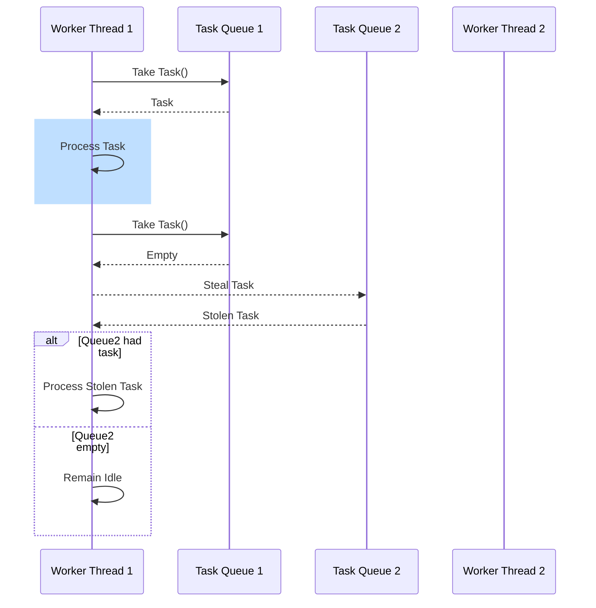

## Overview

Work Stealing is a powerful design pattern used in stream processing and distributed systems to improve resource utilization and maintain balanced workloads across processors. The key idea behind work stealing is to allow idle processors to "steal" or acquire tasks from the queues of busier processors, thereby dynamically balancing the load and minimizing idle time across the system.

### Context and Problem

In a scale-out architecture, where tasks are distributed across multiple processors or nodes, some processors may become overloaded with tasks while others remain idle. This imbalance can lead to inefficient resource usage, degraded performance, and increased processing times, especially in systems dealing with unpredictable workloads or varying task complexities.

The challenge lies in developing a mechanism where work can be dynamically and efficiently redistributed without centralized control, to maximize parallelism and resource utilization.

### Solution

The Work Stealing pattern addresses this challenge by enabling processors with lighter loads to steal tasks from other heavily loaded processors. Each processor maintains its own local work queue, and when a processor completes its tasks and becomes idle, it selects another processor randomly or based on some heuristics and steals tasks from its queue.

This approach reduces contention on shared data structures and improves cache locality by keeping tasks within a processor’s local queue as much as possible. In a multi-core or multi-threaded environment, this minimizes synchronization contention and overhead.

### Example Implementation

The Java Fork/Join framework in Java 7 is a notable implementation of the work stealing algorithm. Below is a simplified example of how work stealing might be implemented in a custom task processing system using a thread pool:

```java
import java.util.concurrent.*;

public class WorkStealingExample {
    public static void main(String[] args) {
        ForkJoinPool pool = new ForkJoinPool();
        RecursiveTask<Integer> task = new RecursiveTaskExample(100);
        int result = pool.invoke(task);
        System.out.println("Computed Result: " + result);
    }
}

class RecursiveTaskExample extends RecursiveTask<Integer> {
    private final int workload;
    
    public RecursiveTaskExample(int workload) {
        this.workload = workload;
    }
    
    @Override
    protected Integer compute() {
        if (workload > 1) {
            int mid = workload / 2;
            RecursiveTaskExample subtask1 = new RecursiveTaskExample(mid);
            RecursiveTaskExample subtask2 = new RecursiveTaskExample(workload - mid);
            
            subtask1.fork();
            int result = subtask2.compute() + subtask1.join();
            
            return result;
        } else {
            // Base case: perform computation
            return workload;
        }
    }
}
```

### Diagrams

Below is a Mermaid diagram illustrating the high-level sequence of the work stealing process.



### Related Patterns

- **Bulkhead Pattern**: Isolates components to prevent failures from cascading.
- **Circuit Breaker**: Prevents systems from trying to execute actions bound to fail.
- **Leader Election**: Chooses a coordinator node to manage tasks, but not dynamically.

### Additional Resources

- [Fork/Join Framework Documentation](https://docs.oracle.com/javase/8/docs/api/java/util/concurrent/ForkJoinPool.html)
- [Concurrency in Practice by Brian Goetz](https://www.amazon.com/Java-Concurrency-Practice-Brian-Goetz/dp/0321349601)
- [Understanding Java Concurrency](https://www.baeldung.com/java-concurrency)

### Summary

The Work Stealing pattern is an effective approach for dynamically balancing workloads in parallel computing environments. By allowing idle processors to "steal" work from their busier counterparts, it effectively minimizes idle time, maximizes resource utilization, and ensures efficient handling of variable workloads within distributed systems. Its implementation in frameworks like Fork/Join demonstrates its utility in modern concurrent programming paradigms.
