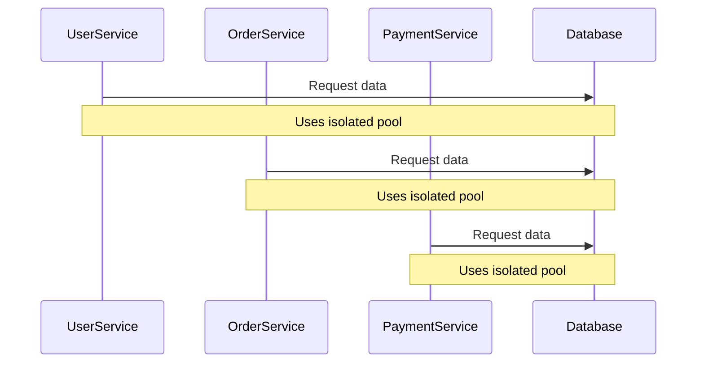

## Introduction

Bulkheading is a design pattern primarily used to enhance the resilience and scalability of cloud-based applications. By isolating different components or services, the pattern ensures that a failure or performance degradation in one part of the system doesn't cascade to other parts. Named after the sections in a ship's hull, each bulkhead acts as a safeguard, containing failures within its boundary.

## Detailed Explanation

The central objective of the Bulkheading pattern is to partition system resources such that issues like resource exhaustion in one component do not impact others. This segmentation boosts system robustness and reliability, crucial for large-scale distributed systems in the cloud.

### Key Concepts

- **Isolation**: Components are designed to operate independently so that their failure does not affect others.
- **Limits**: Each component or service is allocated a specific quota of resources (e.g., threads, connections).
- **Redundancy**: Provides room for retries or fallbacks within isolated sections.

### Benefits

- **Fault Isolation**: Prevents cascading failures across components.
- **Independent Scaling**: Each component can scale based on its requirements without affecting others.
- **Resource Optimization**: Allocates resources where they're most needed, avoiding bottlenecks.

## Architectural Approaches

### Vertical Partitioning

Divide resources vertically by dedicating different resource pools to different components or services. For example, allocate separate database connection pools for each microservice to prevent one from depleting the available connections.

### Horizontal Partitioning

Implement partitioning strategies where each logical group (horizontal slice) is assigned certain quotas. An example could involve partitioning message queues so they handle specific types of operations without interference.

### Service Segmentation

Use cloud-based features such as isolated VMs or separate containers to achieve physical separation of services. This ensures that even if one service crashes due to a fault, others remain unaffected.

## Best Practices

- **Stateless Services**: Maintains independence and isolation more feasible by avoiding shared state.
- **Circuit Breaker Pattern**: Pair with Bulkheading for monitoring and controlling failures, preventing faulty services from overwhelming others.
- **Load Testing**: Regularly stress-test components to ensure resource limits are appropriately set.

## Example Code

Consider a microservices architecture where each service has its dedicated database connection pool.

```kotlin
fun establishConnectionPool(serviceName: String): DataSource {
    val config = HikariConfig()
    config.jdbcUrl = "jdbc:mysql://database-host/$serviceName"
    config.username = "root"
    config.password = "password"
    config.maximumPoolSize = 10
    return HikariDataSource(config)
}

val userServiceDataSource = establishConnectionPool("UserService")
val orderServiceDataSource = establishConnectionPool("OrderService")
```

In this Kotlin example, the `establishConnectionPool` function sets up separate connection pools for different services, thus isolating their database usage patterns.

## Diagrams

Below is a Mermaid UML sequence diagram illustrating resource isolation in microservices:



## Related Patterns

- **Circuit Breaker Pattern**: Helps detect and mitigate failures in specific components before they impact others.
- **Retry Pattern**: Complements Bulkheading by attempting failed operations without affecting isolated components.
- **Rate Limiting**: Ensures that services do not exceed their expected resource limits, preventing overload.

## Additional Resources

- [Resilient Cloud Patterns](https://linktoexample.com)
- Martin Fowler's Articles on Resilience [martinfowler.com](https://martinfowler.com/articles.html)
- [AWS Best Practices for Designing Reliable Systems](https://aws.amazon.com/architecture/well-architected/)

## Summary

The Bulkheading pattern is essential for designing scalable, resilient applications in the cloud. By isolating components, systems can prevent cascading failures and allocate resources efficiently, ensuring high availability and optimal performance. When implemented alongside complementary patterns like Circuit Breakers and Rate Limiting, applications can achieve robust fault tolerance, keeping services running smoothly even under stress.
