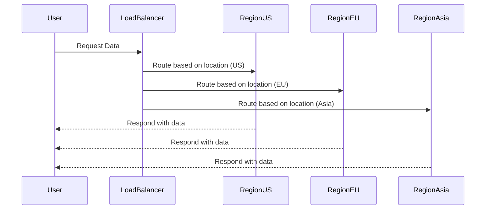

## Introduction

The Geographical Distribution design pattern involves strategically placing system components across multiple geographical locations to enhance performance, ensure low latency, and distribute network traffic efficiently. By distributing workloads globally, enterprises can improve user experience and provide high availability, even under increased load or regional failures.

## Architectural Approach

The architecture generally involves deploying replica services, databases, and application components in data centers located in diverse geographic regions. The choice of regions depends on the user base location, legal/regulatory requirements, and proximity to other cloud services.

### Key Components:
- **Load Balancers**: Direct traffic to the nearest server or node based on geographical proximity.
- **Content Delivery Networks (CDNs)**: Cache content closer to users to provide quick access to frequently accessed data.
- **Distributed Databases**: Systems like Apache Cassandra or Amazon DynamoDB that support data replication across regions.
- **Data Centers**: Multiple hosting locations to serve regional users with lower latency.

## Example Code

The following is an example of using AWS SDK for distributing services across multiple regions:

```java
import software.amazon.awssdk.regions.Region;
import software.amazon.awssdk.regions.providers.DefaultAwsRegionProviderChain;
import software.amazon.awssdk.services.ec2.Ec2Client;

public class GeographicalDistributionExample {
    public static void main(String[] args) {
        Region region = new DefaultAwsRegionProviderChain().getRegion();
        
        try (Ec2Client ec2 = Ec2Client.builder().region(region).build()) {
            // Implement your distribution logic here
            // For instance, launch instances in the specified region
        } catch (Exception e) {
            e.printStackTrace();
        }
    }
}
```

## Best Practices

- **Select Regions Strategically**: Analyze your user base and locate data centers close to large user clusters.
- **Compliance and Security**: Ensure that data handling complies with local laws and regulations (e.g., GDPR in Europe).
- **Latency Consideration**: Use monitoring tools to measure latency and adjust distribution dynamically.
- **Failover Techniques**: Implement failover strategies to switch traffic to another region seamlessly during outages.
- **Consistent Data Replication**: Use automatic replication features in modern databases to keep data consistent across all regions.

## Diagram



## Related Patterns

- **Edge Computing**: Extends geographical distribution by moving computation to the edge of the network to further reduce latency.
- **Multi-Region Application Deployment**: Emphasizes application redundancy across multiple regions for better reliability.
- **Content Delivery Network (CDN)**: Specializes in caching data close to the user's location to speed up content delivery.

## Additional Resources

- [AWS Global Infrastructure](https://aws.amazon.com/about-aws/global-infrastructure/)
- [Google Cloud Inter-Region Traffic](https://cloud.google.com/network-connectivity/docs/inter-region-overview)
- [Azure Latency Test](https://www.azurespeed.com/Azure/Latency)

## Summary

The Geographical Distribution pattern is crucial for global organizations that seek to deliver a fast, reliable, and seamless experience to a diverse user base across different regions. By strategically placing resources and handling network traffic efficiently, enterprises can achieve better performance and reliability in demand-fluctuating environments. This design pattern is an essential foundation for any cloud-native architecture aimed at scaling and user experience optimization.
