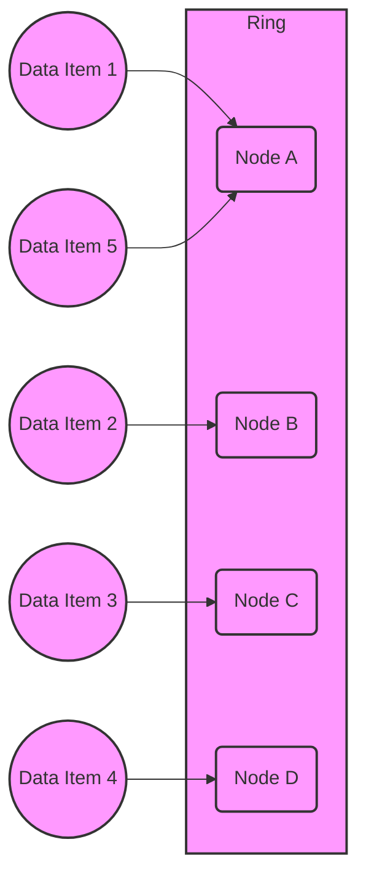

## Overview

Consistent Hashing is a distributed systems design pattern that ensures minimal data movement among nodes when nodes are added or removed from a system. It is particularly beneficial in scalable, fault-tolerant systems where balancing load across servers or data shards without significant reshuffling is critical.

## Detailed Explanation

### Mechanism

Consistent Hashing works by mapping both data and node identifiers onto a circular hash space (often referred to as a "hash ring"). Each data item is assigned to the node with the nearest next identifier on the hash ring. This approach reduces the amount of re-distributed data to a fraction, specifically between adjacent nodes, rather than re-distributing all data when the configuration changes.

### Key Features

- **Uniform Distribution**: Ensures that data is evenly distributed across available nodes, helping balance the system load.
- **Scalability**: Nodes can be added or removed with minimal data migration, as only the immediate neighbors in the hash ring are affected.
- **Fault Tolerance**: Facilitates redistribution of data quickly if a node fails, preserving system integrity.

### Example Use Case

Consider a distributed caching service where user session data needs to be cached across multiple servers. For example, in a social media application:

- User data is hashed using a consistent hashing function.
- Each server (or cache node) is positioned on the hash ring.
- User sessions are stored in the server that immediately follows their hash value on the ring.
- When a new server is added, only a subset of the sessions from neighboring servers might be redistributed.

### Diagram

Below is a conceptual illustration using Mermaid to represent how consistent hashing works in distributing load across nodes.

## Best Practices

- **Data Replication**: To ensure greater fault tolerance, replicate data across multiple nodes on the ring.
- **Virtual Nodes**: Use virtual nodes (multiple mapping points per actual node) to further ensure even distribution and reduce load spikes during node changes.
- **Monitoring and Metrics**: Implement comprehensive monitoring for node loads and data distribution.

## Related Patterns

- **Sharding**: A technique to split data into different databases to scale out.
- **Proxy Caching**: Utilizes caching mechanisms in front of servers to optimize request handling.
- **Load Balancing**: Distributes network or application traffic across multiple servers to ensure reliability.

## Additional Resources

- [Consistent Hashing and Random Trees: Distributed Caching Protocols for Relieving Hot Spots on the World Wide Web - Conference Paper](https://www8.org/w8-papers/2c-webserver/caching/paper2.html)
- [Amazon’s Dynamo: A Consistent Hashing Approach](https://www.allthingsdistributed.com/files/amazon-dynamo-sosp2007.pdf)

## Summary

Consistent Hashing offers an efficient and scalable strategy for data distribution in distributed systems, adeptly managing the trade-offs between consistency, availability, and partition tolerance. Its ability to minimize data movement among nodes during scaling operations makes it exceptionally suited for environments expecting frequent membership changes, enhancing system performance and reliability.
