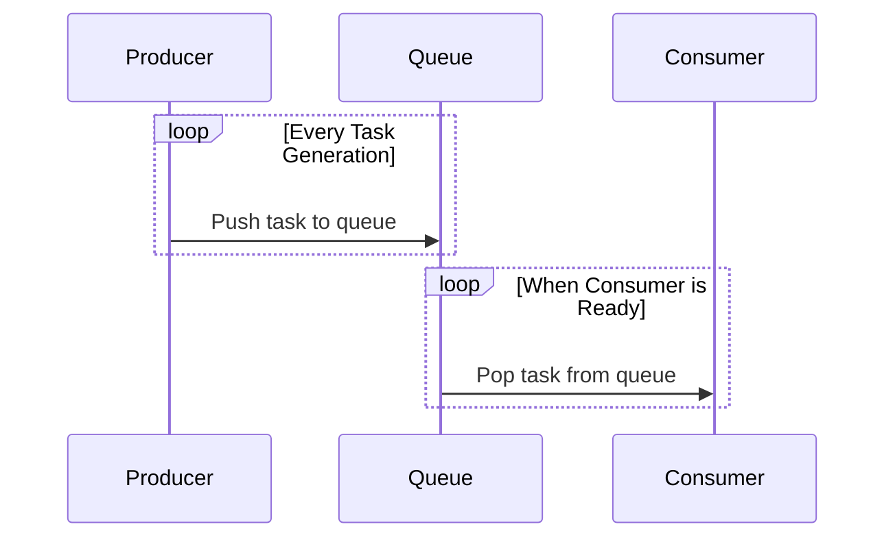

## Queue-Based Load Leveling

### Overview
Queue-based load leveling is a design pattern used to handle and balance high volumes of tasks in a scalable and efficient manner. By introducing a queue between the producers and consumers of a service, you minimize the risks of bottlenecking that may arise from fluctuating workloads. This strategy decouples message production from consumption, enabling each to scale independently and preventing overloads on services.

### Architectural Approach
In a typical queue-based load leveling architecture, tasks initiated by producers are placed onto a queue instead of being directly sent to consumers. The consumer services then pull tasks from this queue as resources become available.

- **Producers**: These are services or applications generating tasks. They do not interact directly with consumers but instead push tasks into queues.
- **Queue**: The intermediary that buffers tasks. It handles the storage, receiving, and sending of messages. Queues like RabbitMQ, Apache Kafka, AWS SQS, and Google Pub/Sub are commonly used.
- **Consumers**: These services retrieve messages from the queue and process them as their compute resources allow, ensuring a smooth workflow.

### Example Code
Here's an example using a mock queue and worker in Java that mimics the behavior of task production and consumption:

```java
import java.util.concurrent.BlockingQueue;
import java.util.concurrent.LinkedBlockingQueue;

class Producer implements Runnable {
    private final BlockingQueue<String> queue;

    public Producer(BlockingQueue<String> queue) {
        this.queue = queue;
    }

    @Override
    public void run() {
        try {
            while (true) {
                String message = produceTask();
                queue.put(message); // Add task to the queue
                System.out.println("Produced: " + message);
            }
        } catch (InterruptedException ex) {
            Thread.currentThread().interrupt();
        }
    }

    private String produceTask() {
        // Simulate task generation
        return "Task - " + System.currentTimeMillis();
    }
}

class Consumer implements Runnable {
    private final BlockingQueue<String> queue;

    public Consumer(BlockingQueue<String> queue) {
        this.queue = queue;
    }

    @Override
    public void run() {
        try {
            while (true) {
                String message = queue.take(); // Retrieve task from queue
                processTask(message);
            }
        } catch (InterruptedException ex) {
            Thread.currentThread().interrupt();
        }
    }

    private void processTask(String task) {
        // Simulate task processing
        System.out.println("Processed: " + task);
    }
}

public class QueueBasedLoadLevelingExample {
    public static void main(String[] args) {
        BlockingQueue<String> queue = new LinkedBlockingQueue<>();
        new Thread(new Producer(queue)).start();
        new Thread(new Consumer(queue)).start();
    }
}
```

### Diagrams
Below is a UML Sequence Diagram illustrating the interaction between producers, the queue, and consumers:



### Best Practices
- **Back-pressure Control**: Implement mechanisms to signal producers to slow down if the queue reaches a certain threshold, preventing overfilling.
- **Load Balancing**: Distribute tasks evenly among consumers to avoid one overloaded worker while others remain idle.
- **Scalability**: Use distributed queues and ensure your system can scale up or out as necessary to handle increased load.
- **Resilience**: Implement retry logic and dead-letter queues for tasks that fail to process after multiple attempts.

### Related Patterns
- **Circuit Breaker**: Protects a service from being overwhelmed when a failure occurs, allowing time for the fault to clear.
- **Throttling**: Controls the rate of incoming requests to prevent overload.
- **Bulkhead**: Isolates failures, so they only affect a smaller part of the system.

### Additional Resources
- [Enterprise Integration Patterns](https://www.enterpriseintegrationpatterns.com/)
- [RabbitMQ Official Documentation](https://www.rabbitmq.com/)
- [Kafka: The Definitive Guide](https://kafka.apache.org/documentation/)

### Summary
Queue-based load leveling provides a robust mechanism for balancing task loads across systems by introducing intermediary queues. This design pattern helps maintain system stability under high load by decoupling producers and consumers and offering scalability and fault tolerance. By implementing queues wisely along with effective monitoring and back-pressure techniques, systems can ensure efficient and reliable task processing.
