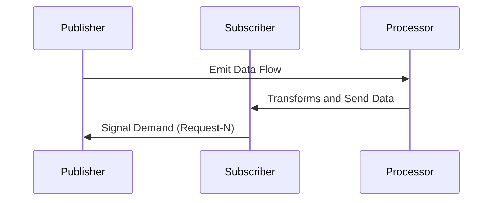

## Introduction to Reactive Streams

Reactive Streams is an architectural pattern designed for asynchronous stream processing with non-blocking backpressure, allowing systems to scale efficiently by managing the rate of data flow. This design pattern is commonly used in web applications, data streaming systems, and anywhere the ability to process data asynchronously in a controllable manner is beneficial.

### Key Concepts

- **Asynchronous Processing**: Ability to handle data asynchronously without blocking threads, which improves the overall system responsiveness.
- **Backpressure**: A mechanism that regulates data flow to ensure that the consumer can process data at a manageable rate, thereby preventing system overload.
- **Publisher-Subscriber Model**: A traditional model adapted for reactive systems where components asynchronously send and receive messages.

## Architectural Approach

Reactive Streams involves a few key participants:

1. **Publisher**: The component that emits data or events asynchronously.
2. **Subscriber**: The component that consumes data from the Publisher. It can request a specific amount of data it is prepared to handle.
3. **Subscription**: A contract between a Publisher and a Subscriber where data flow and control are negotiated.
4. **Processor**: A component that serves as both Subscriber and Publisher to transform data before reaching the final Subscriber.

### Implementations

Reactive Streams have been adopted widely, with several notable implementations:

- **Project Reactor**: Part of the Spring ecosystem, offering tools to create non-blocking reactive applications.
- **RxJava**: A library for composing asynchronous and event-based programs using observable sequences for the Java VM.
- **Akka Streams**: An implementation integrated with the Akka toolkit, aimed at seamlessly handling reactive data streams.

### Workflow

- The **Publisher** initiates and sends an asynchronous stream of data.
- The **Subscriber** processes the data, able to signal its data-processing capability to the Publisher through backpressure.
- As the data is processed, potential transformations can be handled by a **Processor**.

### Example Code

Below is a simple example of using Project Reactor to implement Reactive Streams:

```java
import reactor.core.publisher.Flux;
import reactor.core.scheduler.Schedulers;

public class ReactiveStreamsExample {
    public static void main(String[] args) {
        Flux.range(1, 100)
            .map(i -> i * 2)
            .subscribeOn(Schedulers.parallel())
            .subscribe(System.out::println,
                       error -> System.err.println("Error: " + error),
                       () -> System.out.println("Processing completed!"));
    }
}
```

## Diagram



## Related Patterns

- **Event-Driven Architecture**: Systems based on events and messages; reactive streams extend this with backpressure.
- **Microservices**: Reactive streams support communication patterns that reduce latency between services.
- **Data Streaming**: Large-scale data processing can benefit from non-blocking, backpressure managed streams.

## Additional Resources

- **[Reactive Streams Specification](https://github.com/reactive-streams/reactive-streams-jvm)**: The official specification for reactive streams in JVM languages.
- **[Project Reactor Documentation](https://projectreactor.io/docs/core/release/reference/)**: Comprehensive guide for Project Reactor users.
- **[RxJava Documentation](https://github.com/ReactiveX/RxJava/wiki)**: A detailed resource for RxJava.

## Summary

Reactive Streams provides a scalable solution for handling asynchronous data processing with backpressure, making it highly effective for building responsive and resilient systems. By utilizing libraries such as Project Reactor and RxJava, developers can efficiently manage high volumes of data while controlling system load and ensuring high throughput, harnessing the full potential of modern multi-core processors.
