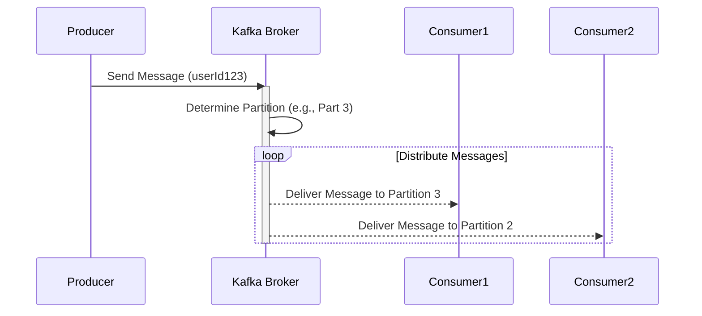

## Introduction

Partitioning is a crucial design pattern in big data processing and stream processing architectures. It allows for dividing a data set into discrete parts, or partitions, based on specific keys. This enables the data to be processed in parallel, improving scalability and performance across distributed systems.

### Key Concepts

- **Key-Based Partitioning**: Data is divided based on a key, ensuring that all data with the same key is sent to the same partition. This method maintains the order of processing for data with the same key.
- **Parallelism**: By distributing partitions across multiple processing instances, systems can process data concurrently, leading to increased throughput.
- **Scalability**: Partitioning services can be easily scaled horizontally by adding more instances, facilitating the handling of large volumes of data.

## Architectural Approaches

### Partitioning in Kafka

Kafka topics are inherently divided into partitions. Data is produced and consumed on these partitions in parallel. Ensuring that a specific key always maps to the same partition maintains message order for that key. In the context of Kafka:

- **Producer Partition Selection**: A custom partitioner can be implemented to determine which partition a message should be sent to.
- **Consumer Group Coordination**: Consumers in a group are assigned specific partitions to ensure only one consumer processes data from a partition at any given time.

```java
// Example Kafka producer with custom partitioner
Properties props = new Properties();
props.put("bootstrap.servers", "localhost:9092");
props.put("key.serializer", "org.apache.kafka.common.serialization.StringSerializer");
props.put("value.serializer", "org.apache.kafka.common.serialization.StringSerializer");
props.put("partitioner.class", "com.example.CustomPartitioner");

Producer<String, String> producer = new KafkaProducer<>(props);
producer.send(new ProducerRecord<>("my-topic", "userId123", "message for user"));
```

### Partitioner Implementation

```java
public class CustomPartitioner implements Partitioner {
    @Override
    public int partition(String topic, Object key, byte[] keyBytes, Object value, byte[] valueBytes, Cluster cluster) {
        int partitionCount = cluster.partitionCountForTopic(topic);
        int partition = key.hashCode() % partitionCount;
        return Math.abs(partition);
    }

    @Override
    public void close() {}

    @Override
    public void configure(Map<String, ?> configs) {}
}
```

## Diagrams

### Partitioning Sequence Diagram



## Related Patterns

- **Sharding**: Similar to partitioning but typically refers to partitioning databases, ensuring data is split across different physical locations.
- **Load Balancing**: Distributes incoming requests evenly across servers to prevent any single server from becoming a bottleneck.
- **Elastic Scalability**: Automatically adds or removes resources in response to the current workload, complementing partitioning for efficient scaling.

## Best Practices

- **Partition Granularity**: Choose the right key to partition on to maintain a balance between processing parallelism and required ordering.
- **State Management**: Ensure stateful operations consider partition boundaries to restore from failures gracefully.
- **Monitoring**: Implement thorough monitoring of partition loads to detect and address skew which can impede parallel processing efficiency.

## Additional Resources

- [Kafka Documentation](https://kafka.apache.org/documentation/)
- [Cloud Native Patterns - Partitioning](https://cloudnativepatterns.com/partitioning)

## Summary

Partitioning is a robust design pattern for optimizing data processing by leveraging parallelism. It is particularly useful in stream-processing frameworks like Kafka, where it ensures ordered processing of data segments while distributing loads evenly across available resources. By adhering to best practices and understanding related patterns, developers and architects can utilize partitioning to significantly enhance system throughput and efficiency.
