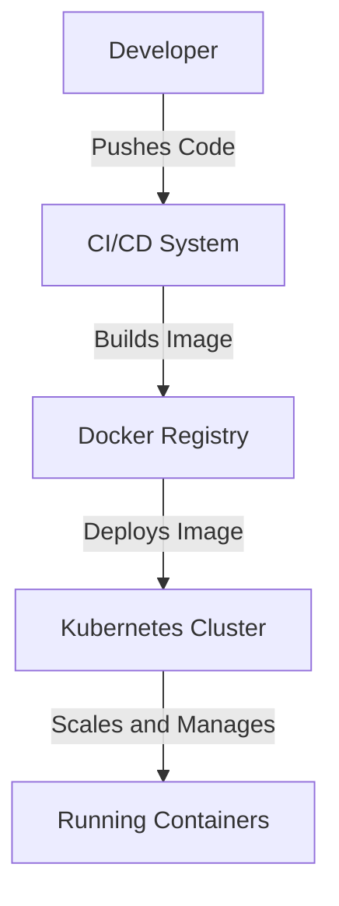

## Introduction

Containerization is a design pattern that involves packaging applications along with their dependencies into immutable, portable units known as containers. This approach ensures that software runs consistently across various environments, which facilitates easy scaling, deployment, and management. Containerization is a critical component of modern cloud architectures, particularly in stream processing applications.

## Detailed Explanation

### Core Components

1. **Container**: A lightweight, standalone, executable package of software that includes everything needed to run an application: code, runtime, system tools, libraries, and configurations.
   
2. **Docker**: A popular platform for developing, shipping, and running applications in containers. It provides the ability to package and distribute applications in containers.
   
3. **Kubernetes**: An open-source system for automating the deployment, scaling, and management of containerized applications.

### Key Benefits

- **Consistency Across Environments**: Containers encapsulate applications and their dependencies, ensuring that they behave identically regardless of the environment (development, test, or production).
  
- **Efficient Resource Utilization**: Containers share the host OS kernel and resources, allowing for efficient use of system resources.

- **Rapid Deployment**: Containers start quickly and can be deployed in seconds, which speeds up development cycles and innovation.
  
- **Scalability and High Availability**: Solutions like Kubernetes orchestrate containers, providing scaling and high availability capabilities.

### Use Case in Stream Processing

In stream processing applications, containerization allows for:

- **Easy Scaling**: By deploying stream processing tasks in containers, you can easily scale up or down based on the incoming data stream load.
  
- **Isolation**: Different stream processing jobs can be isolated to prevent resource contention and facilitate smooth operations.

- **Efficient Management**: Using orchestration tools like Kubernetes, operations such as rolling updates, load balancing, and failover are automated, improving overall system resiliency.

## Example Code
A basic `Dockerfile` for a stream processing application:

```Dockerfile
FROM openjdk:11-jre-slim

WORKDIR /app

COPY target/stream-processing-app.jar .

CMD ["java", "-jar", "stream-processing-app.jar"]
```

A simple `Kubernetes Deployment` for deploying the containerized application:

```yaml
apiVersion: apps/v1
kind: Deployment
metadata:
  name: stream-processing
spec:
  replicas: 3
  selector:
    matchLabels:
      app: stream-processing
  template:
    metadata:
      labels:
        app: stream-processing
    spec:
      containers:
      - name: stream-processing
        image: username/stream-processing:latest
        ports:
        - containerPort: 8080
```

## Diagram



## Related Patterns

- **Microservices Architecture**: Containerization aligns well with microservices, as each microservice can be encapsulated within its own container.
- **Immutable Infrastructure**: Containers support immutable infrastructure concepts by ensuring applications and their environments are not altered once defined.
- **Serverless Architectures**: Containers can be used in serverless models, offering a platform for function deployment without worrying about the underlying servers.

## Additional Resources

- [Docker Documentation](https://docs.docker.com/)
- [Kubernetes Documentation](https://kubernetes.io/docs/home/)
- [AWS ECS and EKS](https://aws.amazon.com/containers/)
- [Google Kubernetes Engine](https://cloud.google.com/kubernetes-engine)
- [Azure Kubernetes Service](https://azure.microsoft.com/en-us/services/kubernetes-service/)

## Summary

Containerization has revolutionized how applications are deployed and managed. By packaging applications in containers, developers can ensure consistent behavior across different environments, streamline deployment processes, and achieve immense scalability and operational efficiency. Tools like Docker and Kubernetes make implementing containerization simple and powerful, particularly in the realm of stream processing, where these benefits translate into real-world improvements in application performance and management.
