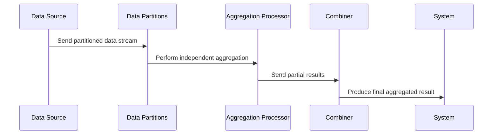

Parallel Aggregations is a design pattern used in distributed stream processing systems to perform aggregation operations concurrently by leveraging partitioned data. This approach improves computational speed and efficiency, which is crucial for processing large data streams and generating analytics in real-time.

## Architectural Explanation

In distributed systems, data is typically partitioned across multiple nodes to facilitate parallel processing. The Parallel Aggregations pattern exploits this architecture by performing aggregation operations in parallel across these partitions. Each partition independently processes the data it contains, and partial results from these computations are then combined to produce a final aggregated result. This pattern is particularly beneficial when dealing with high-velocity data streams.

### Key Components:
- **Data Source**: A continuous stream of data that needs to be aggregated.
- **Partitions**: Divisions of the data stream facilitated by partitioning keys.
- **Aggregation Functions**: Computations performed on the data, such as sum, average, count, min, or max.
- **Combiner**: A mechanism to consolidate results from each partition into a final aggregated output.

## Best Practices

- **Partition Strategy**: Choose an effective partition strategy to balance the load across nodes. A poor partitioning strategy can lead to skewed processing where some partitions have significantly more data than others.
- **Stateless vs. Stateful**: Determine whether aggregations need to maintain state. For example, summing values is stateful, while counting records can be stateless if only the total count is needed.
- **Data Locality**: Ensure that the processing framework supports data locality to minimize data shuffling between nodes.
- **Fault Tolerance**: Implement checkpointing and replication to ensure aggregation operations can recover from failure.

## Example Code

Below is an example using Apache Flink, a distributed stream processing framework, to perform parallel aggregations:

```scala
import org.apache.flink.streaming.api.scala._
import org.apache.flink.streaming.api.windowing.time.Time

object ParallelAggregationExample {
  def main(args: Array[String]): Unit = {
    // Set up the environment
    val env = StreamExecutionEnvironment.getExecutionEnvironment

    // Create a data stream
    val dataStream: DataStream[(String, Int)] = env.socketTextStream("localhost", 9000)
      .map(record => {
        val fields = record.split(",")
        (fields(0), fields(1).toInt)
      })

    // Perform parallel aggregation
    val aggregatedStream = dataStream
      .keyBy(_._1) // Partition by key
      .timeWindow(Time.minutes(1)) // Define a time window
      .reduce((value1, value2) => (value1._1, value1._2 + value2._2)) // Aggregate per partition

    // Print the results
    aggregatedStream.print()

    // Execute the Flink job
    env.execute("Parallel Aggregation Example")
  }
}
```

## Diagrams

### Mermaid UML Sequence Diagram



### Related Patterns:

- **Map-Reduce**: A paradigm where data is mapped to key-value pairs and then reduced by keys. Parallel Aggregations can be seen as a more continuous and real-time variant.
- **Stateful Stream Processing**: Where the state is maintained during stream processing, often complementing the parallel aggregation process.
- **Data Partitioning**: Ensures that data is evenly distributed across partitions for balanced load distribution.

## Additional Resources

- [Apache Flink: Data Streaming with Parallel Aggregations](https://flink.apache.org)
- [Scalable Stream Processing with Kafka Streams](https://kafka.apache.org/documentation/streams/)

## Summary

The Parallel Aggregations design pattern enables efficient and scalable aggregation of data in distributed stream processing frameworks by performing operations in parallel across partitions. By carefully choosing partition strategies and designing fault-tolerant architectures, you can optimize real-time analytics and insights from massive data streams. This pattern is integral to stream processing systems that require low latency and high throughput processing capabilities.
