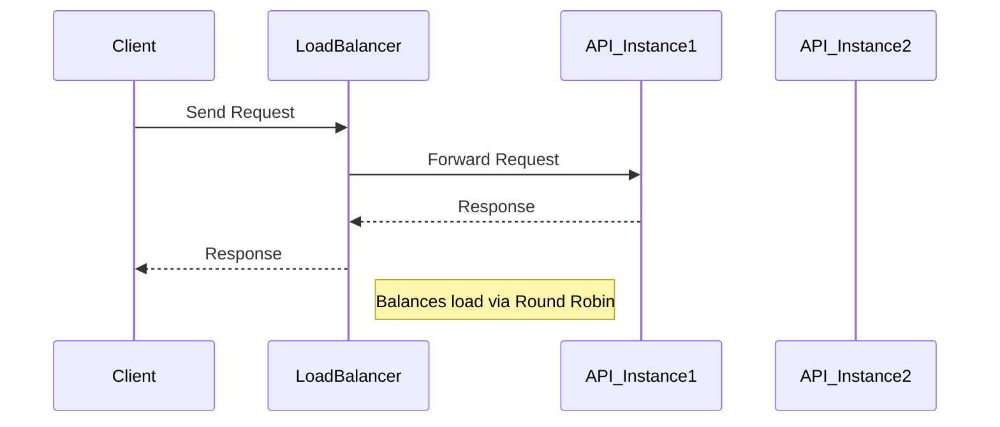

## Introduction

Load balancing is a crucial design pattern in cloud computing and distributed systems, allowing for the efficient distribution of incoming workloads across multiple servers or processing units. The primary goal is to optimize resource use, improve performance, and prevent any single resource from becoming a bottleneck that could potentially compromise the system's reliability and availability.

## Detailed Explanation

Load balancing can be implemented at various levels of an application architecture, including network, application, transport, and at the very infrastructure level on virtualized environments provided by cloud platforms like AWS, GCP, and Azure. This pattern is essential in systems that deal with fluctuating and high-demand workloads, such as online transaction processing systems, web applications, or stream processing systems, which benefit significantly from parallelism and distributed processing.

### Key Characteristics

- **Scalability**: By distributing requests across multiple instances, load balancers ensure that the application can handle increased load seamlessly, preventing any individual node from being overwhelmed.
- **Fault Tolerance**: Load balancers can also monitor the health of instances and re-route traffic to healthy instances, providing a layer of fault tolerance in case of failures.
- **Optimization**: Effective load balancing optimizes resource utilization, responding to dynamic changes in traffic patterns by adjusting the distribution accordingly, thereby improving overall system performance.
- **Flexibility**: Load balancing strategies can be implemented using different algorithms, such as round robin, least connections, IP hashing, or more advanced predictive modeling and learning-based methods.

## Example

Consider an architecture where a load balancer is used to distribute HTTP requests among multiple instances of a stream processing API. The load balancer sits in front of the API services, monitoring the request load and ensuring that no server is overwhelmed, thus maintaining optimal response time and service availability.

### Example Code (Pseudo):

```java
import com.loadbalancer.LoadBalancer;
import com.loadbalancer.Algorithm.RoundRobin;
import com.api.StreamProcessingAPI;

public class LoadBalancingExample {
    public static void main(String[] args) {
        LoadBalancer loadBalancer = new LoadBalancer(new RoundRobin());

        // Add API instances to the load balancer
        loadBalancer.addServer(new StreamProcessingAPI("https://api.instance1.com"));
        loadBalancer.addServer(new StreamProcessingAPI("https://api.instance2.com"));
        loadBalancer.addServer(new StreamProcessingAPI("https://api.instance3.com"));

        // Simulated inbound requests
        for (int i = 0; i < 10; i++) {
            loadBalancer.handleRequest("Incoming request " + i);
        }
    }
}
```

## Diagrams

### Mermaids Sequence Diagram of Request Handling:



## Related Patterns

- **Circuit Breaker Pattern**: Enhances system stability by handling failure gracefully when a particular service is unreachable or fails repeatedly.
- **Service Discovery**: Automatically detects and logs network locations of service instances, particularly in dynamic environments.
- **Autoscaling**: Automatically adjusts the number of running instances based on current demand to ensure consistent performance and cost-effectiveness.

## Additional Resources

- [AWS Elastic Load Balancing](https://aws.amazon.com/elasticloadbalancing/)
- [GCP Cloud Load Balancing](https://cloud.google.com/load-balancing)
- [Azure Load Balancer](https://azure.microsoft.com/en-us/services/load-balancer/)

## Summary

Load balancing is a fundamental pattern in distributed systems that enables efficient resource utilization, high availability, and scalability. By understanding the various strategies and techniques available for load balancing, architects and developers can significantly enhance the performance and reliability of their applications, especially in cloud environments.

This versatile pattern, aligned with related patterns like Service Discovery and Autoscaling, forms the backbone of modern scalable architecture frameworks, ensuring systems are robust, performant, and cost-effective in handling varying workloads.
