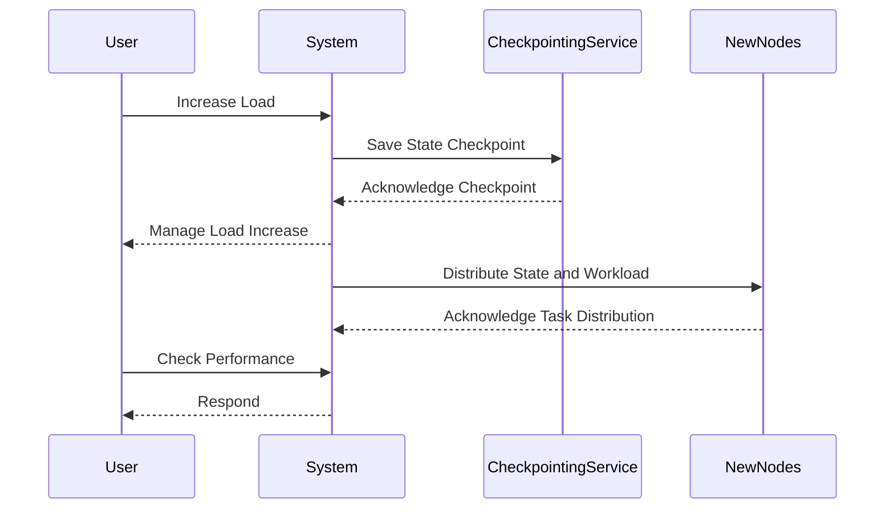

## Introduction to Stateful Scaling

In the realm of distributed stream processing, scaling systems that maintain state presents unique challenges compared to stateless systems. Stateful Scaling involves redistributing tasks across nodes in a cluster while ensuring that state information is preserved and correctly managed. This pattern becomes vital in architectures where applications process data streams with historical context, such as in Apache Flink.

## Detailed Explanation

Stateful applications require that instances or tasks manage portions of data that can change over time, such as user sessions or financial transactions. As load increases, these applications must scale out by redistributing tasks and their associated state across additional computing resources without losing consistency or reliability.

### Key Considerations:

1. **State Management**: Efficiently managing the state during task reassignment is crucial. The state might need to be serialized, partitioned, and transferred to new locations.
2. **Checkpointing**: The application must periodically checkpoint its state to durable storage. This ensures that, in case of failure or scaling operations, the system can be recovered to a previous consistent state.
3. **Latency vs. Throughput**: The balance between low latency state updates and the increased throughput gained from parallel processing needs to be carefully managed.
4. **Fault Tolerance**: The system should be fault-tolerant, meaning it can recover from failures without significant data loss.

## Example Implementation with Apache Flink

Apache Flink is a powerful stream processing framework that excels in stateful computations. Flink offers stateful operators and a robust checkpointing mechanism that helps manage state during scale operations.

### Simplified Example:

Below is a conceptual view of how Flink might handle state management in a stateful scaling scenario.

```java
StreamExecutionEnvironment env = StreamExecutionEnvironment.getExecutionEnvironment();

// Configure checkpointing for stateful management
env.enableCheckpointing(10000); // checkpoint every 10 seconds

DataStream<String> inputDataStream = env
    .addSource(new CustomSourceFunction());

DataStream<String> processedStream = inputDataStream
    .keyBy(value -> extractKey(value))
    .flatMap(new StatefulFlatMapFunction());

// Implement stateful flat map function
public static class StatefulFlatMapFunction extends RichFlatMapFunction<String, String> {
    private transient ValueState<Integer> counterState;

    @Override
    public void open(Configuration config) {
        ValueStateDescriptor<Integer> descriptor = 
            new ValueStateDescriptor<>("counter", Integer.class, 0);
        counterState = getRuntimeContext().getState(descriptor);
    }

    @Override
    public void flatMap(String value, Collector<String> out) throws Exception {
        Integer count = counterState.value() + 1; // update state
        counterState.update(count);
        out.collect("Processed: " + value + ", Count: " + count);
    }
}
```

This Java example sketches a high-level view of state management with incremental state updates, leveraging Flink's ValueState API for stateful transformations.

## Diagram of Stateful Scaling Process

Below is a Mermaid sequence diagram that illustrates stateful scaling in a distributed system:



## Related Patterns

- **Checkpointing**: Storing the state of an application at a particular point in time to enable rollback to that state.
- **Partitioning**: Dividing data into distinct independent units of work for distributed processing.

## Additional Resources

- **Apache Flink Documentation**: Comprehensive resource for understanding stateful operations in Flink.
- **Stream Processing with Apache Flink**: A book that delves into actionable patterns and optimizations.
- **State Management in Stream Processing**: Articles and whitepapers on best practices in stateful stream processing.

## Summary

Stateful Scaling is a crucial pattern for systems that require robust state management while maintaining high throughput and fault tolerance. By effectively managing state through checkpointing and efficient state distribution, systems like those built with Apache Flink can handle dynamic scaling demands without compromising consistency or reliability. Understanding and applying these principles ensures that your distributed system can remain performant and dependable as it scales.
