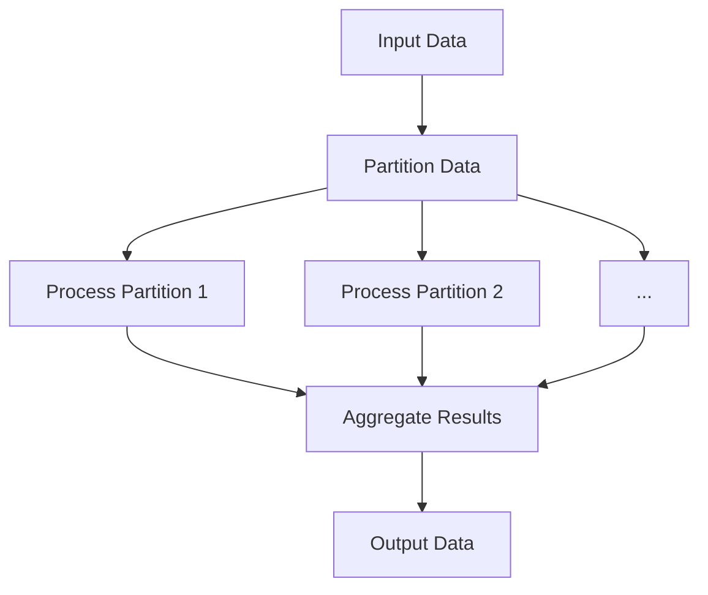

## Data Parallelism

Data Parallelism is a highly effective design pattern employed in scaling and parallelism contexts within cloud computing and big data environments. This pattern focuses on optimizing data processing tasks by partitioning the data into segments or chunks that can be processed in parallel, thus enhancing performance, throughput, and efficiency.

### Architectural Approach

The essence of Data Parallelism lies in its ability to harness multiple processing units (such as CPUs or nodes in a distributed system) to operate on separate partitions of data concurrently. This approach minimizes the time required to process large datasets by leveraging the distributed computing resources effectively.

1. **Data Division**: Data is first divided into multiple partitions or chunks. Each partition is independently processable.

2. **Parallel Processing Units**: Multiple computing units execute tasks simultaneously on these data chunks, allowing tasks to be completed faster rather than sequentially.

3. **Aggregation of Results**: Once processing is complete, results from different processors are aggregated or combined to produce the final output.

### Example Code

Let's consider an example using Apache Spark, a popular framework for big data processing:

```scala
import org.apache.spark.sql.SparkSession

val spark = SparkSession.builder.appName("DataParallelismExample").getOrCreate()

// Creating a Resilient Distributed Dataset (RDD)
val data = spark.sparkContext.parallelize(Seq(1, 2, 3, 4, 5, 6, 7, 8, 9, 10), numSlices = 4)

// Performing a map operation in parallel
val squaredData = data.map(x => x * x)

// Collecting and printing the results
squaredData.collect().foreach(println)
```

In this example, we use Spark's RDD to distribute a dataset across four nodes (or cores) which then perform the computation task (in this case, squaring each number) concurrently.

### Diagrams

#### Data Parallelism Flow



### Best Practices

- **Effective Partitioning**: Achieving optimal performance in data parallelism requires careful consideration of how data is partitioned. Unequal partitioning may lead to resource underutilization or processing bottlenecks.

- **Load Balancing**: Ensure that workloads are balanced evenly across processing units to maximize throughput and avoid data skew.

- **Monitoring and Tuning**: Regular monitoring and tuning of parallel processing operations can help in adjusting configurations to harness maximum efficiency and adapt to dynamic workloads.

### Related Patterns

- **Task Parallelism**: Unlike Data Parallelism, Task Parallelism focuses on concurrently executing different tasks rather than the same task on data partitions.

- **Pipeline Processing**: Involves breaking down a task into a series of staged operations, where the output of one stage becomes the input for the next.

### Additional Resources

- [Apache Spark Documentation](https://spark.apache.org/docs/latest/)
- [Parallel Computing Paradigms](https://en.wikipedia.org/wiki/Parallel_computing)
- [Concurrency in Java](https://docs.oracle.com/javase/tutorial/essential/concurrency/)

### Summary

Data Parallelism is a cornerstone design pattern for efficiently processing large datasets by leveraging parallel processing capabilities in cloud computing and big data environments. By focusing on dividing tasks into manageable partitions, it speeds up processing time and improves the system's overall performance, making it indispensable for applications involving vast amounts of data.
