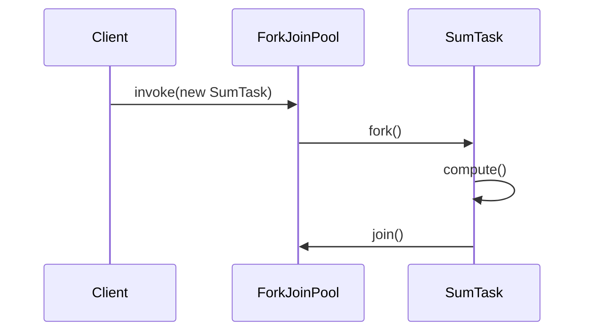
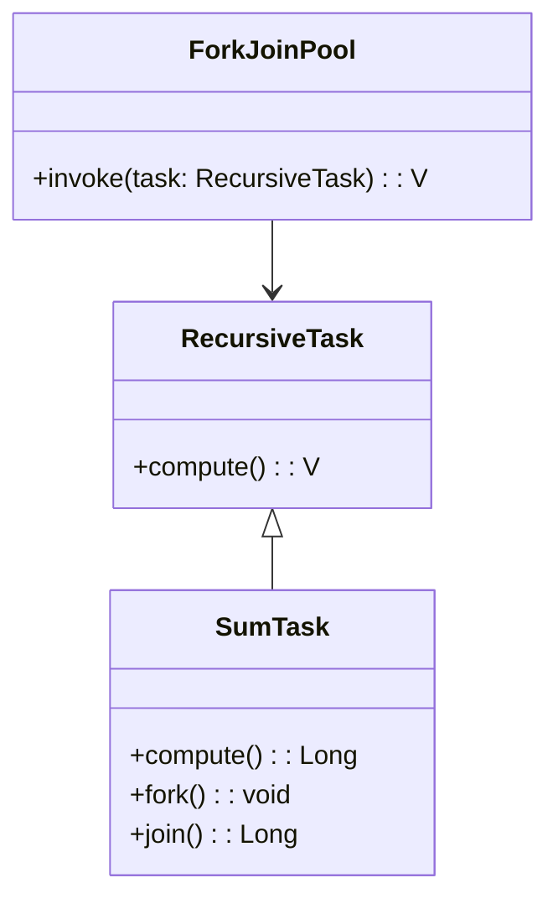

## Introduction

Task parallelism involves executing different tasks or operations concurrently across multiple processors or threads to maximize computational efficiency and speed. This design pattern is commonly used to increase the throughput and responsiveness of applications, especially in environments where different tasks can be processed independently.

## Detailed Explanation

Task parallelism focuses on decomposing a program into concurrent, independent tasks. These tasks can be distributed across multiple processing units, allowing them to run simultaneously. It differs from data parallelism, where the same task is replicated across chunks of data. By implementing task parallelism, developers can achieve higher performance and resource utilization, especially in systems designed to process multiple inputs or handle various operations concurrently.

### Key Components

1. **Task Decomposition**:
   - The process of breaking down applications into smaller, independent tasks that can run in parallel.
  
2. **Concurrency**:
   - Running multiple tasks simultaneously across one or more processing units.

3. **Synchronization**:
   - Mechanisms to ensure tasks are correctly synchronized, avoiding race conditions and ensuring data consistency.

## Architectural Approaches

1. **Pipeline Pattern**:
   - Tasks are arranged in a series of processing steps, where the output of one task acts as the input to the next.
   - This pattern is efficient for processing streaming data.

2. **Producer-Consumer Model**:
   - Tasks produce data that is consumed by other tasks, suitable for scenarios involving queues or buffers.

3. **Task Scheduling**:
   - Dynamic assignment of tasks to available processors to balance the load and optimize resource use.

## Best Practices

- **Identify Independent Tasks**: Ensure tasks can execute without interfering with each other.
- **Optimize Synchronization**: Use appropriate locks or concurrency primitives to maintain a balance between parallel execution and data integrity.
- **Monitor and Adjust Load Balancing**: Continuously measure performance to refine resource allocation and processing power utilization.
- **Leverage Parallel Libraries**: Use existing libraries or frameworks, such as Java's Fork/Join framework or Python's concurrent.futures, to simplify task management and execution.

## Example Code

Here is an example of task parallelism using Java's `ForkJoinPool`:

```java
import java.util.concurrent.RecursiveTask;
import java.util.concurrent.ForkJoinPool;

public class ParallelTaskExample {

    private static class SumTask extends RecursiveTask<Long> {
        private final long[] numbers;
        private final int start;
        private final int end;

        public SumTask(long[] numbers, int start, int end) {
            this.numbers = numbers;
            this.start = start;
            this.end = end;
        }

        @Override
        protected Long compute() {
            if (end - start <= 100) {
                long sum = 0;
                for (int i = start; i < end; i++) {
                    sum += numbers[i];
                }
                return sum;
            } else {
                int mid = (start + end) / 2;
                SumTask leftTask = new SumTask(numbers, start, mid);
                SumTask rightTask = new SumTask(numbers, mid, end);
                leftTask.fork();
                return rightTask.compute() + leftTask.join();
            }
        }
    }

    public static long parallelSum(long[] numbers) {
        ForkJoinPool pool = new ForkJoinPool();
        return pool.invoke(new SumTask(numbers, 0, numbers.length));
    }

    public static void main(String[] args) {
        long[] numbers = new long[10000]; // some large dataset
        System.out.println("Total Sum: " + parallelSum(numbers));
    }
}
```

## Diagrams

### Sequence Diagram



### Class Diagram



## Related Patterns

- **Pipeline Pattern**: For data flow-oriented task parallelism.
- **Map-Reduce Pattern**: Often used for parallel processing of big data tasks.
- **Executor Service**: Managing and executing asynchronous tasks in Java or similar environments.

## Additional Resources

1. [Java Fork/Join Framework](https://docs.oracle.com/javase/tutorial/essential/concurrency/forkjoin.html)
2. [Task Parallel Library (TPL) in .NET](https://learn.microsoft.com/en-us/dotnet/standard/parallel-programming/task-parallel-library-tpl)
3. [Concurrency in Python with asyncio](https://docs.python.org/3/library/asyncio.html)

## Summary

Task parallelism is a powerful design pattern that enhances the performance of applications by allowing multiple independent tasks to be executed simultaneously. By identifying tasks that can be parallelized and efficiently synchronizing them, developers can drastically improve an application's throughput, responsiveness, and resource utilization across various platforms and environments.
