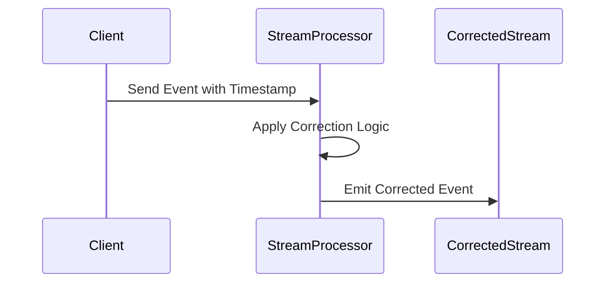

## Description

Timestamp Correction is a design pattern used in stream processing to address the challenges associated with inaccurate or inconsistent timestamps within real-time data streams. This pattern is essential when working with data from distributed systems or various IoT devices whose internal clocks may drift or be misconfigured, leading to inaccuracies in event timing.

Incorrect timestamps can cause significant issues, such as misordering of events, inaccurate time representations, and challenges in real-time analytics. Implementing timestamp correction ensures that the data pipeline ingests and processes events in their accurate temporal order, resulting in improved data integrity and reliability.

## Architectural Approach

The Timestamp Correction pattern involves the following steps:

1. **Identify and Understand Inaccuracies**: Determine which data sources exhibit timestamp inaccuracies and understand the nature of these inaccuracies, such as consistent offsets or random drifts.

2. **Establish Correction Rules**: Define a set of rules or algorithms to correct known timestamp offsets. These may include:
    - Static corrections based on known misalignments.
    - Dynamic adjustments using reference events with known correct timestamps.

3. **Implement Correction in Stream Processing**: Integrate the timestamp correction logic into the stream processing framework. This can be part of the data ingestion pipeline or implemented in the processing layer directly.

4. **Verification and Validation**: Continuously monitor the corrected timestamps against external reference time sources to validate and refine the correction rules.

## Example Code

Below is an example using Kafka Streams in Java to correct timestamps using a simple known offset:

```java
import org.apache.kafka.streams.KafkaStreams;
import org.apache.kafka.streams.StreamsBuilder;
import org.apache.kafka.streams.kstream.KStream;
import org.apache.kafka.streams.test.TestInputTopic;

public class TimestampCorrectionExample {

    public static void main(String[] args) {
        StreamsBuilder builder = new StreamsBuilder();
        KStream<String, String> sourceStream = builder.stream("input-topic");

        KStream<String, String> correctedStream = sourceStream.mapValues(event -> {
            // Adjust the timestamp using a known offset
            long correctedTimestamp = Long.parseLong(event.split(",")[0]) - 3600; // subtracting 1 hour
            return correctedTimestamp + "," + event.split(",")[1];
        });

        correctedStream.to("output-topic");

        KafkaStreams streams = new KafkaStreams(builder.build(), new StreamsConfig());
        streams.start();
    }
}
```

## Diagrams

Here is a basic Mermaid sequence diagram illustrating timestamp correction logic:



## Related Patterns

- **Out-of-Order Event Processing**: Handling events that arrive out of chronological order.
- **Event Deduplication**: Removing duplicate events that may appear in stream data due to various errors.
- **Slow Subscriber Repositioning**: Adjusting for consumers that fall behind in processing speed relative to data generation.

## Additional Resources

- [Designing Data-Intensive Applications by Martin Kleppmann](https://dataintensive.net/)
- [Stream Processing with Apache Kafka](https://kafka.apache.org/documentation/streams/)
- [Event Time and Processing Time in Streaming Systems](https://www.oreilly.com/library/view/stream-processing-with/9781491964936/ch06.html)

## Summary

The Timestamp Correction pattern is pivotal in stream processing, ensuring data integrity by handling discrepancies in event timing. By implementing robust correction mechanisms, systems can maintain accurate data sequences and support dependable real-time analytics. This pattern is a crucial consideration for any stream processing architecture dealing with diverse data sources, especially in IoT and distributed systems.
