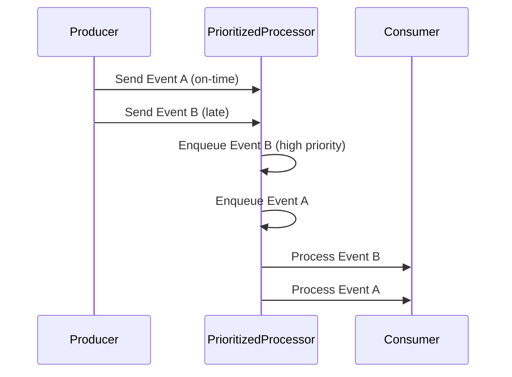

## Prioritized Processing

### Description

In stream processing, dealing with late-arriving data is a common challenge. Traditional event processing often relies on the order in which events are received; however, late events—those which arrive after their expected processing time—pose unique challenges. The prioritized processing pattern addresses this issue by ensuring that late events are given precedence over on-time events to minimize disruptions in analytic calculations or real-time decision-making processes.

By implementing prioritized processing, systems can ensure that late events are handled immediately, thus reducing their potential to skew aggregation or analytics results.

### Architectural Approach

To implement prioritized processing, you can employ the following architectural components:

- **Priority Queue**: Use a priority queue to manage event processing. Late events are enqueued with higher priority, allowing them to be processed before on-time events.
  
- **Timestamp Evaluation**: Upon receipt, each event's timestamp is evaluated to determine its priority. This entails checking whether the event has missed its intended processing window.

- **Dynamic Reordering**: Sophisticated stream processing frameworks provide mechanisms to reorder events dynamically based on priority, often leveraging features such as stateful processing, windowing, and watermarking.

### Example Code

Here's a Scala code example using Apache Flink, a popular stream processing framework, to demonstrate prioritized event processing using a custom priority queue:

```scala
import org.apache.flink.streaming.api.scala._
import org.apache.flink.streaming.api.scala.function.ProcessFunction
import org.apache.flink.util.Collector
import scala.collection.mutable.PriorityQueue

case class Event(id: String, timestamp: Long, data: String)

object PrioritizedProcessingExample {

  def createPriorityStream(env: StreamExecutionEnvironment): DataStream[Event] = {
    val events = env.fromElements(
      Event("1", System.currentTimeMillis() - 5000, "late event"),
      Event("2", System.currentTimeMillis(), "on-time event")
    )

    events
      .process(new PrioritizedProcessFunction)
  }

  class PrioritizedProcessFunction extends ProcessFunction[Event, Event] {
    lazy val priorityQueue: PriorityQueue[Event] = PriorityQueue.empty(
      Ordering.by((e: Event) => -e.timestamp)
    )

    override def processElement(event: Event, ctx: Context, out: Collector[Event]): Unit = {
      priorityQueue.enqueue(event)
      processQueue(out)
    }

    def processQueue(out: Collector[Event]): Unit = {
      if (priorityQueue.nonEmpty) {
        val nextEvent = priorityQueue.dequeue()
        out.collect(nextEvent)
      }
    }
  }
}
```

### Diagrams

Here is a Mermaid diagram showing how events flow through a prioritized processing system:



### Related Patterns

- **Dead Letter Queue**: A pattern to handle unprocessable events separately, ensuring that the system does not break due to unexpected data.
- **Event Time Processing**: Focus on processing events based on the time they were created rather than the time they were received.

### Additional Resources

- [Apache Flink Documentation on Event Time](https://flink.apache.org/)
- [PriorityQueue in Scala Collections](https://docs.scala-lang.org/overviews/collections-2.13/priority-queue.html)
- [Dataflow Concepts in Stream Processing](https://dataflow.cloud.google.com/)

### Summary

The prioritized processing pattern is crucial in environments with high volumes of data and time-sensitive analytic needs. By leveraging priority queues and evaluating event timestamps, systems can ensure timely handling of late events, thus reducing the potential bias in results and maintaining the fidelity and accuracy of data-driven decisions. Using frameworks like Apache Flink, implementing this pattern becomes more accessible, providing built-in support for complex event time processing.
