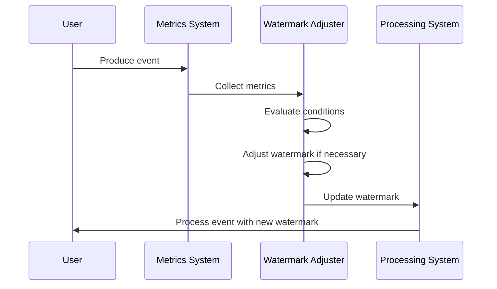

## Introduction

In stream processing systems, handling late-arriving data is crucial for accurate result computation. Watermarks help manage out-of-order events by providing a temporal marker, thus ensuring that computations can progress without waiting indefinitely. This article explores the **Dynamic Watermark Adjustments** design pattern, which aims to dynamically adjust watermark thresholds based on observed event delays to effectively manage late data and ensure accurate results.

## Pattern Explanation

### Context

In distributed and streaming systems, data can arrive late due to network issues, processing delays, or load fluctuations. Traditional watermarking techniques use fixed thresholds, which might not be sufficient in varying latency conditions. Static watermarks may lead to premature result finalization, ignoring late-arriving data, or increased idle time while the system awaits late data. As a result, maintaining flexible watermarking based on real-time metrics can greatly enhance accuracy and system responsiveness.

### Problem

How can streaming systems dynamically adjust watermark thresholds to handle late arrivals effectively in dynamic network conditions and processing environments without manually reconfiguring the system?

### Solution

**Dynamic Watermark Adjustments** involve analyzing real-time data flow metrics to modify watermark generation policies adaptively. By monitoring metrics such as average delay, variance in event arrival times, or network latency, the system can automatically recalibrate the watermark to allow more time for processing when delays are detected.

1. **Metrics Collection**: Continuously collect metrics related to event timing and network conditions, such as event timestamps, processing times, and arrival delays.

2. **Condition Evaluation**: Implement logic to evaluate if the current conditions deviate from normal operation significantly.

3. **Adjustment Logic**: Define rules or use machine learning models to adjust the watermark thresholds based on the deviation from expected conditions. For instance, increase the allowed lateness buffer during high-latency periods.

4. **Continuous Monitoring**: Ensure ongoing adjustment based on current metrics, enabling the system to return to default thresholds when conditions normalize.

### Example Code

```java
public class DynamicWatermarking {
    private long currentWatermark;
    private long latenessBuffer = DEFAULT_LATENESS_BUFFER;

    public void adjustWatermark(Event evt) {
        long eventDelay = System.currentTimeMillis() - evt.timestamp;
        if (eventDelay > latenessBuffer) {
            // Adjust the watermark
            currentWatermark += dynamicLatenessAdjustment(eventDelay);
        }
    }

    private long dynamicLatenessAdjustment(long delay) {
        // Implement logic to calculate adjusted lateness
        return delay / ADJUSTMENT_FACTOR;
    }
}
```

### Diagram



## Related Patterns

- **Time Windowing**: Combines with dynamic watermarks to ensure windows accommodate late events effectively.
- **Out-of-Order Processing**: Supports systems designed to naturally handle unordered event streams.
- **Event Sourcing**: Facilitates replaying events in order to improve accuracy during varied lateness periods.

## Best Practices

- Implement robust metrics systems to collect timing and latency information in real-time.
- Use predictive models sparingly to prevent over-adjustment that may degrade performance by introducing excessive buffering.
- Regularly test and calibrate adjustment rules to align with evolving network conditions and system performance.

## Additional Resources

- [The Data Stream Development Platforms](https://datastreamplatforms.com)
- [Understanding Watermarks and Triggers in Stream Processing](https://streamingframeworks.com/understanding-watermarks)
- [Stream Processing Architecture Patterns](https://architecturepatterns.com/stream-processing)

## Summary

The **Dynamic Watermark Adjustments** design pattern offers a flexible approach to managing late data in real-time systems by dynamically adjusting watermark thresholds based on real-time event conditions. It optimizes the balance between result timeliness and accuracy in distributed, latency-sensitive applications. By integrating dynamic watermark logic, streaming systems can improve resilience, efficiency, and accuracy in diverse and changeable operational environments.
