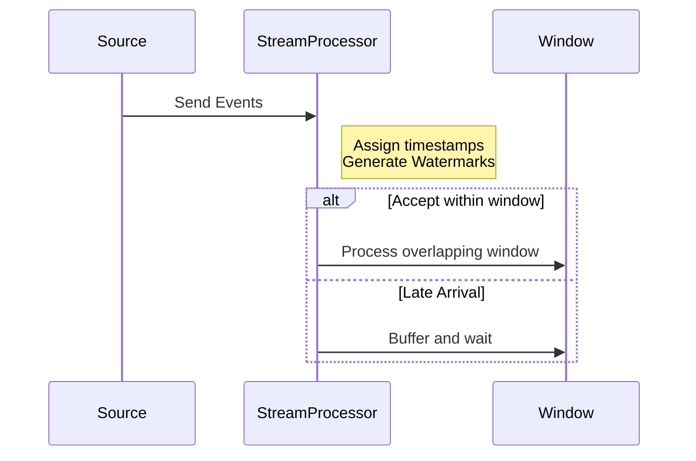

## Overview

Temporal Bucketing is a design pattern used in stream processing systems for managing and processing events that may arrive late. In real-time data processing, events do not always arrive in chronological order, and a mechanism is required to ensure that late-arriving data is adequately handled. Temporal Bucketing addresses this challenge by grouping events into time-based buckets with overlapping boundaries, thereby ensuring that late arrivals can still be included in the appropriate time segment.

## Detailed Explanation

### Architectural Approach

1. **Dynamic Windows**: Unlike static time windows, Temporal Bucketing employs overlapping windows to flexibly manage incoming streams. This involves creating windows that slightly overlap with previous or subsequent ones to capture any late-arriving events.

2. **Buffering Strategy**: A buffer is maintained to temporarily hold events that arrive after the initial processing of a window. This allows the system to reconsider these events for inclusion in past windows.

3. **Watermarks**: Watermarks help in determining the lateness of events. They are periodic timestamps emitted by the system indicating that no event earlier than this timestamp is expected. Temporal Bucketing adjusts the position of watermarks to handle lateness by delaying their progression.

### Best Practices

- **Define Overlapping Intervals**: Carefully specify the duration of the overlapping section to balance between capturing late events and resource efficiency.

- **Adjust Window Lengths Based on Event Patterns**: Analyze the usual delays in event arrival to adjust the length and overlap of windows.

- **Use Watermarks Efficiently**: Set watermarks correctly to accommodate a reasonable amount of lateness while avoiding excessive delay of result generation.

## Example Code

Below is a pseudo-code example implementing Temporal Bucketing using a stream processing library such as Apache Flink:

```scala
val env = StreamExecutionEnvironment.getExecutionEnvironment

val stream = env.socketTextStream("localhost", 9999)
  .assignTimestampsAndWatermarks(WatermarkStrategy
    .forBoundedOutOfOrderness(Duration.ofSeconds(5))) // Set watermark delay

val bucketedStream = stream
  .keyBy(event => event.key)
  .window(SlidingEventTimeWindows.of(Time.minutes(10), Time.minutes(5))) // Overlapping window
  .reduce((e1, e2) => e1.combine(e2)) // Aggregation function

bucketedStream.print()

env.execute("Temporal Bucketing Example")
```

## Diagrams

### Mermaid Sequence Diagram



## Related Patterns

- **Event Time Processing**: A paradigm wherein event timestamps are used to manage event order rather than processing time.
  
- **Watermarking**: A related mechanism that informs the system about the latency of the data stream, closely used with Temporal Bucketing to manage late arrivals.
  
- **Sliding Windows**: This pattern overlaps windows which is conceptually similar to temporal bucketing in ensuring no loss of late data.

## Additional Resources

- [Apache Flink Documentation on Windowing](https://ci.apache.org/projects/flink/flink-docs-stable/dev/stream/operators/windows.html)
- [Stream Processing with Apache Kafka](https://kafka.apache.org/documentation/streams/)

## Summary

Temporal Bucketing is a crucial design pattern in stream processing for ensuring accurate processing of out-of-order events. Through the use of overlapping windows and careful management of watermarks, it allows systems to handle late-arriving data effectively without compromising on real-time processing goals. By implementing Temporal Bucketing with best practices and in combination with other related patterns like Event Time Processing and Watermarking, we can build robust data processing pipelines that handle complexities such as lateness and data compatibility efficiently.
