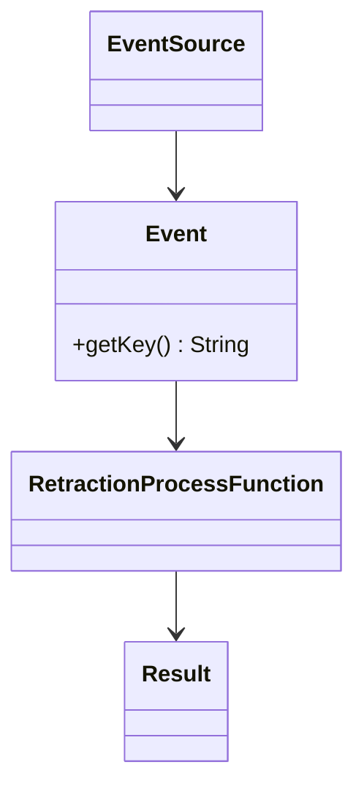
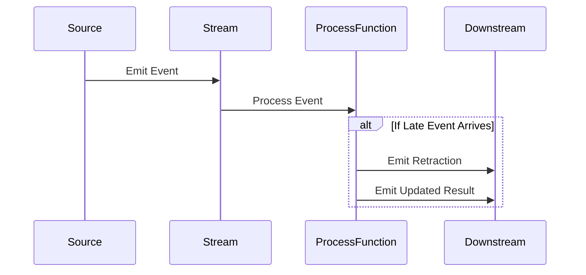

## Introduction
The "Time-Based Retractions" pattern addresses the challenge of late-arriving events in stream processing systems. In scenarios where events might arrive with delays due to network latencies or asynchronous event generation, early-emitted results based on incomplete data may need revision. This design pattern helps applications retract previous results and emit updated values, thus ensuring data accuracy and consistency.

## Architectural Approach

### Description
In Time-Based Retraction, systems receiving streams of real-time data need methods to adjust previously computed outputs due to late-arriving events that affect previous time windows or queries' results. This design often involves:

- **Stream Reprocessing**: Rerunning computations using late-arriving events.
- **State Management**: Maintaining stateful information on previously emitted results.
- **Retraction Messages**: Sending retraction notifications to downstream systems to adjust already ingested data.

### Paradigms
- **Event Time Processing**: Using event timestamps instead of processing timestamps to ensure computations reflect the order and timing of event generation.
- **Windowed Aggregations**: Applying fixed-size or session-based window computations to handle batch-like accumulation over streams.

## Best Practices

- **Watermarking**: Implementing watermarks to indicate the relative completeness of data streams and trigger updates for late data.
- **Idempotency**: Ensuring that retractions and updates do not lead to duplicated operations, maintaining idempotent processing.
- **Compensation Logic**: Providing mechanisms to correct previous computations without full recomputation when possible.
- **Buffered Storage**: Temporarily storing data points to wait for potential late arrivals before committing changes.

## Example Code
Here's a simple example using Apache Flink's DataStream API to illustrate how one might implement time-based retractions:

```java
import org.apache.flink.api.common.eventtime.WatermarkStrategy;
import org.apache.flink.streaming.api.datastream.DataStream;
import org.apache.flink.streaming.api.environment.StreamExecutionEnvironment;
import org.apache.flink.streaming.api.windowing.time.Time;

public class TimeBasedRetractionExample {
    public static void main(String[] args) throws Exception {
        StreamExecutionEnvironment env = StreamExecutionEnvironment.getExecutionEnvironment();
        
        DataStream<Event> events = env.addSource(new EventSource());

        DataStream<Result> results = events
            .assignTimestampsAndWatermarks(WatermarkStrategy.<Event>forBoundedOutOfOrderness(Duration.ofSeconds(10)))
            .keyBy(Event::getKey)
            .timeWindow(Time.minutes(5))
            .process(new RetractionProcessFunction());
        
        results.print();

        env.execute("Flink Time-Based Retraction Example");
    }
}
```

## Diagrams

### Class Diagram (UML)



### Sequence Diagram



## Related Patterns

- **Event Sourcing**: Replayable log of events to handle retraction and update logic.
- **Windowed Joins**: Temporally combining streams with time windows to adjust data relations across streams.
- **Watermarks and Triggers**: Useful in defining when to emit, retract, or complete operations in stream processing.

## Additional Resources
- "The Data Warehouse Toolkit" by Ralph Kimball: Insight into dimensional modeling with late-arriving facts in data warehousing.
- Apache Flink Documentation: Detailed resources on implementing time-based windows and watermarks.
- Streaming Architecture by Ted Dunning and Ellen Friedman: Concepts and detailed explanations on stream processing patterns.

## Summary
The Time-Based Retractions pattern is an integral part of stream processing systems where the accuracy and reliability of real-time analytics rely on the ability to handle late-arriving events gracefully. Employing this pattern involves using sophisticated stream management techniques like watermarks, stateful computation, and windowing mechanisms to ensure that streamed data maintains its consistency and correctness over time while adapting to changes in data availability.
