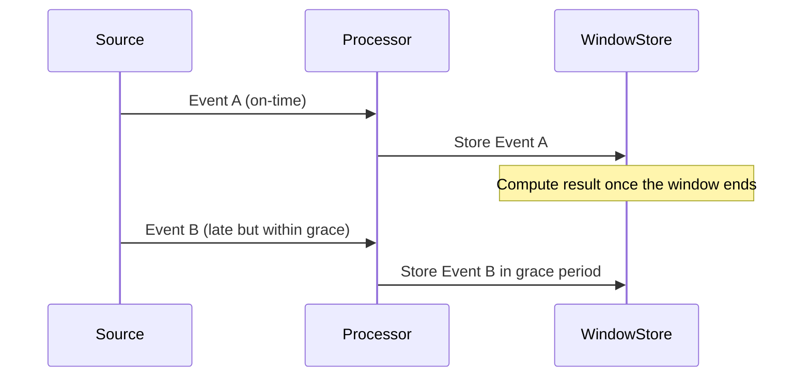

## Introduction

In the realm of stream processing, handling late-arriving events is a common challenge. Grace periods are a design pattern that provides a solution by extending the window duration past its official end to account for late data. This pattern is crucial in scenarios where events may arrive late due to network or processing delays, but still need to be included in the correct computational window.

## Concept

The concept of grace periods revolves around the idea of intentionally delaying the closure of a data window even after its official end. This allows for a buffer time during which late-arriving events can still be included in computational results, enhancing the accuracy and reliability of real-time data processing systems.

### Key Points:
1. **Event Time vs. Processing Time**: Distinguishing between when an event actually occurred (event time) versus when it was processed by the system (processing time).

2. **Windowing**: Dividing stream data into finite chunks called windows, for aggregation or detailed analysis.

3. **Late Data Handling**: Strategies to efficiently handle data arriving after a window's scheduled closure.

## Example in Kafka Streams

Kafka Streams, a popular stream processing library, offers built-in support for grace periods. When defining a window, developers can specify a grace period allowing additional time for late events:

```java
StreamsBuilder builder = new StreamsBuilder();
KStream<String, Long> stream = builder.stream("input-topic");

TimeWindows timeWindows = TimeWindows.of(Duration.ofMinutes(5)).grace(Duration.ofMinutes(2));

KTable<Windowed<String>, Long> results = stream
    .groupByKey()
    .windowedBy(timeWindows)
    .count();
```

In this example, a 5-minute tumbling window is extended with a 2-minute grace period during which late events will still be processed. This ensures late messages arriving within 7 minutes total (initial window + grace) contribute to the computation.

## Diagrams

### Grace Periods Processing Flow


## Related Patterns

- **Event Sourcing**: Captures all changes as a sequence of events, analogous to handling late-arriving events as part of a continuous log.
- **Idempotency**: Ensures repeated processing does not affect system state, useful when reprocessing late or repeated events.

## Best Practices

- **Define Appropriate Grace Periods**: Consider the behavior of your data flows and define grace periods that balance allowing enough time for late arrivals while ensuring timely results.
- **Monitor Late Data**: Implement monitoring to track late arrivals and adjust window and grace configurations if necessary.
- **Optimize for Performance**: Use efficient data stores and processing architectures to handle increased workloads from late-arriving data.

## Additional Resources

- Confluent Blog on Grace Periods in Kafka Streams
- "Designing Data-Intensive Applications" by Martin Kleppmann
- Apache Kafka Streams Documentation

## Summary

Grace periods are an essential stream processing pattern that ensure late arrivals don't lead to data loss or incorrect computations. By providing a controlled mechanism for processing late events, grace periods help maintain data accuracy and system robustness, accommodating the unpredictability of network conditions and data delays. Implementing this pattern requires careful planning to balance timeliness with completeness in data-processing applications.
