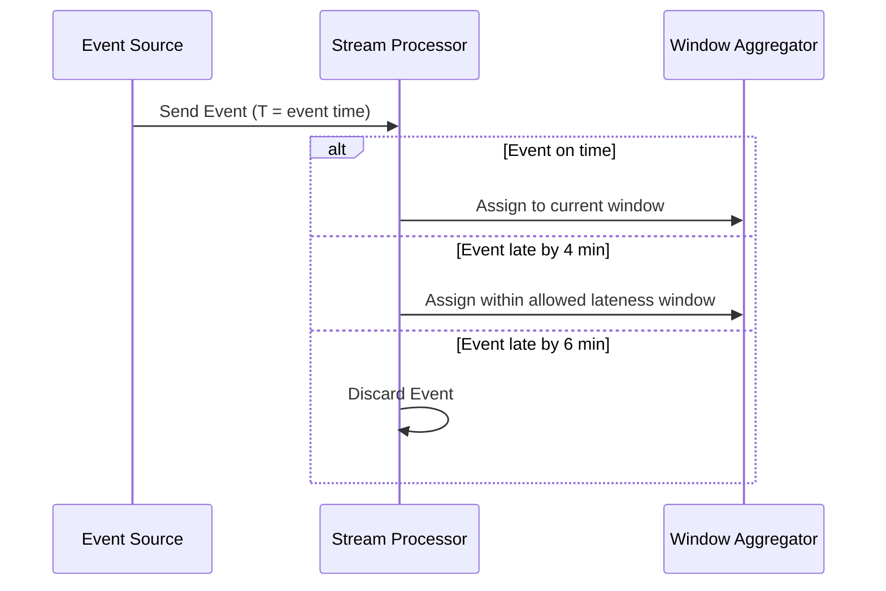

## Allowed Lateness Configuration

**Allowed Lateness Configuration** is a crucial design pattern in stream processing systems, particularly when dealing with real-time data that is susceptible to arriving late due to various network latencies and out-of-order delivery.

### Description

In stream processing, data often arrives out of order, potentially leading to inaccurate results if late data is discarded or not managed properly. The **Allowed Lateness Configuration** pattern allows for configuring a specific time window after the event window closes, during which late-arriving data can still be accepted and processed. This approach aids in improving the accuracy and completeness of stream analytics.

### Architectural Approach

1. **Event Time vs. Processing Time**: Distinguish between event time (when the event occurred) and processing time (when the event is processed). This separation is fundamental to handle late data correctly.
   
2. **Windowing Strategy**: Establish your windowing strategy (such as tumbling, sliding, or session windows) to determine how events are grouped.

3. **Allowed Lateness Configuration**: Set up an "allowed lateness" period which determines how long after the window's end processing time summary  pertinent late events can still be considered. 

   - For example, if you configure a 5-minute allowed lateness, any events arriving within 5 minutes after a window closes will be included in that window's results.

### Example Code

Below is a simplified example using Apache Flink, a popular stream processing framework:

```java
StreamExecutionEnvironment env = StreamExecutionEnvironment.getExecutionEnvironment();
    
DataStream<Event> stream = env.addSource(new MyEventSource());

stream
    .assignTimestampsAndWatermarks(new BoundedOutOfOrdernessTimestampExtractor<Event>(Time.seconds(10)) {
        @Override
        public long extractTimestamp(Event element) {
            return element.getTimestamp();
        }
    })
    .keyBy((Event event) -> event.getKey())
    .window(TumblingEventTimeWindows.of(Time.minutes(1)))
    .allowedLateness(Time.minutes(5))
    .process(new ProcessWindowFunction<Event, Result, String, TimeWindow>(){
        @Override
        public void process(String key, Context context, Iterable<Event> elements, Collector<Result> out) {
            // Processing logic here
        }
    });
```

### Diagrams

Here's an example of a sequence diagram illustrating allowed lateness:



### Related Patterns

- **Watermarking**: Determines when a window is ready for the results to be emitted by considering the progress in event time.
- **Session Windows**: Adaptively manage timing based on event gaps, not fixed units, ideal for variable-rate event streams.
- **Out-of-Order Event Handling**: Strategies to deal with unordered events in stream processing.

### Additional Resources

- [Apache Flink Documentation](https://flink.apache.org)
- [Stream Processing: The Vocabulary](https://www.oreilly.com/radar/the-world-beyond-batch-streaming-101/)

### Conclusion

The Allowed Lateness Configuration pattern is vital for handling late-arriving data in stream processing systems. It ensures data consistency and accuracy by allowing late events to be processed even after the initial window has closed. By integrating this pattern, systems can deliver more reliable analytics and insights even from irregular data flows.
