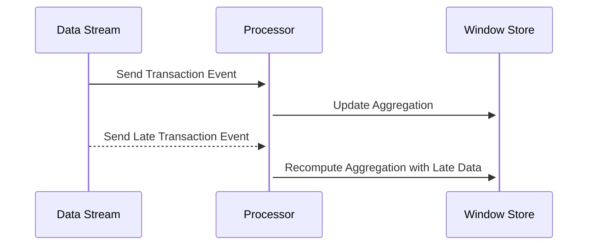

## Overview

In the realm of stream processing, one of the critical challenges is dealing with late-arriving data. Late data can significantly alter pre-computed aggregates if not handled properly. The **Recomputing Aggregations** pattern focuses on recalculating aggregates to ensure data accuracy and consistency when late data is introduced into streams.

This design pattern is crucial in applications where precision in real-time analytics is paramount, such as financial transactions, sensor data analysis, or monitoring systems.

## Architectural Approaches

1. **Windowing Strategies**

   Utilize flexible windowing strategies like session windows, sliding windows, or custom windows that can adjust to account for late arrivals dynamically. By extending or re-evaluating these windows, systems can accommodate new data that affect aggregations.

2. **Stateful Stream Processing**

   Maintain an internal state that keeps track of all events contributing to an aggregation. When late events arrive, the state can be updated to reflect their impact on the computed results.

3. **Watermarking**

   Employ watermarking techniques to estimate the spectrum of lateness tolerable in a stream. Watermarks help to determine when computation results can be considered "complete" and when late data should trigger re-aggregation.

## Best Practices

- **Set Appropriate Watermark Thresholds**: Adjust watermark thresholds based on use-case tolerances and observed data delays to maximize accuracy without sacrificing timeliness.
  
- **Mitigate Impact of Reprocessing**: Optimize your stream processing pipeline to minimize the computational overhead when re-aggregating data due to late arrivals.

- **Employ Exactly-Once Semantics**: Ensure your processing guarantees that late event handling does not result in duplicated work, especially when recomputing aggregates.

## Example Code: Kafka Streams

```java
KStream<String, Transaction> transactions = builder.stream("transactions");

KGroupedStream<String, Transaction> groupedTransactions = transactions
    .groupBy((key, value) -> value.getRegion());

TimeWindows timeWindows = TimeWindows.of(Duration.ofMinutes(5)).grace(Duration.ofMinutes(1));

KTable<Windowed<String>, Double> totalSales = groupedTransactions
    .windowedBy(timeWindows)
    .aggregate(
        () -> 0.0,
        (aggKey, newValue, aggValue) -> aggValue + newValue.getAmount(),
        Materialized.with(Serdes.String(), Serdes.Double())
    );

totalSales.toStream().to("total-sales");
```

## Diagram: Windowing with Late Data



## Related Patterns

- **Event Sourcing**: Consider using event sourcing to reconstruct the state in case of late data, allowing for exact reprocessing from a series of immutable events.
  
- **Compensating Transaction**: Use compensating actions to offset changes in aggregates when handling late or out-of-order data.

## Additional Resources

- [Apache Kafka Streams Documentation](https://kafka.apache.org/documentation/streams)
- [The Data Engineering Podcast on Stream Processing Patterns](https://www.dataengineeringpodcast.com/)
- [Google Cloud Platform Stream Processing Fundamentals](https://cloud.google.com/stream-processing)

## Summary

The Recomputing Aggregations pattern presents an essential approach to maintain accuracy in stream processing systems when facing the challenge of late-arriving data. By implementing suitable windowing strategies, maintaining stateful streams, and utilizing watermarking, developers can ensure that late data is adequately integrated into aggregate computations, allowing for accurate and reliable downstream analytics.
