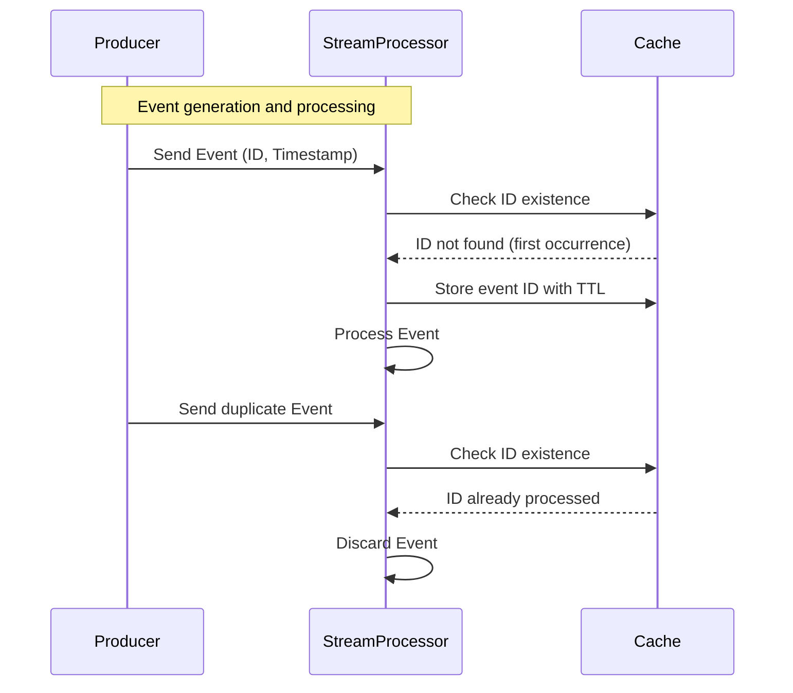

**Deduplication with Late Data**

### Description

In stream processing, the challenge of deduplicating data intensifies when dealing with late-arriving events. Late events can occur due to network delays, system outages, or retries. Without a robust deduplication strategy, these events can lead to inflated counts, incorrect analytics, and downstream errors. This pattern describes methods to identify and remove duplicates by leveraging unique identifiers and temporal data associating elements with precise time windows.

### Architectural Approach

The following architectural approaches address deduplication in the context of late-arriving data:

1. **Unique Identifiers**: Assign a globally unique ID (UUID, for example) to each incoming event. Check for this ID in a cache or a database before processing to ensure the event hasn't been processed already.

2. **Temporal Windows**: Use time windows to group events and clear duplicates per window. Windows can be tumbling, sliding, or session-based, accommodating various application needs. Storing processed IDs only for the current time window minimizes memory usage and speeds up lookup times.

3. **Timestamps and Watermarks**: Attach a timestamp to events at the point of generation. Use watermarks to track the progress of event time in the stream, allowing late events to be processed within a certain tolerance period while ensuring low-latency results. 

4. **Cache with TTL**: Utilize an in-memory cache like Redis or Apache Flink’s state management with a Time-To-Live (TTL) on the unique event IDs to discard them automatically after a latency window passes.

### Best Practices

- **Define Window Tolerances**: Set appropriate window retention and tolerances for late arrival based on business requirements and latency tolerance.
  
- **Memory Management**: Properly manage memory and state storage to prevent resource exhaustion, especially in high-throughput scenarios.

- **Consistent Timezones**: Ensure all timestamps are aligned to a single timezone to prevent logical errors in deduplication windows.

### Example Code

Below is a Scala example using Apache Flink to deduplicate late-arriving data using unique identifiers stored in a state with a TTL:

```scala
case class Event(id: String, timestamp: Long)

val env = StreamExecutionEnvironment.getExecutionEnvironment

val eventStream: DataStream[Event] = env.fromElements(
  // Populate with event data
)

val deduplicatedStream = eventStream
  .keyBy(_.id)
  .process(new KeyedProcessFunction[String, Event, Event] {

    lazy val seenIds: ValueState[Boolean] = getRuntimeContext.getState(
      new ValueStateDescriptor[Boolean]("processed-ids", Types.of[Boolean])
    )

    override def processElement(event: Event, ctx: Context, out: Collector[Event]): Unit = {
      if (seenIds.value() == null) {
        seenIds.update(true)
        out.collect(event)
      }

      ctx.timerService().registerEventTimeTimer(event.timestamp + eventTimeThreshold)
    }

    override def onTimer(timestamp: Long, ctx: OnTimerContext, out: Collector[Event]): Unit = {
      seenIds.clear()
    }
  })
```

### Diagram



### Related Patterns and Descriptions

- **Event Sourcing**: Capture every change to the state as a sequence of events, providing a reliable mechanism to regenerate state and filter duplicates based on events order.

- **Windowed Aggregation**: Group records based on a window to aggregate data comfortably and apply deduplication efficiently within these boundaries.

### Additional Resources

- [Apache Flink Documentation: Working with State](https://ci.apache.org/projects/flink/flink-docs-master/docs/dev/datastream/fault-tolerance/state/)
- [Kafka Streams Deduplication Patterns](https://kafka.apache.org/10/documentation/streams/)
  
### Summary

Handling late-arriving, duplicate data is crucial in real-time data processing environments where accuracy and timeliness are paramount. By assigning unique identifiers, using windowed and time-based strategies, and leveraging intelligent state management, deduplication can reliably ensure data integrity and correctness in continuous data flow systems. These strategies are vital for building resilient and scalable stream processing applications.
