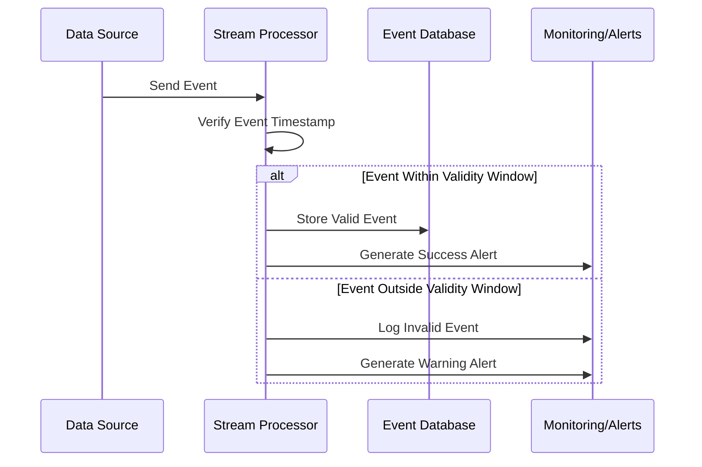

## Description

In the domain of stream processing, "Data Validity Windows" is a design pattern that focuses on managing late-arriving data by defining specific validity periods for incoming events. This pattern ensures that only data within a predefined time window is processed, effectively discarding or relegating events that are deemed too old or past the timeframe where their processing would yield relevant insights. This approach helps maintain data freshness, integrity, and relevance, reducing resource waste in processing outdated information.

## Architectural Approach

1. **Event Ingestion**: Utilize stream processing platforms such as Apache Kafka, Amazon Kinesis, or Google Cloud Pub/Sub, which allow for event timestamping during ingestion.

2. **Defining Time Windows**: Establish boundaries for acceptable event timestamps, typically using a sliding, tumbling, or session window approach. These windows dictate the operational timeframe during which data is considered valid.

3. **Time Synchronization**: Employ time references such as system time or event time to ensure consistency in event processing. This involves clock synchronization mechanisms if operating in a distributed architecture.

4. **Window Management**: Implement mechanisms to manage and discard events falling outside predefined time windows utilizing features in stream processing frameworks like Apache Flink or Spark Streaming.

5. **Error Handling**: Design strategies to handle and possibly reroute or log invalid data for further inspection or auditing.

## Example Code

Here's a simple example in Apache Flink, depicting the implementation of data validity windows to filter out stale events:

```scala
case class Event(id: String, timestamp: Long, data: String)

val env = StreamExecutionEnvironment.getExecutionEnvironment

// Assume eventTimeExtractor is a method to extract timestamp from Event
val eventStream: DataStream[Event] = env.addSource(mySourceFunction)
  .assignTimestampsAndWatermarks(
    WatermarkStrategy
      .forBoundedOutOfOrderness(Duration.ofSeconds(10))
      .withTimestampAssigner((event, _) => event.timestamp)
  )

val validDataStream = eventStream
  .filter(event => {
    val currentTime = System.currentTimeMillis()
    val validityDuration = Duration.ofMinutes(5).toMillis // e.g., 5 minutes validity period
    event.timestamp >= currentTime - validityDuration
  })

validDataStream.addSink(myValidDataSinkFunction)

env.execute("Flink Stream Processing with Data Validity Windows")
```

## Diagrams

### Workflow Diagram



## Related Patterns

- **Event Time Processing**: Focuses on using event time instead of ingestion time for better accuracy in time-dependent stream processing tasks.
  
- **Watermarks**: Used in stream processing to handle out-of-order events by marking the progress of event time. Helps in determining when a certain time window can be considered complete.

- **Sliding Windows**: Useful for continuous, overlapping computations over streams, offering a smooth transition and accurate analysis as the window slides over time.

## Additional Resources

- [Google Cloud Dataflow: Event Time](https://cloud.google.com/dataflow/docs)
- [Apache Flink Documentation: Time Windows](https://nightlies.apache.org/flink/flink-docs-stable/docs/dev/datastream/operators/windows/)
- [Netflix Business Complexity Management via Time Windows](https://medium.com/netflix-techblog)

## Summary

The Data Validity Windows design pattern is essential for systems requiring real-time data validity checks in stream processing. By defining clear time-bound rules for events, it ensures the integrity and freshness of processed data, optimizes resource utilization, and guards against the detrimental effects of outdated data on analytics or downstream decision-making processes. Integrating this pattern helps organizations maintain an agile, responsive, and reliable data processing pipeline that effectively adapts to the dynamic nature of streaming data environments.
