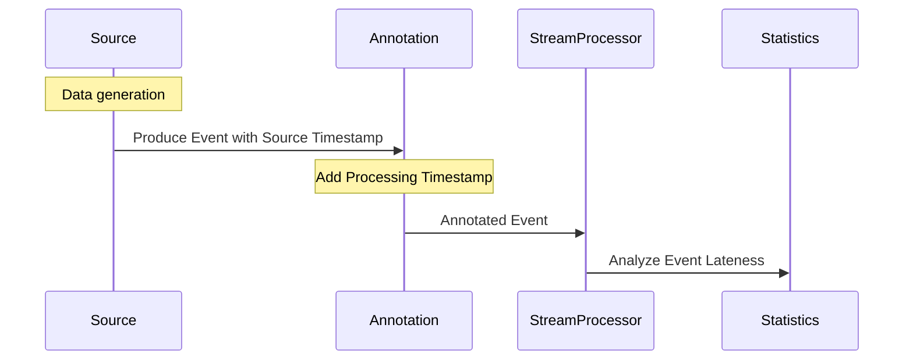

## Introduction

In real-time stream processing, handling late-arriving data can be a critical challenge. To efficiently address this, the Data Annotation pattern is employed, which incorporates additional metadata into the data streams. This metadata typically includes source timestamps, processing timestamps, and other contextual information. By doing so, systems can better assess and manage the lateness of events, providing more accurate analytics and response strategies.

## Problem

In many stream processing applications, data arrives out-of-order or after specified windows of time. Without proper handling, this late data can lead to inaccuracies in calculations, analytics, and decision-making processes. There is a need for a mechanism that can seamlessly handle such scenarios by leveraging additional information encapsulated with the data.

## Solution

The Data Annotation pattern proposes annotating data with relevant metadata when it is produced or within the processing pipeline. This metadata is used later to make informed decisions about how to handle each individual data event. Common metadata includes:

- **Source Timestamp**: The time at which the data was generated at the source.
- **Processing Timestamp**: The time at which the data was received and processed by the system.
- **Event Identifiers**: Unique identifiers that help track or manage replays and duplicates.
- **Contextual Information**: Any additional data that helps in understanding and processing the event, such as origin location or event type.

### Example Code

Consider a stream processing system using Apache Kafka and Apache Flink. Below is a simplified example in Java demonstrating how to apply the Data Annotation pattern by appending a processing timestamp:

```java
DataStream<Event> inputStream = ...
DataStream<AnnotatedEvent> annotatedStream = inputStream.map(event -> {
    long processingTimestamp = System.currentTimeMillis();
    return new AnnotatedEvent(
        event.getSourceTimestamp(),
        processingTimestamp,
        event.getId(),
        event.getData()
    );
});

// Definition of AnnotatedEvent
public class AnnotatedEvent {
    private final long sourceTimestamp;
    private final long processingTimestamp;
    private final String id;
    private final String data;

    public AnnotatedEvent(long sourceTimestamp, long processingTimestamp, String id, String data) {
        this.sourceTimestamp = sourceTimestamp;
        this.processingTimestamp = processingTimestamp;
        this.id = id;
        this.data = data;
    }

    // Getters and other methods...
}
```

## Diagram

Below is a Mermaid UML Sequence Diagram illustrating how data annotation is integrated into a stream processing workflow:



## Best Practices

- **Consistent Timestamp Management**: Ensure consistent and reliable source and processing timestamps across various data sources to prevent discrepancies.
- **Storage and Serialization**: Decouple metadata management from business logic by using common storage formats like Avro or Protobuf.
- **Windowing Strategies**: Implement flexible windowing techniques to accommodate late arrivals and ensure proper event ordering.

## Related Patterns

- **Watermarking**: Integrate watermarks to handle event-time processing and define lateness thresholds.
- **Event Sourcing**: Capture changes as a sequence of events to enable reconstruction based on annotated data.
- **Backpressure Management**: Address system capacity issues when late arrivals cause processing spikes.

## Additional Resources

- [Understanding and Handling Late Data in Apache Flink](https://ci.apache.org/projects/flink/flink-docs-stable/dev/event_time.html)
- [Kafka Streams and Stream Processing](https://kafka.apache.org/documentation/streams/)
- [Implementing Kappa Architecture in Spark Streaming](https://databricks.com/session_na20/implementing-kappa-architecture-in-spark-streaming)

## Summary

The Data Annotation design pattern effectively enhances a system's ability to handle late arrivals in stream processing contexts by enriching source data with critical metadata. This pattern forms the foundation for accurate data processing, window management, and latency analysis, ultimately leading to more reliable and timely business intelligence outputs in event-driven architectures.
