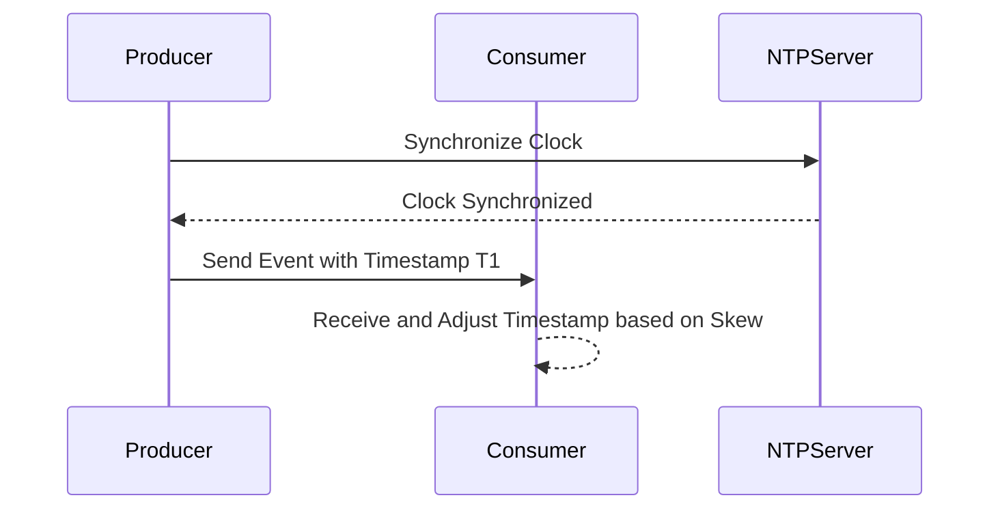

Event Time Skew Handling is a crucial design pattern in stream processing and distributed systems, aimed at addressing the challenges presented by discrepancies in event times due to clock skew. This pattern ensures that events are processed in a consistent and reliable manner, despite variations in the reported time from different nodes in a distributed system.

## Problem Context

In distributed systems, each machine has its own clock, which may not perfectly align with others. This misalignment, known as clock skew, can lead to several issues in stream processing:

- **Order of Events**: Discrepancies in the perceived order of events that can affect the accuracy of data analytics.
- **Data Integrity**: Potential data loss or duplication if events are erroneously considered as processed or pending.
- **Latency and Lag**: Increased processing time as systems attempt to reconcile time differences.

## Solution

To address these challenges, the Event Time Skew Handling pattern employs several strategies:

1. **Clock Synchronization**: 
   - Utilize Network Time Protocol (NTP) to synchronize the clocks of different machines within a permissible range of accuracy, minimizing skew.

2. **Watermarks**:
   - Use watermarks to represent the time up to which the system has processed events. This helps in estimating lateness and determining when to output results.

3. **Time Adjustment**: 
   - Adjust event timestamps based on known skew patterns or drift corrections derived from machine learning models.

4. **Buffering and Windowing**:
   - Implement buffering techniques, such as sliding windows or tumbling windows, to manage out-of-order events and ensure accurate processing within defined time frames.

## Example Code

Here's an example in Apache Kafka Streams using watermarks to handle event time skew:

```java
StreamsBuilder builder = new StreamsBuilder();
KStream<String, Event> stream = builder.stream("input-topic", Consumed.with(Serdes.String(), Serdes.serdeFrom(Event.class)));

// Define a timestamp extractor
TimestampExtractor timestampExtractor = new org.apache.kafka.streams.processor.WallclockTimestampExtractor();

stream.selectKey((key, value) -> value.getKey())
      .groupByKey(Grouped.with(Serdes.String(), Serdes.serdeFrom(Event.class)))
      .windowedBy(TimeWindows.of(Duration.ofMinutes(5)).advanceBy(Duration.ofMinutes(1)))
      .count(Materialized.as("event-count"))
      .toStream()
      .to("output-topic");

// Set up the stream configuration
Properties props = new Properties();
props.put(StreamsConfig.APPLICATION_ID_CONFIG, "event-time-skew-handling-example");
props.put(StreamsConfig.BOOTSTRAP_SERVERS_CONFIG, "localhost:9092");
props.put(StreamsConfig.DEFAULT_TIMESTAMP_EXTRACTOR_CLASS_CONFIG, timestampExtractor.getClass().getName());

KafkaStreams streams = new KafkaStreams(builder.build(), props);
streams.start();
```

## Diagram



## Related Patterns

- **Late Arrival Handling**: Deals with the processing of events that arrive after their scheduled processing time.
- **Out-Of-Order Event Processing**: Handles events that arrive in a non-sequential order.

## Additional Resources

- [Google Cloud - Time Synchronization](https://cloud.google.com/logging/docs/event-time-schema)
- [Apache Kafka - Handling Time Skew](https://kafka.apache.org/documentation/streams/)
- [The Role of Time in Distributed Systems](https://research.google.com/pubs/pub45855.html)

## Summary

Managing event time skew is critical in ensuring data integrity and reliability in streamed processes within distributed architectures. By leveraging time synchronization protocols like NTP, employing watermarks, and strategically buffering data, systems can maintain consistent event timelines and enhance processing accuracy. This pattern forms an essential component of modern event-driven architectures used in cloud computing environments.
