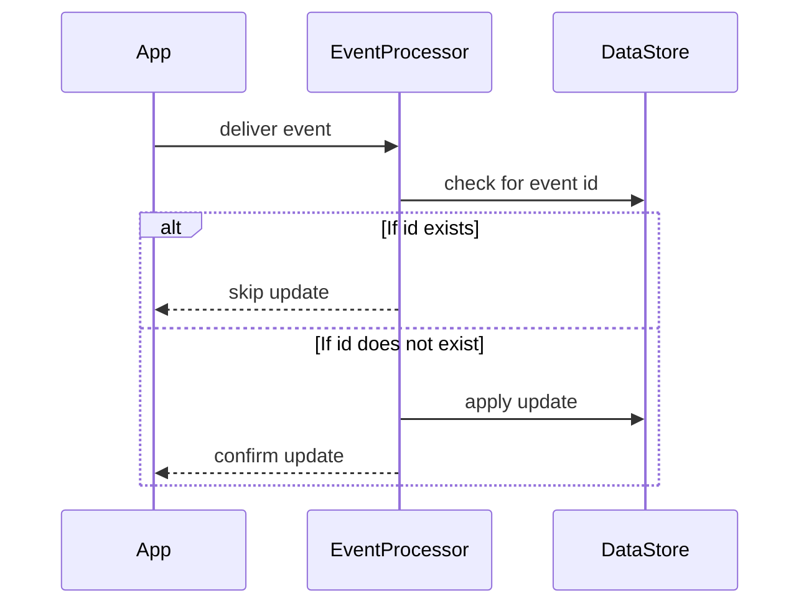

## Description

In systems that process streaming data, it's crucial to handle late-arriving events in a manner that doesn't disrupt the overall system state. This is precisely where idempotent updates shine. Idempotent updates ensure that applying updates from late events multiple times does not adversely affect system state. This design pattern is vital in scenarios where retries and duplication of event data may occur, necessitating an approach that guarantees consistency and durability through repeated operations.

## Architectural Approach

### Key Components:
- **Event Processor**: Consumes events and applies business logic. It's responsible for activation of idempotent logic during state updates.
- **Data Store**: Maintains state. It's designed or configured to support idempotency with primary and unique keys.
- **Idempotency Strategy**: Involves generating unique identifiers or leveraging existing unique fields to detect and intelligently manage duplicates.

### Operational Flow:
1. **Event Reception**: Receive an event from the stream.
2. **Identity Check**: Determine if an identical update has occurred previously by using a unique identifier derived from the event.
3. **State Application**: Only apply the update if it hasn’t already been processed.
4. **Multi-Processing Safety**: Ensure that operations applied are naturally idempotent (e.g., setting a value directly rather than incrementing it).

By ensuring that updates can be safely applied multiple times without additional side effects, system integrity is preserved even in the presence of network retries or failed deliveries that necessitate reprocessing of events.

## Best Practices

- **Use Unique Identifiers**: Always use a part of the event's payload as a unique key for idempotent checks.
- **Atomic Operations**: Utilize database features that support atomic operations to ensure updates remain atomically idempotent.
- **Timeframe Management**: Implement sliding windows or tombstone markers for historical event data to constrain the persistence of idempotent operations.
- **Conflict Resolution**: Design clear conflict resolution mechanisms when simultaneous updates are received.

## Example Code

Here's a simplified example in Kotlin, leveraging a key-value store to demonstrate idempotent updates:

```kotlin
data class Event(val id: String, val data: String)

class EventProcessor(private val stateStore: MutableMap<String, String>) {

    fun processEvent(event: Event) {
        if (!stateStore.containsKey(event.id)) {
            // Apply update
            stateStore[event.id] = event.data
        }
    }
}

// Usage
val stateStore: MutableMap<String, String> = mutableMapOf()
val eventProcessor = EventProcessor(stateStore)

val event = Event(id = "event-123", data = "some data")
eventProcessor.processEvent(event)
eventProcessor.processEvent(event)  // This will not reapply the update
```

## Diagrams

### Sequence Diagram



## Related Patterns and Descriptions

- **Event Sourcing**: Maintains a log of state changes which naturally supports reprocessing and repeat event handling.
- **CQRS (Command-Query Responsibility Segregation)**: Separates read and update operations to support scalability and tailored handling of update idempotency.
- **Retry Pattern**: Complements idempotent updates by offering assurances that retrying operations will not lead to data corruption.

## Additional Resources

- [Martin Fowler on Idempotency](https://martinfowler.com/business-patterns/idempotent-handler.html)
- Community-focused guides on stream processing with Apache Kafka

## Summary

The Idempotent Updates pattern is an essential aspect of designing robust stream processing systems that are resilient to data duplication and reordering. By leveraging unique identifiers and implementing atomic operations, systems can ensure safe handling of late-arriving or duplicated events without impacting the correctness and consistency of the system. This pattern is vital in cloud environments where distributed systems must handle data from diverse and often uncontrollable sources.
