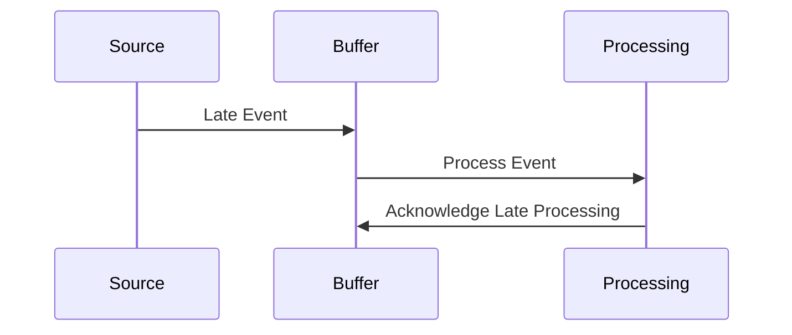

## Overview

Buffering Late Events is a design pattern used in stream processing to handle data that arrives after its expected processing window. In real-time data systems, events often stream from diverse sources such as IoT devices, tapping into the need to manage events that arrive late due to network delays or other disruptions. This pattern helps ensure that late-arriving data is not lost and can still contribute to accurate analysis and decision-making.

## Problem

Real-time data systems often receive out-of-order or delayed data, leading to potential data integrity issues. Inaccurate results can occur if late data is simply dropped or handled inefficiently. This presents challenges in contexts such as financial transactions, IoT systems, and user interaction tracking.

## Solution

Implement a buffering mechanism that temporarily stores late-arriving events, allowing these events to be processed and integrated once they are received, within a certain tolerance or window.

### Key Components

- **Buffer Storage**: A temporary storage solution (in-memory store, Redis, Kafka, etc.) which holds late events.
- **Windowing Mechanism**: Establish time windows to which data events belong and apply corrections when late data arrives.
- **Watermarks**: Use watermarks to track progress and determine late events relative to processing time.
- **Reprocessing Logic**: Integrate late events into existing aggregates or analyses when received.

## Example

```scala
import org.apache.flink.streaming.api.scala._
import org.apache.flink.streaming.api.windowing.time.Time
import org.apache.flink.streaming.api.windowing.triggers.EventTimeTrigger

val env = StreamExecutionEnvironment.getExecutionEnvironment

val sensorDataStream: DataStream[SensorReading] = ...

val watermarkStrategy = WatermarkStrategy
  .forBoundedOutOfOrderness(Duration.ofSeconds(5))
  .withTimestampAssigner(new SerializableTimestampAssigner[SensorReading] {
    override def extractTimestamp(element: SensorReading, recordTimestamp: Long): Long = element.timestamp
  })

val lateEventHandlingStream = sensorDataStream
  .assignTimestampsAndWatermarks(watermarkStrategy)
  .keyBy(_.sensorId)
  .window(TumblingEventTimeWindows.of(Time.seconds(10)))
  .allowedLateness(Time.seconds(60))
  .trigger(EventTimeTrigger.create())
  .sum("reading")

lateEventHandlingStream.print()

env.execute("Buffering Late Events Example")
```

In this Apache Flink example, we define a stream of sensor readings with event time semantics. We configure watermarking to handle events arriving with up to 5 seconds delay. Late events up to 60 seconds delayed are also incorporated, ensuring accurate analysis.

## Diagram



## Related Patterns

- **Event-Based Windows**: Similar to Buffering Late Events but focuses more on grouping events by logical occurrence rather than absolute time.
- **Event Sourcing**: Maintains a running log of all events, allowing late events to align with previous states retrospectively.

## Additional Resources

- [Streaming 101 by Tyler Akidau](https://www.oreilly.com/library/view/streaming-systems/9781491983874/)
- [The Data Engineering Podcast - Handling Late Data](https://www.dataengineeringpodcast.com/)
- [Google's Apache Beam Documentation](https://beam.apache.org/documentation/)

## Summary

Buffering Late Events is an essential pattern in stream processing, addressing the complexities of dealing with data that deviates from expected timing. By implementing an efficient buffering and processing strategy, organizations can enhance the accuracy of real-time data processing tasks, accommodating inevitable irregularities in data arrival. This pattern is particularly useful in IoT applications, financial systems, and anywhere precision in data alignment is crucial.
