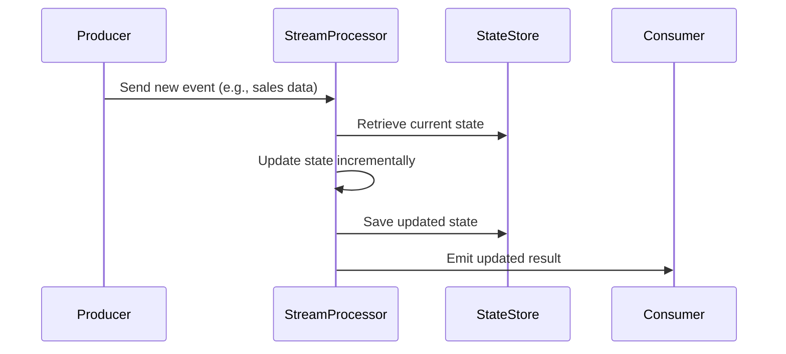

## Overview

The **Incremental Updates** design pattern allows systems to efficiently update results as new data—including late-arriving events—is received. Instead of recalculating from scratch, the pattern optimizes computational resources by adjusting current results incrementally. This is particularly useful in stream processing environments where timely outputs are crucial, yet data can arrive out of order.

## Detailed Explanation

### Context and Problem

In real-time data processing systems, data is often not available all at once or can arrive late due to network lag, system delays, or other issues. Recomputing entire results whenever new data arrives can be inefficient and computationally expensive, especially with large-scale data streams. This necessitates a more efficient approach that minimizes redundant calculations.

### Solution

The **Incremental Updates** pattern addresses this problem by maintaining the state of computations and adjusting this state as new events are processed. It involves:

- **State Management**: Holding current results and metadata about raw data that influenced these results, like the count, sum, or individual events.
- **Delta Calculations**: Applying only the changes (or deltas) from new events to the existing results.
- **Efficient Storage**: Using storage systems that facilitate rapid access and update of state information, such as in-memory data grids or specialized databases.

### Use Cases

- **Real-time Analytics**: Generating up-to-date statistics by incrementally modifying existing results when new data arrives.
- **E-commerce**: Continuously updating inventory levels, considering late sales events.
- **Finance**: Adjusting stock price aggregation calculations with the arrival of late trading activity data.

## Implementation Example

```java
// Java code example to update a running sum incrementally
import java.util.concurrent.atomic.AtomicLong;

public class IncrementalSum {
    private AtomicLong sum = new AtomicLong(0);

    public void addValue(long value) {
        // Updates the sum incrementally
        sum.addAndGet(value);
    }

    public long getCurrentSum() {
        // Returns the current sum
        return sum.get();
    }
}
```

## Diagram



## Related Patterns

- **Lambda Architecture**: Utilizes both batch and stream processing to handle large amounts of data efficiently, a suitable foundation for implementing incremental updates in both domains.
- **Event Sourcing**: Maintains the sequence of incoming events, which can be replayed to recover state or respond to late arrivals.
- **CQRS (Command Query Responsibility Segregation)**: Decouples commands and queries for systems requiring periodic updates and scalable reads.

## Additional Resources

- "Stream Processing with Apache Flink" by Fabian Hueske: Offers insights into applying incremental update techniques in Flink-powered applications.
- [Incremental Processing in Google Cloud Dataflow](https://cloud.google.com/blog/products/data-analytics/introducing-apache-beam-and-google-cloud-dataflow-sdk-for-java): A paper detailing how incremental processing is handled in Beam and Dataflow.

## Summary

The **Incremental Updates** design pattern is an efficient approach for maintaining up-to-date computations in data stream processing by only updating the evolving parts of previously computed results. This pattern is instrumental in scenarios involving large volumes of data where late-arriving events are common, providing both performance and precision advantages by avoiding repetitive recalculations.
