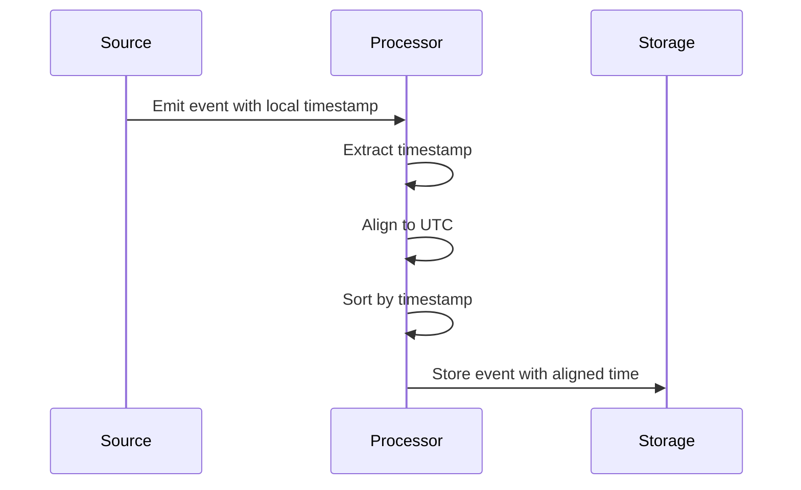

## Event Time Alignment

**Description**: The Event Time Alignment design pattern is crucial in stream processing architecture for aligning event times from different sources to ensure consistent processing. As data is gathered from various distributed systems, each stream might have different inherent timestamps, often due to differing time zones, clock skews, and formats. This pattern helps in normalizing and aligning these timestamps to ensure accurate and synchronized data processing.

### Architectural Approach

Incorporating the Event Time Alignment pattern is particularly important in real-time data streams where accurate event sequencing and aggregation depend on synchronized timing across all events. The architectural approach generally includes the following steps:

- **Timestamp Extraction**: Extract the event time from each incoming record. This can be custom-defined if it is not automatically recognized.
  
- **Time Zone Normalization**: Convert timestamps from various time zones to a common reference time zone (e.g., UTC).
  
- **Clock Skew Adjustment**: Correct any discrepancies arising from clock skew on different machines or devices to align events within the acceptable threshold.

- **Watermarks**: Implement watermarks to handle out-of-order events by estimating the progress of event time and allowing for lateness handling.

- **Event Sorting**: Sort events based on the adjusted timestamps to maintain correct sequence within the stream processing applications.

### Best Practices

1. **Time Zone Awareness**: Always be conscious of time zones when dealing with global applications. Standardizing to UTC is a common practice.
   
2. **Handling Late Arrivals**: Consider implementing watermarks to accommodate out-of-order or late-arriving events while maintaining processing efficiency.

3. **Clock Synchronization**: Use network time protocol (NTP) or similar mechanisms to stabilize clock timings on server machines and IoT devices.

4. **Monitoring and Alerts**: Set up monitoring and alert systems to detect discrepancies and performance issues related to time alignment.

5. **Testing**: Thoroughly test the event alignment logic with various edge cases and across different environments to ensure reliability and correctness.

### Example Code

Here is a simplified example using Apache Flink to handle event time alignment by extracting and aligning timestamps from incoming events:

```java
import org.apache.flink.api.common.eventtime.WatermarkStrategy;
import org.apache.flink.api.common.eventtime.WatermarkGeneratorSupplier;
import org.apache.flink.api.common.eventtime.TimestampAssignerSupplier;
import org.apache.flink.streaming.api.datastream.DataStream;
import org.apache.flink.streaming.api.environment.StreamExecutionEnvironment;

public class EventTimeAlignmentExample {

    public static void main(String[] args) throws Exception {

        StreamExecutionEnvironment env = StreamExecutionEnvironment.getExecutionEnvironment();

        DataStream<Event> events = env.addSource(new EventSource());

        // Define and apply watermark strategy for event time alignment
        WatermarkStrategy<Event> watermarkStrategy = WatermarkStrategy
                .<Event>forBoundedOutOfOrderness(Duration.ofSeconds(10))
                .withTimestampAssigner(event -> event.getEventTimestamp());

        DataStream<Event> alignedEvents = events.assignTimestampsAndWatermarks(watermarkStrategy);

        alignedEvents.process(new EventProcessFunction())
            .print();

        env.execute("Event Time Alignment Example");
    }
}
```

### Mermaid UML Sequence Diagram

Below is an example of a sequence diagram showing the flow of event time alignment:



### Related Patterns

- **Out-of-Order Processing**: Handles events arriving outside their anticipated order.
- **Late Data Handling**: Patterns for managing and processing data that arrives late in the system.
- **Event Sourcing**: A pattern in which state changes are captured as a sequence of events.

### Additional Resources

- Apache Flink Documentation on [Time and Watermarks](https://nightlies.apache.org/flink/flink-docs-release-1.15/docs/concepts/time/)
- Google Cloud's [Stream-Processing with Event Time](https://cloud.google.com/architecture/stream-processing-event-time)
- [Designing Data-Intensive Applications](https://dataintensive.net/), Martin Kleppmann

### Summary

The Event Time Alignment pattern facilitates effective and accurate stream processing by ensuring that events from disparate sources are synchronized to a coherent timeline. This prevents issues with data sequencing and aggregation accuracy, thereby enhancing the reliability of real-time data processing applications in cloud environments. By implementing robust strategies for time extraction, normalization, and sorting, organizations can handle large streams of events consistently and efficiently.
