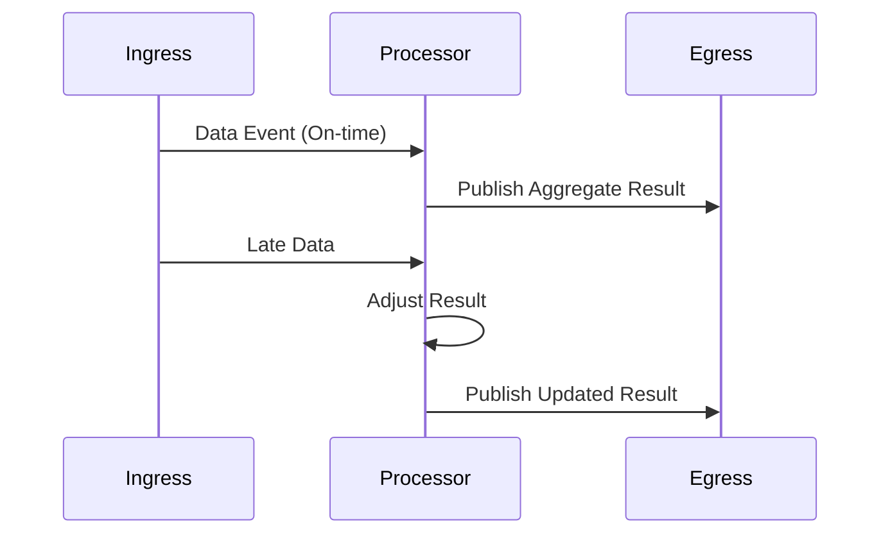

## Introduction

In stream processing, data often arrives with delays for various reasons such as network latency or slow upstream systems. Managing these late-arriving data correctly is crucial to ensure the accuracy and consistency of processed information. The "Updating Results with Late Data" pattern is designed to rectify previously emitted results when late data impacts past calculations or aggregates.

## Design Pattern Overview

### Context

In scenarios where data is streamed in real-time, systems routinely compute aggregates, metrics, or other derived values. These systems must imperatively account for data that arrives outside of its expected temporal window. Without handling these late-arriving events, any computed results may become inaccurate or incomplete.

### Problem

The primary challenge addressed by this pattern is maintaining the integrity and precision of real-time analytics or monitoring applications when data is delayed. Failure to update results with late data can lead to misleading conclusions, inaccurate decision-making, and compromised system behavior.

### Solution

Implement mechanisms to handle late-arriving data effectively. This involves storing intermediate results, listening for delayed inputs, and adjusting previously computed outputs. This process typically includes:

1. **Event Time Processing**: Use event time rather than processing time for computation, which is often more reliable when dealing with late data.
   
2. **Watermarks**: Set watermarks that track the progress of data through the system, beyond which no further updates are typically expected.
   
3. **Windows**: Employ various types of windows (e.g., sliding, tumbling, session) to manage data within defined time boundaries.
   
4. **Updates and Retracts**: Emit updated results or retractions when late data changes previously calculated aggregates.

### Example Code (Apache Beam)

Apache Beam is a popular stream processing framework supporting late data handling. Here is how it might be utilized for adjusting results:

```java
PipelineOptions options = PipelineOptionsFactory.create();
Pipeline pipeline = Pipeline.create(options);

PCollection<KV<String, Integer>> input = // source

PCollection<KV<String, Integer>> updatedResults = input
    .apply(Window.<KV<String, Integer>>into(FixedWindows.of(Duration.standardMinutes(5)))
           .withAllowedLateness(Duration.standardMinutes(2))
           .accumulatingFiredPanes())
    .apply(Sum.integersPerKey());

PCollection<KV<String, Integer>> resultsWithLateData = updatedResults
    .apply(ParDo.of(new UpdateResultsFn())); // Logic to handle late data

pipeline.run().waitUntilFinish();
```

### Diagrams

Here is a simplified Mermaid Sequence diagram to illustrate how late data updates a computed window result.



## Related Patterns

- **Event Sourcing**: Persist all changes as a sequence of events so historical data is always accessible and amendable.
- **CQRS (Command Query Responsibility Segregation)**: Use different models for reading and updating data to handle late adjustments.
- **Lambda Architecture**: Mix batch and real-time processing to rectify late-arriving data.

## Best Practices

- Define appropriate lateness thresholds and watermarks to minimize incorrect updates and compute costs.
- Choose suitable strategies (e.g., exactly-once processing) to ensure result consistency.
- Regularly evaluate system performance metrics to tune parameters like window size and allowed lateness.

## Additional Resources

- [Apache Beam Documentation on Windowing and Triggers](https://beam.apache.org/documentation/programming-guide/#windowing)
- [Google Cloud Dataflow Window Functions](https://cloud.google.com/dataflow/docs/)
- [Latency and Consistency Trade-offs in Dependable Distributed Systems](subURL)

## Summary

The "Updating Results with Late Data" pattern is integral in real-time stream processing contexts where data should remain consistent despite delays. By incorporating strategic handling of late-arriving events, systems can ensure the reliability and accuracy of their analytics and results. This pattern empowers systems responsible for mission-critical decision-making processes to maintain data quality even under challenging conditions.
