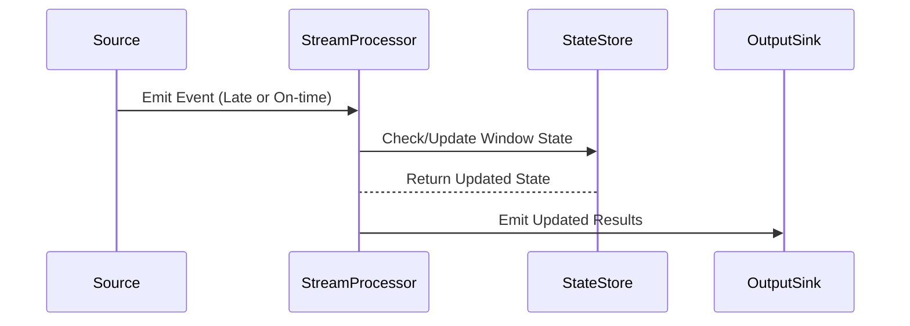

## Overview

In real-time data processing, handling late arrivals presents a significant challenge. Accumulating Windows is a design pattern that allows systems to update cumulative results with late-arriving events instead of dismissing them. This pattern is essential for scenarios where every piece of data matters, and maintaining accuracy in analytics is critical.

## Design Pattern: Accumulating Windows

### Description

Accumulating Windows refer to the logical time windows in data stream processing systems that continue to update their results to include late data. This approach contrasts with typical windowing strategies that close and finalize earlier, discarding any events that arrive after the window's closure. Accumulating Windows ensure that historical analyses stay current and correct even when data arrives out of order.

### Motivation

In the realm of real-time and near-real-time analytics, the ability to incorporate late arrivals is crucial in many applications — such as financial analytics, IoT sensor data analysis, and user activity tracking. Accumulating Windows enable more precise and complete analysis by ensuring data integrity and accuracy across systems.

### Architectural Approach

- **Window Definition**: Configure windows to collect data over defined periods, typically specified by time limits.
- **Late Data Handling**: Set up rules to incorporate data that arrives late naturally. Usually involves watermarking techniques.
- **State Management**: Use state management systems to store intermediate computations that can be updated as late data arrives.
- **Triggering Updates**: Implement a strategy to reprocess and update results whenever late-arriving data is incorporated into a window.

### Example Code

Here's a simplified example using Apache Spark Streaming that demonstrates the setup of an accumulating window:

```scala
import org.apache.spark.sql.SparkSession
import org.apache.spark.sql.streaming.Trigger

val spark = SparkSession.builder
  .appName("AccumulatingWindowsExample")
  .getOrCreate()

import spark.implicits._

// Example stream of data
val dataStream = spark
  .readStream
  .format("socket")
  .option("host", "localhost")
  .option("port", 9999)
  .load()

// Assuming structured data with a timestamp column
val processedStream = dataStream
  .withWatermark("timestamp", "10 minutes")
  .groupBy("id", window($"timestamp", "5 minutes"))
  .count()

val query = processedStream.writeStream
  .outputMode("update") // Enables the ability to update results
  .format("console")
  .trigger(Trigger.ProcessingTime("1 minute"))
  .start()

query.awaitTermination()
```

### Diagrams

#### UML Sequence Diagram



### Related Patterns

- **Time Windowing**: A generic pattern that defines fixed, sliding, or session-based windows in stream processing for grouping events.
- **Watermarking**: A common technique that introduces a delay threshold, allowing systems to wait for late data for a defined period.

### Best Practices

- **Tuning Watermarks**: Setting appropriate watermark delays is crucial to balancing the trade-offs between result latency and result completeness.
- **State Management**: Effective state management is critical to ensure the system can efficiently handle growing data sizes and late event scenarios.
- **Performance Optimization**: Regularly monitor the performance impact of rewriting window outputs when late-arriving data occurs.

### Additional Resources

- [Apache Kafka Streams Documentation](https://kafka.apache.org/documentation/streams/)
- [Apache Spark Structured Streaming](https://spark.apache.org/docs/latest/structured-streaming-programming-guide.html)

## Summary

Accumulating Windows offer a resilient and flexible approach to handling late-arriving events in stream processing systems. By maintaining the ability to update previously emitted results, this design pattern ensures more accurate analytics and reports in dynamic environments. Employing Accumulating Windows effectively involves careful planning on watermarking and state management to sustain system performance and data integrity.
