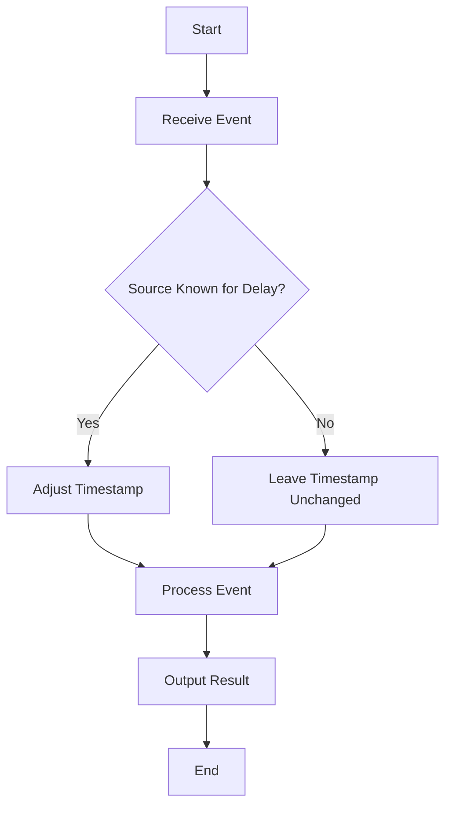

In stream processing systems, handling events that arrive late is a frequent challenge. The Event-Time Adjustments pattern involves altering the timestamps of incoming events to offset known delays or synchronize them with the processing time. This approach ensures that the stream processing system can handle the data accurately and order events effectively, even when there are predictable delays.

## Architectural Approach

- **Event Time vs. Processing Time**: Distinguish between event time (when the event actually occurred) and processing time (when the event is processed by the system). This pattern focuses on aligning event time with processing realities.
- **Timestamp Adjustment Strategies**: Develop strategies that add, subtract, or transform event timestamps based on known delay patterns or latency within the data sources.
- **Dynamic Adjustment Mechanisms**: Implement systems capable of dynamically adjusting timestamps based on changing conditions and latency insights, ensuring robustness and adaptability.

## Example Code

Below is an example of how you might implement a basic event-time adjustment in a Java stream processing application using Apache Flink:

```java
DataStream<Event> inputStream = env.addSource(new EventSource());

// Adjust timestamps by adding a fixed delay of 5,000 milliseconds
SingleOutputStreamOperator<Event> adjustedStream = inputStream
    .assignTimestampsAndWatermarks(
        WatermarkStrategy.<Event>forBoundedOutOfOrderness(Duration.ofSeconds(5))
            .withTimestampAssigner((event, timestamp) -> event.getTimestamp() + 5000)
    );

// Process adjusted event stream
adjustedStream
    .windowAll(TumblingEventTimeWindows.of(Time.seconds(10)))
    .apply(new EventWindowFunction())
    .print();
```

## Diagrams

### Event-Time Adjustment Flow



## Related Patterns

- **Watermarking**: Watermarks help in estimating the progression of event time and trigger event processing. This is related as they deal with late arrivals, but focus more on the estimation rather than adjustment.
- **Out-of-Order Handling**: Ensures the system can ingest events out of the order they were produced and still process them correctly after adjustments.

## Best Practices

- **Evaluate Source Behaviors**: Regularly assess data source behaviors to ensure your adjustments are based on the current understanding of delays.
- **Leverage Machine Learning**: Use machine learning models to predict delays for more dynamic timestamp adjustments.
- **Test with Different Delay Scenarios**: Validate your timestamp adjustment logic under various delay conditions to ensure robustness.
- **Monitor and Adapt**: Continuously monitor the timeliness of your data processing and adapt strategies to align with current data arrival patterns.

## Additional Resources

- [Apache Flink Documentation](https://flink.apache.org/)
- [Stream Processing with Apache Kafka](https://www.confluent.io/resources/)
- [Time-Sensitive Event Processing in Azure Stream Analytics](https://docs.microsoft.com/en-us/azure/stream-analytics/)

## Summary

The Event-Time Adjustments design pattern is crucial for handling late-arriving data in stream processing systems. By aligning event times with processing capabilities, you ensure data integrity and timeliness, improving the overall effectiveness of the data processing pipeline. Implementing this pattern requires understanding your data flows, assessing temporal behaviors, and utilizing appropriate tools and strategies to manage timestamp adjustments accurately.
